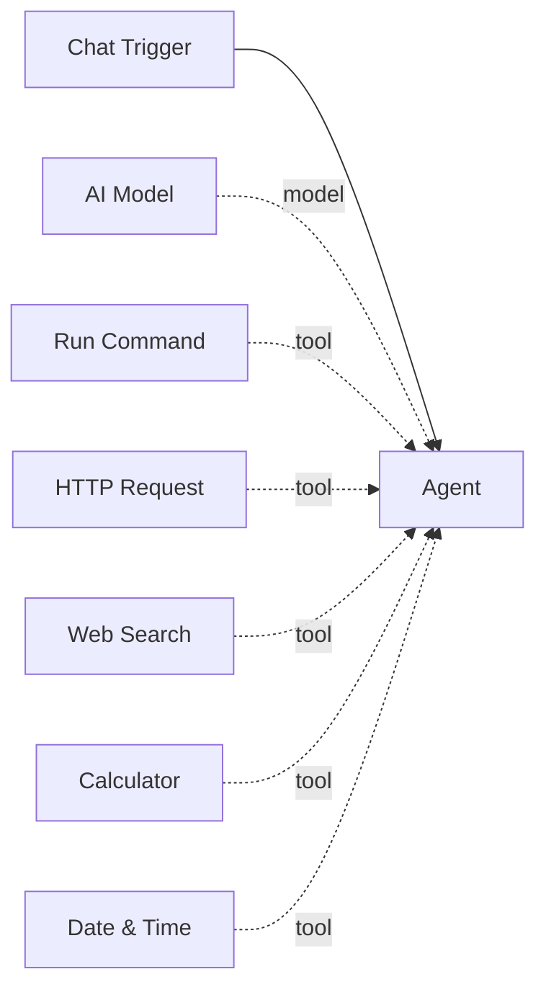

# Tools

Tools are **sub-component nodes** that give agents capabilities beyond language generation. They provide LangChain tool functions that an agent can invoke during its reasoning loop to interact with the outside world -- run shell commands, make HTTP requests, search the web, evaluate math, or check the current time.

## How tools work

Tools connect to agent nodes via the green diamond **tools** handle on the canvas. At build time, the agent queries all edges with `edge_label="tool"`, loads each connected tool node's factory function, and registers the resulting LangChain `@tool` functions for LLM function calling.

When the agent's LLM decides to call a tool during execution, WebSocket `node_status` events are published so the tool node shows running, success, or failed badges on the canvas in real time.

## Built-in tools

Pipelit ships with 5 built-in utility tools:

| Tool | Component Type | Description |
|------|---------------|-------------|
| [Run Command](run-command.md) | `run_command` | Execute shell commands on the host system |
| [HTTP Request](http-request.md) | `http_request` | Make HTTP requests to external APIs |
| [Web Search](web-search.md) | `web_search` | Search the web via a SearXNG instance |
| [Calculator](calculator.md) | `calculator` | Evaluate mathematical expressions safely |
| [Date & Time](datetime.md) | `datetime` | Get the current date and time |

## Connecting tools to agents

1. Add a tool node from the **Node Palette** (under the Tools category)
2. Add an agent node if you have not already
3. Drag an edge from the tool node to the agent's green diamond **tools** handle at the bottom
4. The edge will be created with `edge_label="tool"` automatically

An agent can have any number of tools connected. Each tool becomes available to the agent's LLM for function calling.

!!! tip "Tools are optional"
    An agent does not require any tools. Without tools, the agent acts as a pure conversational LLM that can only generate text responses.

## Tool execution lifecycle

1. The agent receives input and begins its reasoning loop
2. The LLM decides to call a tool and emits a tool-call message
3. LangGraph dispatches the call to the corresponding tool function
4. The tool node's status changes to `running` (visible on the canvas)
5. The tool executes and returns a result string
6. The tool node's status changes to `success` or `failed`
7. The result is fed back into the agent's reasoning loop
8. The LLM can call more tools or produce a final response

## Configuration

Most tools accept optional configuration via their `extra_config` field in the node details panel. See each tool's page for specific configuration options.

!!! warning "Security considerations"
    Some tools (particularly Run Command and HTTP Request) can interact with the host system and external services. Review the [Security](../../concepts/security.md) documentation before deploying workflows with these tools in production.
