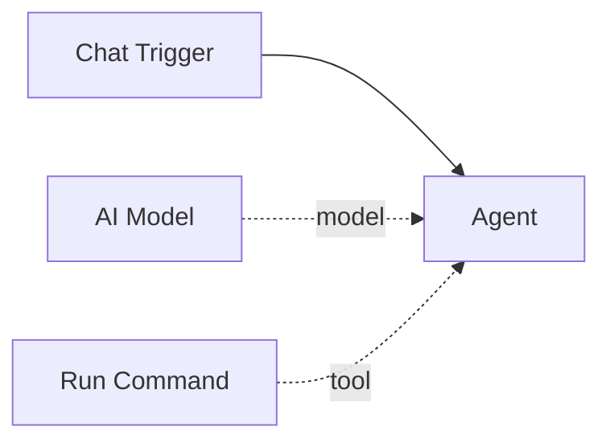

# Run Command

The **Run Command** tool executes shell commands on the host system and returns the combined stdout/stderr output. It gives agents the ability to interact with the operating system, run scripts, inspect files, manage processes, and perform any operation available from the command line.

| Property | Value |
|----------|-------|
| **Component Type** | `run_command` |
| **Category** | Sub-component (Tool) |
| **Display Name** | Run Command |

## Ports

### Inputs

| Port | Data Type | Required | Description |
|------|-----------|----------|-------------|
| `command` | STRING | No | Shell command to execute |

The `command` input is provided by the agent's LLM at invocation time, not wired from an upstream node.

### Outputs

| Port | Data Type | Description |
|------|-----------|-------------|
| `result` | STRING | Combined stdout and stderr from the command |

The output includes stderr (prefixed with `STDERR:`) and the exit code if non-zero.

## Configuration

The Run Command tool accepts the following optional configuration in `extra_config`:

| Field | Type | Default | Description |
|-------|------|---------|-------------|
| `timeout` | integer | `300` | Maximum execution time in seconds |

## Usage

1. Add a **Run Command** node from the Node Palette
2. Connect it to an agent node via the green diamond **tools** handle
3. Optionally set a custom timeout in the node's Extra Config field

The agent's LLM will then be able to call the `run_command` tool with any shell command string. The tool runs the command via `subprocess.run()` with `shell=True` and returns the output.

### Output handling

- Output longer than 50,000 characters is truncated, keeping the first and last 25,000 characters with a truncation notice in between
- If the command produces no output, the result is `(no output)`
- If the command times out, the result is `Error: command timed out after {timeout} seconds`
- Non-zero exit codes are appended as `[exit code: N]`

## Example

An agent with a Run Command tool connected can answer questions like "How much disk space is available?" by calling:

```
run_command("df -h")
```

The tool returns:

```
Filesystem      Size  Used Avail Use% Mounted on
/dev/sda1       100G   45G   55G  45% /
tmpfs           7.8G     0  7.8G   0% /dev/shm
```

The agent then interprets this output and formulates a natural language response.



!!! danger "Security warning"
    The Run Command tool executes **arbitrary shell commands** with the same permissions as the Pipelit process. This means it can read and write files, install packages, modify system configuration, and perform any operation the process user has access to. **Do not expose workflows with this tool to untrusted users.** Consider running Pipelit in a sandboxed environment (container, VM) when using this tool. See [Security](../../concepts/security.md) for recommendations.

!!! note "Subprocess isolation"
    Commands run in a new session (`start_new_session=True`) with stdin set to `/dev/null`. This prevents interactive commands from blocking execution and provides basic process group isolation.
