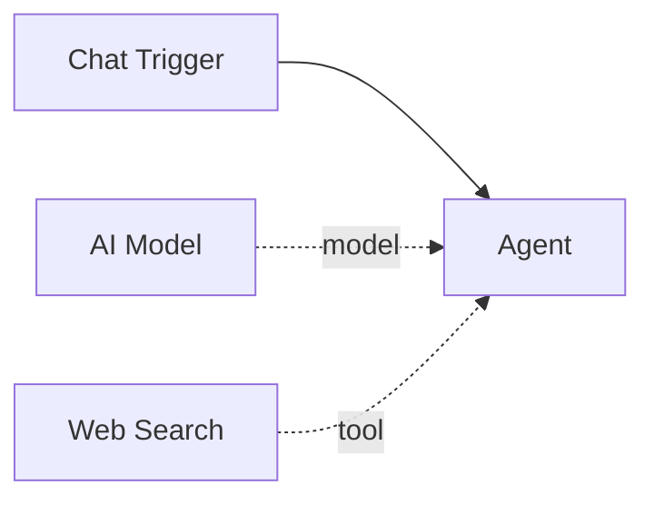

# Web Search

The **Web Search** tool searches the web using a [SearXNG](https://docs.searxng.org/) instance and returns the top results. It gives agents the ability to find current information, research topics, and answer questions that require up-to-date knowledge beyond their training data.

| Property | Value |
|----------|-------|
| **Component Type** | `web_search` |
| **Category** | Sub-component (Tool) |
| **Display Name** | Web Search |

## Ports

### Inputs

| Port | Data Type | Required | Description |
|------|-----------|----------|-------------|
| `query` | STRING | Yes | Search query string |

The `query` input is provided by the agent's LLM at invocation time.

### Outputs

| Port | Data Type | Description |
|------|-----------|-------------|
| `result` | STRING | Formatted list of top search results |

Each result includes the title, URL, and a content snippet (up to 200 characters).

## Configuration

The Web Search tool accepts the following configuration in `extra_config`:

| Field | Type | Default | Required | Description |
|-------|------|---------|----------|-------------|
| `searxng_url` | string | `"http://localhost:8888"` | Yes | Base URL of your SearXNG instance |

### Example extra_config

```json
{
  "searxng_url": "http://localhost:8888"
}
```

## Prerequisites

The Web Search tool requires a running **SearXNG** instance. SearXNG is a free, privacy-respecting metasearch engine that aggregates results from multiple search providers.

### Quick SearXNG setup with Docker

```bash
docker run -d \
  --name searxng \
  -p 8888:8080 \
  -e SEARXNG_SECRET=$(openssl rand -hex 32) \
  searxng/searxng
```

!!! warning "SearXNG is required"
    Without a running SearXNG instance, every search call will fail with a connection error. Make sure SearXNG is accessible at the URL configured in `extra_config` before using this tool.

## Usage

1. Ensure a SearXNG instance is running and accessible
2. Add a **Web Search** node from the Node Palette
3. Connect it to an agent node via the green diamond **tools** handle
4. Set the `searxng_url` in the node's Extra Config field

The agent's LLM can then call the `web_search` tool with a search query string.

### Result format

The tool returns the top 5 results in the following format:

```
- Result Title
  https://example.com/page
  Content snippet up to 200 characters...

- Another Result
  https://example.com/other
  Another content snippet...
```

If no results are found, the tool returns `No results found.`

## Example

An agent with a Web Search tool can answer current-events questions:

```
web_search("Pipelit workflow automation platform")
```

Returns:

```
- Pipelit - Visual Workflow Automation
  https://github.com/theuselessai/Pipelit
  Build, connect, and orchestrate LLM-powered agents visually. Design workflows on a React Flow canvas...

- Getting Started with Pipelit
  https://theuselessai.github.io/Pipelit/getting-started/
  Installation guide for the Pipelit visual workflow platform...
```



!!! tip "Combine with other tools"
    Web Search works well alongside HTTP Request. The agent can search for information, then use HTTP Request to fetch full page content or interact with APIs discovered through search results.
