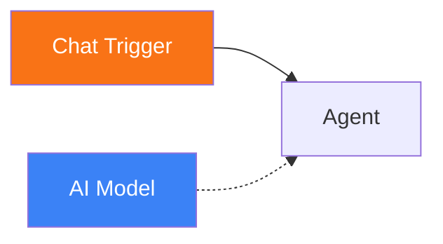
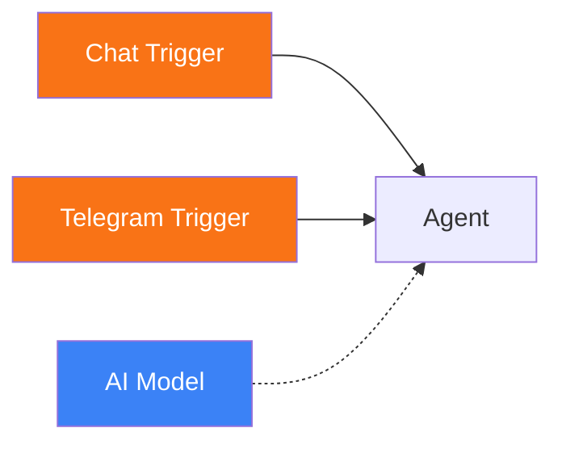

# Chat Trigger

<span class="badge badge--trigger">Trigger</span>

The Chat Trigger provides a built-in web chat interface for interacting with workflows directly from the Pipelit frontend. Users type messages in the ChatPanel, and each message fires the trigger to start a new workflow execution.

**Component type:** `trigger_chat`

---

## Ports

### Outputs

| Port | Type | Description |
|------|------|-------------|
| `text` | STRING | The message text sent by the user |
| `payload` | OBJECT | Full trigger payload including text and metadata |

### Inputs

This component has no input ports. It is an entry point.

## Configuration

The Chat Trigger requires no configuration. Add it to the canvas and connect it to downstream nodes.

## Usage

1. Drag a **Chat Trigger** node onto the canvas from the Node Palette (under Triggers).
2. Connect its output to an Agent, Code, or any other downstream node.
3. Connect an AI Model sub-component to your agent.
4. Open the **ChatPanel** in the workflow editor (bottom panel).
5. Type a message and press Enter.

Each message sent through the ChatPanel creates a new workflow execution scoped to the Chat Trigger. The user's message text is available on the `text` output port, and the full payload (including metadata) on the `payload` port.

### Accessing Chat Input Downstream

In your agent's system prompt or any node's configuration, reference the chat input using Jinja2 expressions:

```
{{ trigger.text }}
```

Or reference the specific trigger node by its ID:

```
{{ trigger_chat_abc123.text }}
```

### Conversation Memory

When the Chat Trigger connects to an Agent with **Conversation Memory** enabled, the agent maintains conversation history across multiple chat messages. This gives the agent continuity -- it remembers what was said in previous messages within the same workflow.

The thread ID for conversation memory is constructed from the user's profile ID and the workflow ID, so each user gets their own conversation thread per workflow.

## Example

A minimal chat-based workflow:



1. **Chat Trigger** receives the user's message.
2. **Agent** processes the message using the connected AI Model, reasons through the response, and produces output.
3. The response is displayed back in the ChatPanel.

### Multi-trigger workflow

A Chat Trigger and a Telegram Trigger can both feed the same agent:



In this layout, the same agent handles messages from both the web chat and Telegram. The `{{ trigger.text }}` expression works regardless of which trigger fired.

## API Endpoint

Chat messages are sent via:

```
POST /api/v1/workflows/{slug}/chat/
```

Request body:

```json
{
  "text": "Hello, can you help me with something?",
  "trigger_node_id": "trigger_chat_abc123"
}
```

The `trigger_node_id` field is optional. If omitted, Pipelit uses the first `trigger_chat` node found in the workflow.
