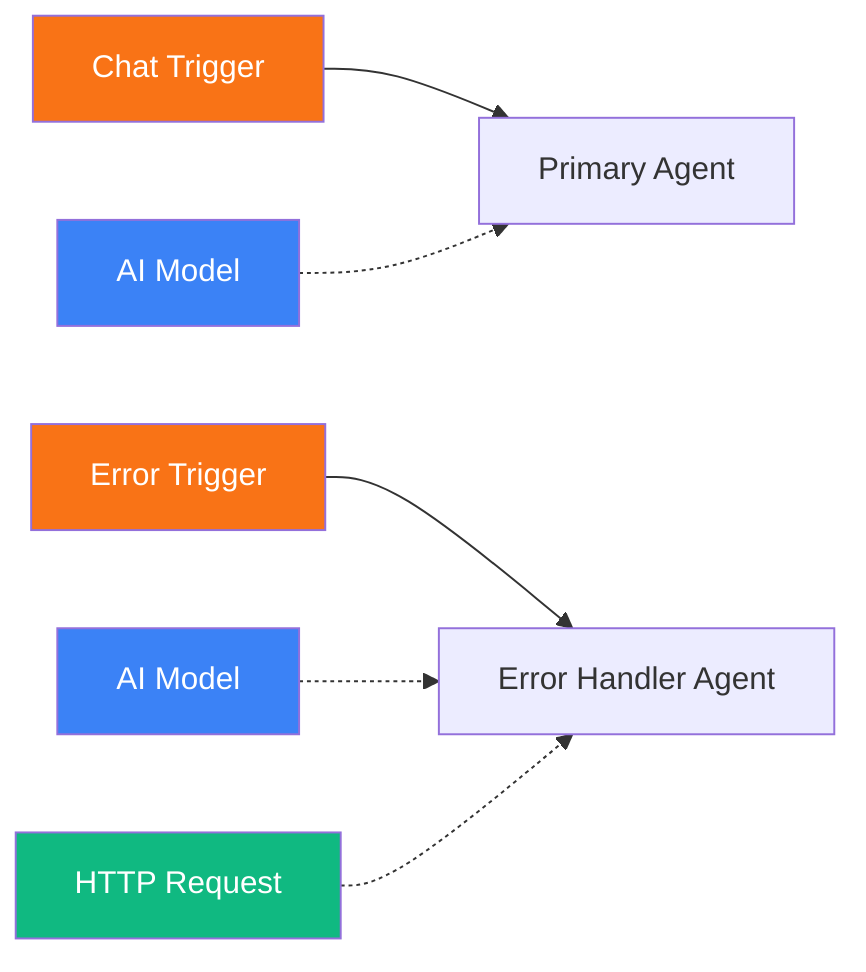
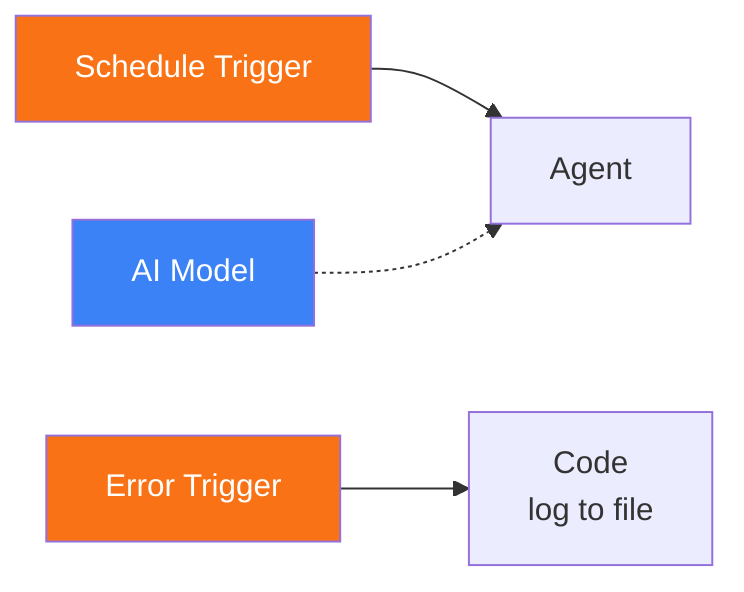

# Error Trigger

<span class="badge badge--trigger">Trigger</span>

The Error Trigger fires when an error occurs during workflow execution. It enables error-handling branches that can log failures, send notifications, retry operations, or escalate issues -- all within the workflow graph itself.

**Component type:** `trigger_error`

---

## Ports

### Outputs

| Port | Type | Description |
|------|------|-------------|
| `error` | OBJECT | Error details including message, error code, source node, and stack trace |

### Inputs

This component has no input ports. It is an entry point.

## Configuration

The Error Trigger requires no configuration. It activates automatically when an error event is dispatched within the workflow.

## Usage

1. Drag an **Error Trigger** onto the canvas.
2. Connect it to nodes that handle the error (e.g., an Agent that formats an alert, a Code node that logs to an external service).
3. When any node in the workflow fails, the Error Trigger fires with the error details.

### Accessing Error Data

The error payload is available as an object on the `error` output port:

```
{{ trigger.error }}
```

The error object typically contains:

```json
{
  "message": "Connection refused",
  "error_code": "CONNECTION_ERROR",
  "source_node_id": "agent_abc123",
  "source_node_type": "agent",
  "execution_id": "...",
  "timestamp": "2026-01-15T10:30:00Z"
}
```

### Error Handling Patterns

**Notification on failure:**
Connect the Error Trigger to an Agent with HTTP Request tools to send alerts to Slack, email, or other notification channels when something goes wrong.

**Logging:**
Connect the Error Trigger to a Code node that writes error details to an external logging service or database.

**Graceful degradation:**
Use the Error Trigger to invoke a fallback workflow that provides a default response when the primary path fails.

## Example

A workflow with error handling:



1. **Chat Trigger** receives a user message and routes to the Primary Agent.
2. If the Primary Agent fails (e.g., LLM API timeout, tool error), the **Error Trigger** fires.
3. The **Error Handler Agent** receives the error details and uses HTTP Request to send an alert to the operations team.

### Error trigger with code-based logging



A scheduled workflow with an Error Trigger connected to a Code node. If the scheduled agent fails, the Code node logs the error details for later analysis.

## Trigger Resolution

The Error Trigger matches all error events unconditionally -- there is no filtering by error type or source node. If you need conditional error handling, connect the Error Trigger to a Switch node that routes based on the error code or source node type.
