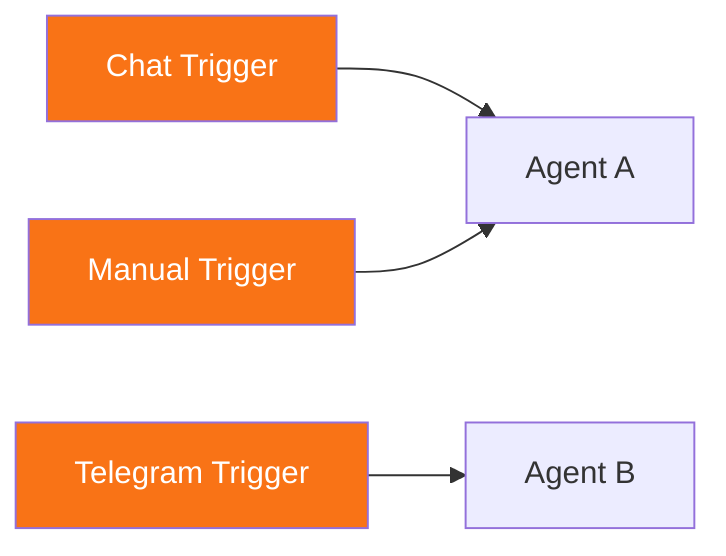

# Triggers

<span class="badge badge--trigger">Trigger</span>

Triggers are the entry points of every workflow. They receive events from external sources -- a chat message, a Telegram update, a scheduled interval, or an error condition -- and initiate workflow execution.

## Triggers Are Nodes

In Pipelit, triggers are **not** separate entities. They are first-class nodes on the canvas, sharing the same unified node model as agents, tools, and logic components. This means:

- Triggers appear on the canvas with the same drag-and-drop behavior as other nodes.
- They have defined output ports that emit typed data downstream.
- They connect to other nodes via standard edges.
- Multiple triggers can exist on the same canvas, each firing independently.

On the canvas, all trigger nodes display with an **orange border** (`#f97316`) and strip the `trigger_` prefix in their label (e.g., `trigger_telegram` displays as `telegram`).

## Trigger Types

| Component Type | Display Name | Description |
|----------------|-------------|-------------|
| [`trigger_chat`](chat.md) | Chat Trigger | Built-in web chat interface |
| [`trigger_telegram`](telegram.md) | Telegram Trigger | Receives messages from Telegram bots |
| [`trigger_manual`](manual.md) | Manual Trigger | One-click execution from the UI |
| [`trigger_schedule`](schedule.md) | Schedule Trigger | Fired by the scheduler system on intervals |
| [`trigger_workflow`](workflow.md) | Workflow Trigger | Triggered by a parent workflow |
| [`trigger_error`](error.md) | Error Trigger | Triggered when errors occur in the workflow |

## Trigger-Scoped Execution

When a trigger fires, the execution engine does **not** compile the entire workflow graph. Instead, it performs a BFS (breadth-first search) from the fired trigger node and only compiles nodes that are **reachable downstream** from that trigger via direct edges.

This design has two important consequences:

1. **Multiple trigger branches**: A single workflow can have a Chat Trigger feeding one agent and a Telegram Trigger feeding a different agent. Each trigger fires independently and only executes its own branch.

2. **Unused nodes are ignored**: Nodes on the canvas that are not connected to the firing trigger are skipped entirely. This allows you to keep draft or experimental nodes on the canvas without causing build errors.



In this example, firing the Chat Trigger executes only Agent A. Firing the Telegram Trigger executes only Agent B. The Manual Trigger also routes to Agent A, providing a second entry point to the same branch.

## Trigger Resolution

When an event arrives (e.g., a Telegram message), the **TriggerResolver** matches the event type to the appropriate `component_type` and finds the first active trigger node that matches:

| Event Type | Component Type |
|------------|---------------|
| `telegram_message` / `telegram_chat` | `trigger_telegram` |
| `schedule` | `trigger_schedule` |
| `manual` | `trigger_manual` |
| `workflow` | `trigger_workflow` |
| `error` | `trigger_error` |

Chat triggers are handled differently -- they are invoked directly via the `POST /workflows/{slug}/chat/` API endpoint rather than going through the resolver.

## Trigger Payload

Every trigger receives an event payload that becomes available to downstream nodes via the `trigger` Jinja2 shorthand:

```
{{ trigger.text }}       {# message text from chat or telegram #}
{{ trigger.payload }}    {# full event payload object #}
```

The exact fields available depend on the trigger type. See each trigger's documentation for its specific output ports.

## Non-Executable Status

Triggers themselves do not "execute" in the traditional sense -- they initiate execution. On the canvas, trigger nodes do not show running/success/failed status badges during execution. Their role is to receive events and pass data downstream to the first executable node in the chain.
