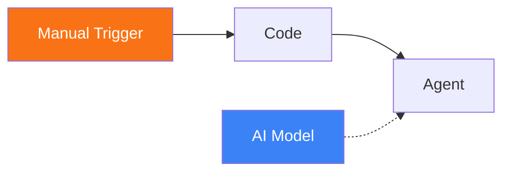
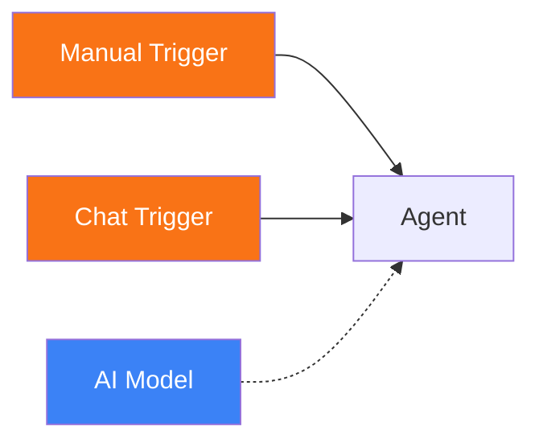

# Manual Trigger

<span class="badge badge--trigger">Trigger</span>

The Manual Trigger provides one-click workflow execution from the Pipelit UI. It is the simplest trigger type -- click a button and the workflow runs. This is useful for testing, administrative tasks, and workflows that should be run on demand.

**Component type:** `trigger_manual`

---

## Ports

### Outputs

| Port | Type | Description |
|------|------|-------------|
| `payload` | OBJECT | Trigger payload containing optional text and metadata |

### Inputs

This component has no input ports. It is an entry point.

## Configuration

The Manual Trigger requires no configuration. Add it to the canvas and connect it to downstream nodes.

An optional `text` field can be provided at execution time, which is included in the payload.

## Usage

1. Drag a **Manual Trigger** onto the canvas from the Node Palette (under Triggers).
2. Connect its output to downstream nodes.
3. Execute the workflow by clicking the **Run** button in the workflow editor or by calling the API endpoint.

### Accessing Manual Trigger Data

The manual trigger payload is available via Jinja2 expressions:

```
{{ trigger.payload }}       {# full payload object #}
{{ trigger.payload.text }}  {# optional text if provided #}
```

### Running via the UI

In the workflow editor, when a Manual Trigger is present on the canvas, you can click the execute button to fire it. If the workflow has multiple Manual Trigger nodes, you can specify which one to target.

### Running via the API

```
POST /api/v1/workflows/{workflow_slug}/execute/
```

Request body:

```json
{
  "text": "optional input text",
  "trigger_node_id": "trigger_manual_abc123"
}
```

Both fields are optional. If `trigger_node_id` is omitted, the first `trigger_manual` node in the workflow is used. If `text` is omitted, it defaults to an empty string.

## Example

A manual workflow for running a maintenance task:



1. **Manual Trigger** is fired by clicking Run.
2. **Code** node runs a preparation script.
3. **Agent** processes the results and produces a summary.

### Dual-entry workflow

A Manual Trigger can coexist with other triggers on the same workflow, providing a way to test the same pipeline manually:



Both triggers feed the same Agent. Use the Chat Trigger for interactive use and the Manual Trigger for quick test runs.
