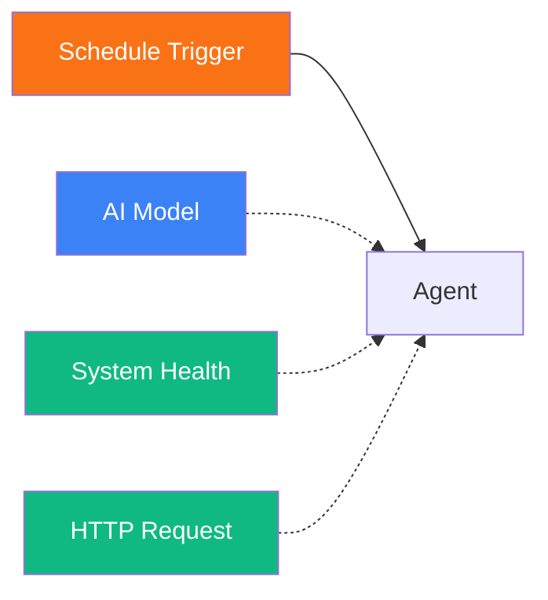
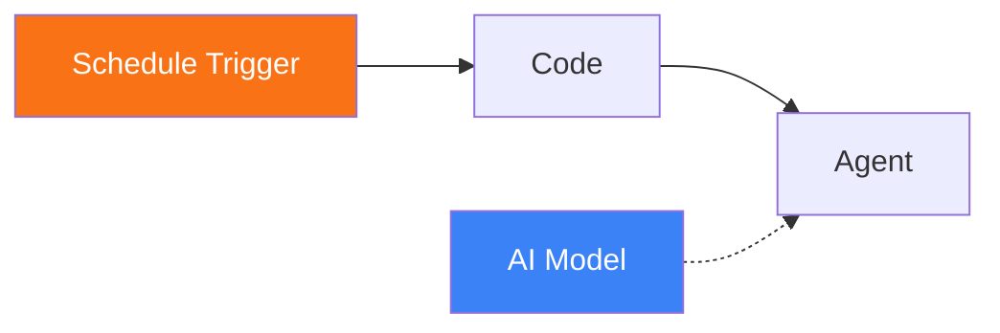

# Schedule Trigger

<span class="badge badge--trigger">Trigger</span>

The Schedule Trigger is fired by the Pipelit scheduler system at configured intervals. It enables recurring workflow execution without external cron -- interval-based scheduling with retry logic, pause/resume, and automatic crash recovery.

**Component type:** `trigger_schedule`

---

## Ports

### Outputs

| Port | Type | Description |
|------|------|-------------|
| `timestamp` | STRING | ISO 8601 timestamp of when the trigger fired |

### Inputs

This component has no input ports. It is an entry point.

## Configuration

The Schedule Trigger itself requires no canvas-level configuration. Scheduling is managed through **ScheduledJob** records, which are created and controlled via the Schedules API.

### ScheduledJob Properties

| Field | Description |
|-------|-------------|
| `workflow_id` | The workflow to execute |
| `trigger_node_id` | The specific Schedule Trigger node to fire |
| `interval_seconds` | Time between executions (e.g., 3600 for hourly) |
| `repeat_count` | How many times to repeat (0 = infinite) |
| `retry_max` | Maximum retries on failure |
| `status` | `active`, `paused`, `done`, or `dead` |
| `next_run_at` | Timestamp of the next scheduled execution |

### Trigger-Level Matching

The trigger's configuration supports an optional `scheduled_job_id` field. When set, the trigger only fires for events from that specific ScheduledJob. This allows multiple Schedule Triggers on the same workflow to be targeted by different schedules.

## Usage

1. Drag a **Schedule Trigger** onto the canvas.
2. Connect it to downstream nodes that should execute on a recurring basis.
3. Create a ScheduledJob via the API that targets this workflow and trigger node.

### Creating a Scheduled Job

```
POST /api/v1/schedules/
```

```json
{
  "workflow_id": 1,
  "trigger_node_id": "trigger_schedule_abc123",
  "interval_seconds": 3600,
  "repeat_count": 0,
  "retry_max": 3
}
```

This creates a job that fires every hour, repeats indefinitely, and retries up to 3 times on failure.

### Managing Schedules

| Endpoint | Action |
|----------|--------|
| `POST /schedules/{id}/pause/` | Pause the schedule |
| `POST /schedules/{id}/resume/` | Resume a paused schedule |
| `DELETE /schedules/{id}/` | Delete the schedule |
| `GET /schedules/` | List all schedules |

### Accessing Schedule Data Downstream

Reference the trigger timestamp in downstream nodes:

```
{{ trigger.timestamp }}
```

The payload also contains the `scheduled_job_id` for identifying which schedule triggered the execution.

## How the Scheduler Works

The Pipelit scheduler uses a **self-rescheduling** architecture built on RQ (Redis Queue):

1. A ScheduledJob is created and enqueued as an RQ job.
2. When the job fires, it dispatches the workflow via `dispatch_event("schedule", ...)`.
3. After execution, the scheduler calls `_enqueue_next()` to schedule itself again using `Queue.enqueue_in()`.
4. Each enqueued job gets a deterministic RQ job ID (`sched-{id}-n{repeat}-rc{retry}`) to prevent duplicate enqueues.
5. On failure, exponential backoff is applied, capped at 10x the interval.
6. On startup, `recover_scheduled_jobs()` re-enqueues any active jobs whose `next_run_at` is in the past.

## Example

A scheduled monitoring workflow:



1. **Schedule Trigger** fires every hour.
2. **Agent** checks system health and makes HTTP requests to external services.
3. Results are logged or sent via a delivery channel.

### Scheduled report with Telegram delivery



A daily report workflow: the Schedule Trigger fires at a set interval, a Code node gathers data, and an Agent summarizes and formats the report for delivery.
