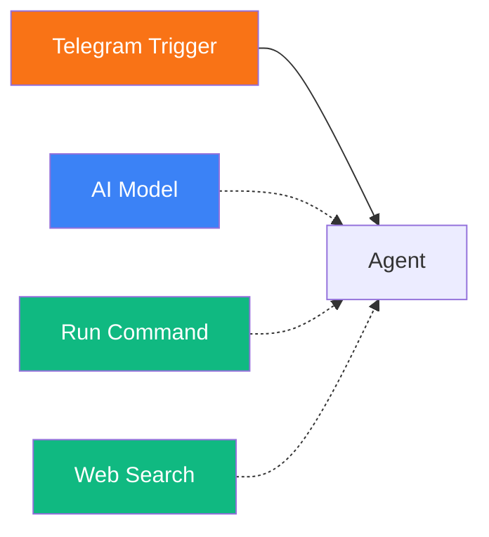
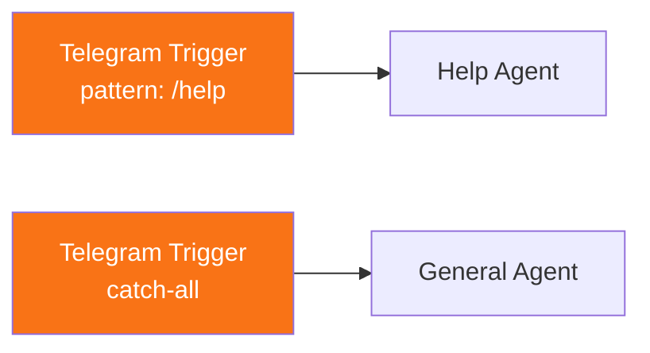

# Telegram Trigger

<span class="badge badge--trigger">Trigger</span>

The Telegram Trigger receives messages from Telegram bots via webhook integration. When a user sends a message to your Telegram bot, the trigger fires and passes the message text, chat ID, and full payload to downstream nodes.

**Component type:** `trigger_telegram`

---

## Ports

### Outputs

| Port | Type | Description |
|------|------|-------------|
| `text` | STRING | The message text sent by the Telegram user |
| `chat_id` | NUMBER | The Telegram chat ID (used for sending replies) |
| `payload` | OBJECT | Full trigger payload including user ID, message ID, and bot token |

### Inputs

This component has no input ports. It is an entry point.

## Configuration

### Telegram Bot Credential

The Telegram Trigger requires a **Telegram credential** to be configured on the platform. This credential contains:

- **Bot Token**: The token from BotFather (e.g., `123456:ABC-DEF...`)
- **Allowed User IDs** (optional): Comma-separated list of Telegram user IDs that are permitted to interact with the bot. If empty, all users are allowed.

Create a Telegram credential on the **Credentials** page before using this trigger.

### Trigger-Level Matching

The trigger resolver supports optional matching rules in the trigger's configuration:

| Config Field | Description |
|-------------|-------------|
| `allowed_user_ids` | List of Telegram user IDs to accept (empty = all) |
| `pattern` | Regex pattern to match against message text |
| `command` | Telegram command to match (e.g., `start` matches `/start`) |

These rules determine which workflow handles a given Telegram message when multiple workflows have Telegram triggers.

## Usage

1. Create a Telegram bot via [BotFather](https://t.me/BotFather) and obtain the bot token.
2. Add a **Telegram** credential on the Credentials page with the bot token.
3. Drag a **Telegram Trigger** onto the canvas.
4. Connect it to an Agent or other downstream nodes.
5. Set up the webhook URL to point to your Pipelit instance:

```
https://your-pipelit-domain/api/v1/telegram/webhook/{bot_token}/
```

### Accessing Telegram Data Downstream

Reference trigger outputs using Jinja2 expressions:

```
{{ trigger.text }}       {# message text #}
{{ trigger.chat_id }}    {# chat ID for replies #}
{{ trigger.payload }}    {# full payload object #}
```

The payload object includes:

```json
{
  "user_id": 123456789,
  "chat_id": 123456789,
  "message_id": 42,
  "text": "Hello bot!",
  "bot_token": "123456:ABC-DEF..."
}
```

### Automatic Replies

When the workflow execution completes, the **delivery service** automatically sends the agent's final output back to the Telegram chat as a reply. A typing indicator is displayed while the workflow is processing.

### Human Confirmation via Telegram

If the workflow includes a **Human Confirmation** node downstream of the Telegram Trigger, the confirmation prompt is sent to the Telegram chat with inline buttons. The user can approve or cancel directly from Telegram using `/confirm_{task_id}` and `/cancel_{task_id}` commands, or the `/pending` command to list all pending confirmations.

## Example

A Telegram bot workflow with tool access:



1. **Telegram Trigger** receives a message from a Telegram user.
2. **Agent** processes the message with access to shell commands and web search tools.
3. The agent's response is automatically delivered back to the Telegram chat.

### Filtered trigger for specific commands



With pattern matching, different Telegram triggers can route specific commands to specialized agents while a catch-all handles everything else.

## User Management

When a Telegram user first interacts with the bot, Pipelit automatically creates a `UserProfile` for them using their Telegram user data (username, first name, last name). Subsequent messages from the same Telegram user ID are associated with the existing profile, enabling conversation memory continuity.
