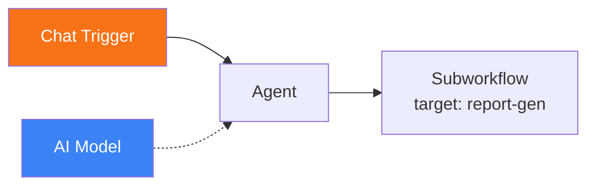
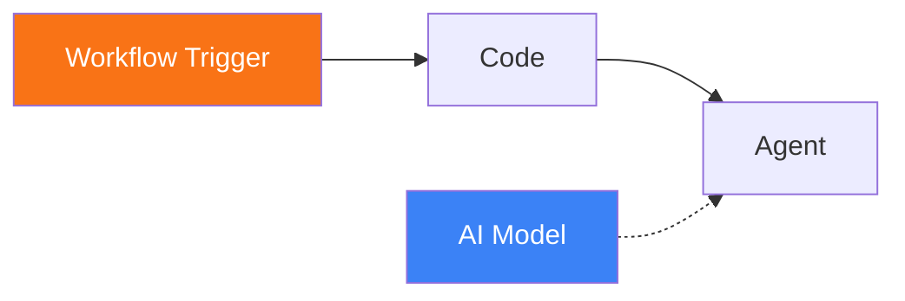
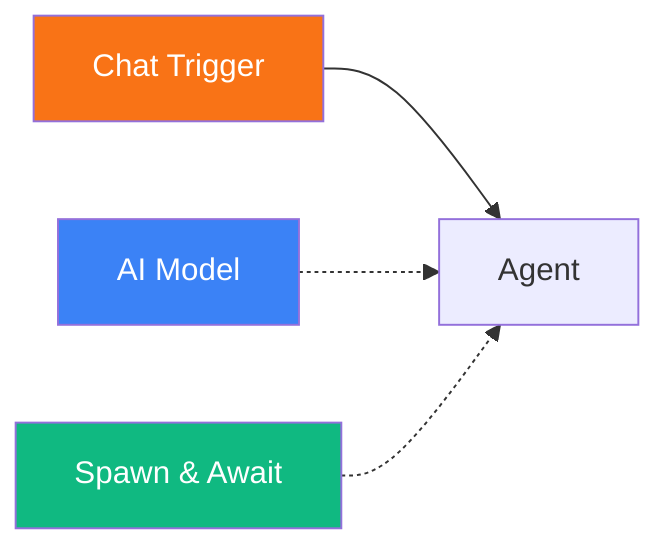

# Workflow Trigger

<span class="badge badge--trigger">Trigger</span>

The Workflow Trigger is fired when a parent workflow invokes this workflow as a child. It receives the payload passed by the parent through a **Subworkflow** node or a **Spawn & Await** tool, enabling hierarchical workflow composition.

**Component type:** `trigger_workflow`

---

## Ports

### Outputs

| Port | Type | Description |
|------|------|-------------|
| `payload` | OBJECT | Data passed from the parent workflow |

### Inputs

This component has no input ports. It is an entry point.

## Configuration

The Workflow Trigger supports an optional `source_workflow` field in its trigger configuration. When set, the trigger only fires for invocations from the specified parent workflow slug. When not set, it accepts invocations from any parent.

## Usage

1. Create a **child workflow** that performs a specific task.
2. Drag a **Workflow Trigger** onto the child workflow's canvas.
3. Connect it to the nodes that process the incoming payload.
4. In the **parent workflow**, use either:
    - A **Subworkflow** node (logic category) to invoke the child synchronously.
    - A **Spawn & Await** tool (self-awareness category) to invoke the child from within an agent's reasoning loop.

### Accessing Parent Data

The parent workflow's data is available through the `payload` output port:

```
{{ trigger.payload }}
```

The contents of the payload depend on what the parent sends. For a Subworkflow node, the payload is defined by the `input_mapping` configuration. For Spawn & Await, the agent determines what data to pass.

### Source Workflow Filtering

When multiple parent workflows might invoke the same child, you can use the `source_workflow` trigger config to restrict which parent is allowed:

```json
{
  "trigger_config": {
    "source_workflow": "parent-workflow-slug"
  }
}
```

If omitted, the trigger accepts invocations from any workflow.

## Example

A child workflow invoked by a parent:

**Parent workflow:**


**Child workflow (`report-gen`):**


1. The parent's Chat Trigger receives a user request.
2. The parent Agent decides to delegate to the `report-gen` child workflow.
3. The **Subworkflow** node invokes the child, passing data via `input_mapping`.
4. The child's **Workflow Trigger** receives the payload.
5. The child's Code and Agent nodes process the request.
6. The child's final output is returned to the parent's Subworkflow node.

### Agent-driven child invocation

When using Spawn & Await as a tool connected to an agent, the agent autonomously decides when to invoke the child workflow and what data to pass:



The agent calls the Spawn & Await tool during its reasoning loop, specifying the target workflow slug and payload. The child workflow must have a Workflow Trigger to receive the invocation.
