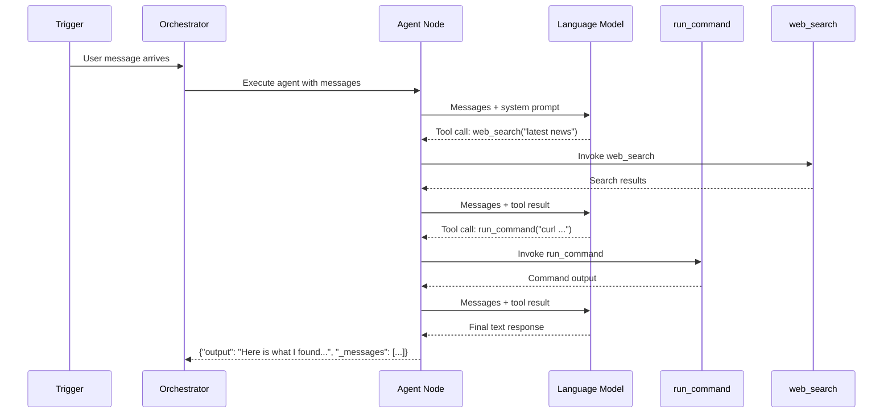

# Agents

Agents are the core AI nodes in Pipelit. The standard **Agent** is a LangGraph ReAct agent -- an LLM that can reason about a task, decide which tools to call, observe the results, and iterate until it produces a final answer. For more advanced use cases, the **[Deep Agent](../components/ai/deep-agent.md)** extends this with built-in task planning, filesystem tools, and inline subagent delegation.

## How ReAct Agents Work

The ReAct (Reason + Act) pattern gives an LLM a loop:

1. **Reason** -- the LLM reads the conversation so far and decides what to do next.
2. **Act** -- if it needs more information, it calls one of its connected tools.
3. **Observe** -- the tool result is appended to the conversation as a `ToolMessage`.
4. **Repeat** -- the LLM reasons again with the new information, calling more tools or producing a final response.

In Pipelit, this loop is powered by LangGraph's `create_agent()`. The agent continues reasoning and acting until it produces a text response without any tool calls.



## Agent Sub-Components

Every agent node has diamond-shaped handles on its bottom edge for connecting sub-components:

| Sub-Component | Handle Color | Required | Purpose |
|---------------|-------------|----------|---------|
| **Model** | Blue (`#3b82f6`) | Yes | The LLM provider and model to use |
| **Tools** | Green (`#10b981`) | No | LangChain tools the agent can call |
| **Memory** | Amber (`#f59e0b`) | No | Global memory read/write access |

!!! warning "Model is Required"
    Every agent node must have an AI Model sub-component connected via the blue "model" handle. Without it, the agent cannot resolve which LLM to use and will fail at build time. The model node's credential and model name (e.g., `gpt-4o`, `claude-sonnet-4-20250514`) are set in its configuration panel.

## System Prompts

The system prompt defines the agent's personality, instructions, and constraints. It is delivered to the LLM in two ways:

1. **SystemMessage** -- passed via `create_agent(prompt=SystemMessage(...))` for the standard system role.
2. **HumanMessage fallback** -- a `HumanMessage` with a stable ID prefixed with `[System instructions]` is prepended to the conversation. This handles LLM providers (e.g., Venice.ai) that ignore the system role entirely.

The stable ID (`system_prompt_fallback`) prevents the fallback message from being duplicated across checkpointer invocations, thanks to LangGraph's `add_messages` reducer which deduplicates by message ID.

### Jinja2 Template Support

System prompts support Jinja2 template expressions. Before the agent executes, the orchestrator resolves `{{ }}` expressions against upstream node outputs and trigger data:

```
You are a customer support agent for {{ trigger.payload.company_name }}.
The user said: {{ trigger.text }}
Previous analysis: {{ categorizer_abc123.category }}
```

See the [Expressions](expressions.md) concept page for full details.

## Tool Calling

Agents invoke tools through LangChain's function-calling interface. At build time, the agent queries all edges with `edge_label="tool"` pointing to it, loads each connected tool node's factory, and registers the resulting `@tool` functions.

When the LLM decides to call a tool during reasoning:

1. The tool's wrapper publishes a `node_status` WebSocket event with `status: "running"` for the tool node.
2. The tool function executes (e.g., running a shell command, making an HTTP request).
3. On completion, a `node_status` event with `status: "success"` or `status: "failed"` is published.
4. The tool result is returned to the LLM as a `ToolMessage`.

This means tool nodes on the canvas show real-time status badges (spinning circle, checkmark, or X) as the agent uses them.

!!! tip "Tools Without Tool Calls"
    If an agent has no tools connected, it strips any `ToolMessage` and tool-call AI messages from upstream agents to avoid confusing the LLM with foreign tool calls it cannot handle.

## Conversation Memory

By default, agents are **stateless** -- each execution starts with a fresh conversation. Enabling **Conversation Memory** persists the conversation history across executions so the agent remembers prior interactions.

### How It Works

When conversation memory is enabled (toggle in the Node Details Panel):

- A **SqliteSaver** checkpointer stores the full conversation state in `platform/checkpoints.db`.
- Each invocation uses a **thread ID** to identify which conversation to resume.
- The checkpointer is a lazy singleton -- initialized once and reused across all executions.

### Thread ID Construction

The thread ID determines which conversation history an agent loads. It is constructed from three components:

```
{user_profile_id}:{telegram_chat_id}:{workflow_id}
```

| Component | Source | Purpose |
|-----------|--------|---------|
| `user_profile_id` | `state["user_context"]` | Identifies the human user |
| `telegram_chat_id` | `state["user_context"]` | Separates Telegram chats (omitted if empty) |
| `workflow_id` | Agent node's workflow | Isolates conversations per workflow |

This means:

- The same user talking to the same workflow always gets the same conversation thread.
- Different users get separate threads even on the same workflow.
- Different Telegram chats (group vs. DM) get separate threads.
- If there is no Telegram chat ID, the thread ID simplifies to `{user_profile_id}:{workflow_id}`.

!!! info "Ephemeral Checkpoints for Spawn & Await"
    If an agent has a `spawn_and_await` tool connected but conversation memory is disabled, a **RedisSaver** checkpointer is used instead of SqliteSaver. This ephemeral checkpointer only persists state long enough for the child workflow to complete and the agent to resume. The thread ID uses the format `exec:{execution_id}:{node_id}`.

### Stale Checkpoint Cleanup

When an execution fails (especially mid-interrupt during `spawn_and_await`), the SqliteSaver checkpoint may retain orphaned tool calls with no matching `ToolMessage`. On the next conversation turn, this would cause an `INVALID_CHAT_HISTORY` error. Pipelit automatically detects and deletes stale checkpoints for failed executions to prevent this.

## Deep Agent

The **Deep Agent** (`deep_agent`) is an advanced alternative to the standard Agent, powered by the `deepagents` library. While it shares the same ReAct reasoning loop and output format, it includes built-in capabilities that the standard Agent requires canvas tool connections for:

- **Task Planning (Todos)** -- the agent can create and manage a task list during execution, breaking complex requests into steps.
- **Filesystem Tools** -- built-in file read/write with selectable backends (`state` for in-memory, `filesystem` for disk, `store` for LangGraph store).
- **Inline Subagents** -- define specialized sub-agents directly in the node configuration. The parent agent can delegate subtasks to them without needing separate workflows or Spawn & Await nodes.

Deep Agent supports canvas tool connections (green diamond handle) just like the standard Agent, so you can combine built-in features with external tools like web search or HTTP requests.

For full configuration details, see the [Deep Agent component reference](../components/ai/deep-agent.md).

## Agent Output

When an agent finishes its reasoning loop, the component returns:

| Key | Type | Description |
|-----|------|-------------|
| `output` | `string` | The final text content from the last AI message |
| `_messages` | `list` | All messages from the agent's execution (appended to workflow state) |
| `_token_usage` | `dict` | Token counts, cost in USD, and tool invocation count |

The `output` value is what downstream nodes see in `{{ agent_abc123.output }}`. The `_messages` list preserves the full conversation including tool calls and responses for logging and downstream agents.

## Configuration Reference

| Setting | Location | Description |
|---------|----------|-------------|
| System Prompt | Node Details Panel | Instructions and persona for the agent |
| Conversation Memory | Extra Config toggle | Enable/disable cross-execution memory |
| LLM Model | Connected AI Model node | Which provider and model to use |
| Tools | Connected tool nodes | Which tools the agent can call |
