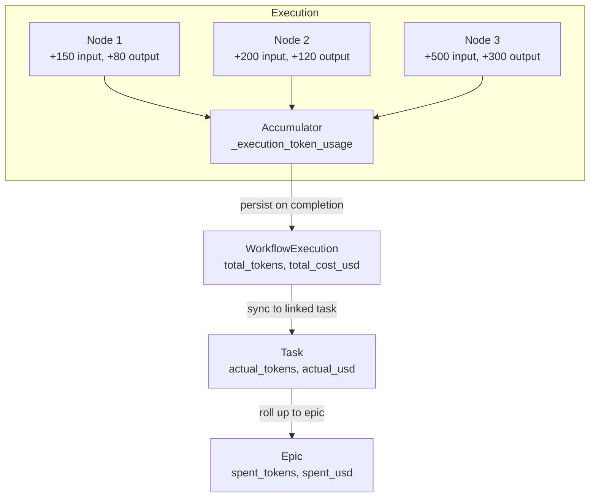
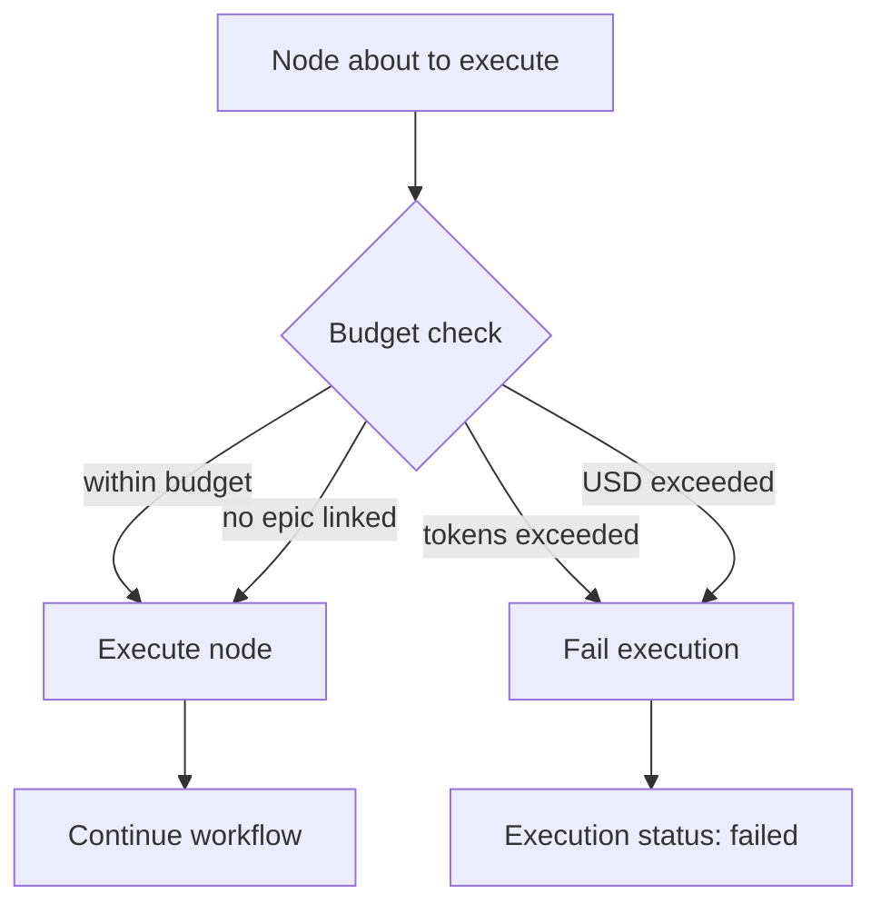

# Cost Tracking

Pipelit tracks token usage and USD costs for every LLM call across every execution. Costs roll up from individual nodes to executions, from executions to tasks, and from tasks to epics -- giving you visibility at every level and enabling budget enforcement that prevents runaway spending.

## How costs are tracked



### Per-node token extraction

After each node executes, the orchestrator extracts token usage from the component's output via the `_token_usage` reserved key. The token usage dict contains:

| Field | Description |
|-------|-------------|
| `input_tokens` | Tokens sent to the LLM (prompt + context) |
| `output_tokens` | Tokens generated by the LLM (response) |
| `total_tokens` | Sum of input and output tokens |
| `llm_calls` | Number of LLM API calls in this node |

For agent nodes that make multiple LLM calls (e.g., during a ReAct reasoning loop with tool calls), the usage is extracted from all AI messages in the conversation via `extract_usage_from_messages()`.

### Execution-level accumulation

Token usage from each node is merged into a running total stored in the execution state as `_execution_token_usage`:

```python
state["_execution_token_usage"] = merge_usage(existing_usage, node_usage)
```

The `merge_usage()` function sums all numeric fields across the two dicts. When the execution completes (success or failure), the accumulated totals are persisted to the `WorkflowExecution` model.

### USD cost calculation

USD cost is calculated using a built-in pricing table that maps model name prefixes to per-million-token rates:

| Model Prefix | Input (per 1M tokens) | Output (per 1M tokens) |
|-------------|----------------------|------------------------|
| `gpt-4o-mini` | $0.15 | $0.60 |
| `gpt-4o` | $2.50 | $10.00 |
| `gpt-4-turbo` | $10.00 | $30.00 |
| `gpt-4` | $30.00 | $60.00 |
| `gpt-3.5-turbo` | $0.50 | $1.50 |
| `o3-mini` | $1.10 | $4.40 |
| `o1-mini` | $3.00 | $12.00 |
| `o1` | $15.00 | $60.00 |
| `claude-3-5-sonnet` | $3.00 | $15.00 |
| `claude-3-5-haiku` | $0.80 | $4.00 |
| `claude-3-opus` | $15.00 | $75.00 |
| `claude-sonnet-4` | $3.00 | $15.00 |
| `claude-opus-4` | $15.00 | $75.00 |

The pricing lookup uses **longest prefix matching** -- the model name is compared against prefixes in order, so `gpt-4o-mini-2024-07-18` correctly matches the `gpt-4o-mini` rate rather than the more expensive `gpt-4o` rate.

!!! note "Unknown models"
    Models that do not match any known prefix are tracked with `$0.00` cost. Token counts are still recorded accurately -- only the USD calculation is skipped.

The cost formula is:

```
cost_usd = (input_tokens * input_rate + output_tokens * output_rate) / 1,000,000
```

## Execution cost fields

Every `WorkflowExecution` records:

| Field | Type | Description |
|-------|------|-------------|
| `total_input_tokens` | int | Total input tokens across all nodes |
| `total_output_tokens` | int | Total output tokens across all nodes |
| `total_tokens` | int | Sum of input + output tokens |
| `total_cost_usd` | decimal | Calculated USD cost |
| `llm_calls` | int | Total number of LLM API calls |

These fields are populated when the execution completes (or fails) via `_persist_execution_costs()`.

## Epic-level budget enforcement

When an execution is linked to a task within an epic, the orchestrator enforces budget limits **before every node execution**.



### How budget enforcement works

The `_check_budget()` function runs before each node in the orchestrator:

1. Look up the `Task` linked to this execution (via `Task.execution_id`)
2. If no task or no epic, skip budget checks
3. Read the current execution's accumulated token usage from state
4. **Token budget**: Add current execution tokens to the epic's `spent_tokens`. If the total exceeds `epic.budget_tokens`, fail the execution.
5. **USD budget**: Add current execution cost to the epic's `spent_usd`. If the total exceeds `epic.budget_usd`, fail the execution.

!!! danger "Budget overruns are hard stops"
    When a budget is exceeded, the execution is immediately marked as `failed` with a descriptive error message. The execution's accumulated costs are persisted, and the task and epic costs are synced before the failure is broadcast.

### Cost roll-up

When a child execution completes, the orchestrator syncs costs in two steps:

**Step 1 -- Execution to task:**

```python
task.actual_tokens = execution.total_tokens
task.actual_usd = float(execution.total_cost_usd)
task.llm_calls = execution.llm_calls
task.tool_invocations = exec_usage.get("tool_invocations", 0)
```

**Step 2 -- Tasks to epic (recalculated, not incremental):**

```python
epic.spent_tokens = SUM(task.actual_tokens) for all tasks in epic
epic.spent_usd = SUM(task.actual_usd) for all tasks in epic
```

The epic totals are always recalculated from scratch by summing all task costs. This avoids double-counting issues that could arise from incremental updates.

## Monitoring costs

### Execution detail page

The Execution Detail page (`/executions/:id`) displays token counts and cost for each completed execution.

### WebSocket events

Node-level token usage is included in `node_status` WebSocket events when a node completes with `status: success`:

```json
{
  "type": "node_status",
  "node_id": "agent_abc123",
  "status": "success",
  "token_usage": {
    "input_tokens": 1500,
    "output_tokens": 450,
    "total_tokens": 1950,
    "llm_calls": 3
  }
}
```

### API endpoints

Query execution costs via the REST API:

| Endpoint | Description |
|----------|-------------|
| `GET /api/v1/executions/` | List executions with cost fields |
| `GET /api/v1/executions/{id}/` | Execution detail including token counts and USD cost |

Epic and task costs are available through the `epic_tools` and `task_tools` agent tools (e.g., `epic_status` returns `spent_tokens` and `spent_usd`).

## What's next?

- Learn how epics organize tasks with budgets: [Epics & Tasks](epics-and-tasks.md)
- Understand how workflows execute: [Execution](execution.md)
- Configure recurring executions: [Scheduler](scheduler.md)
