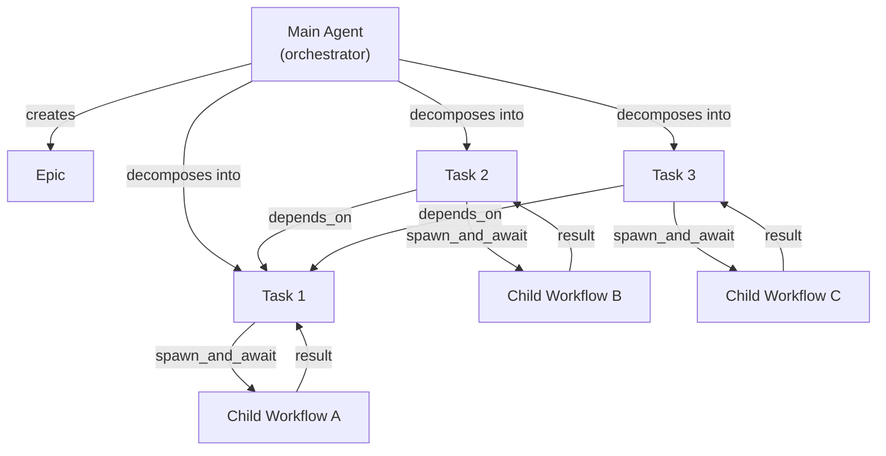
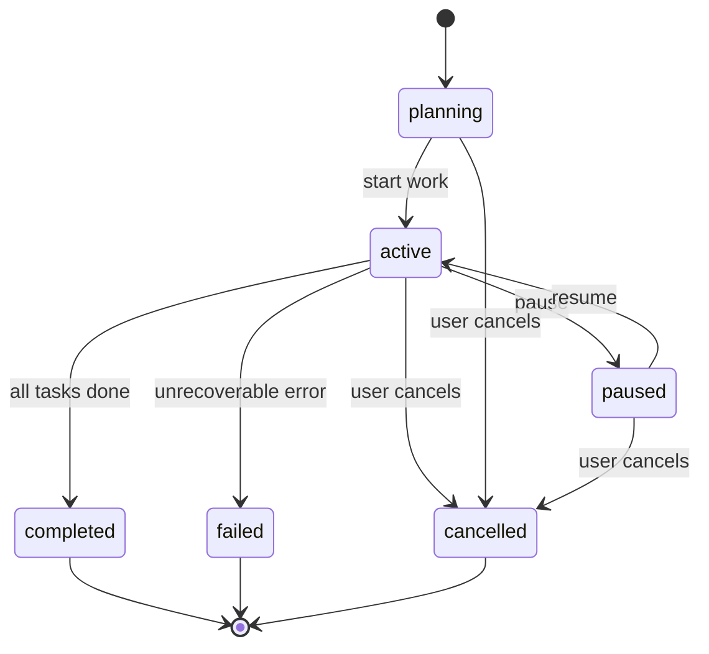
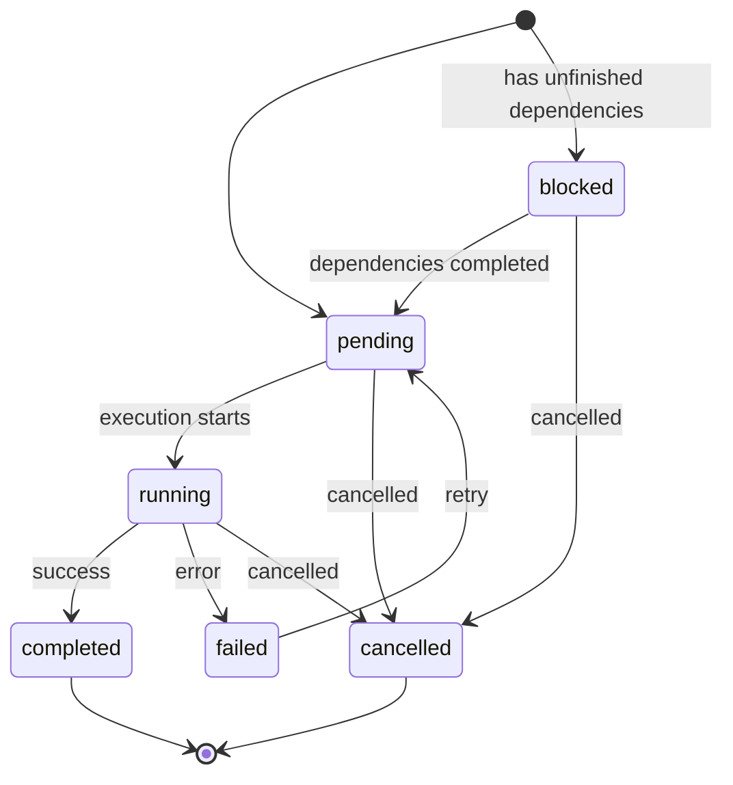
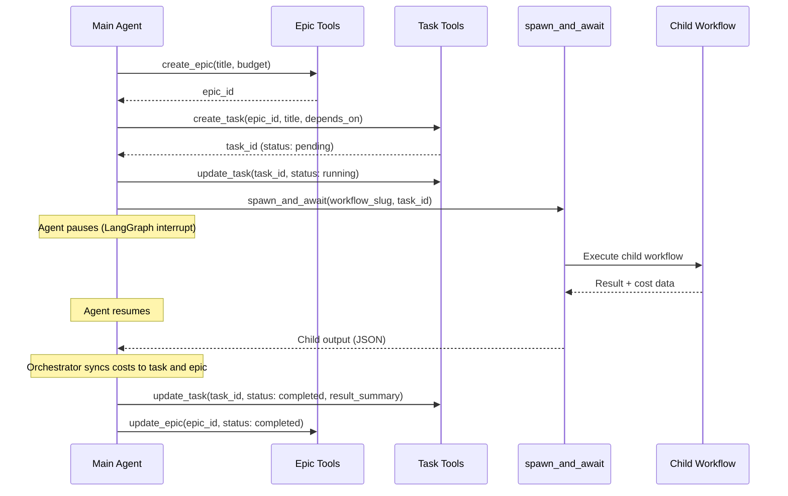
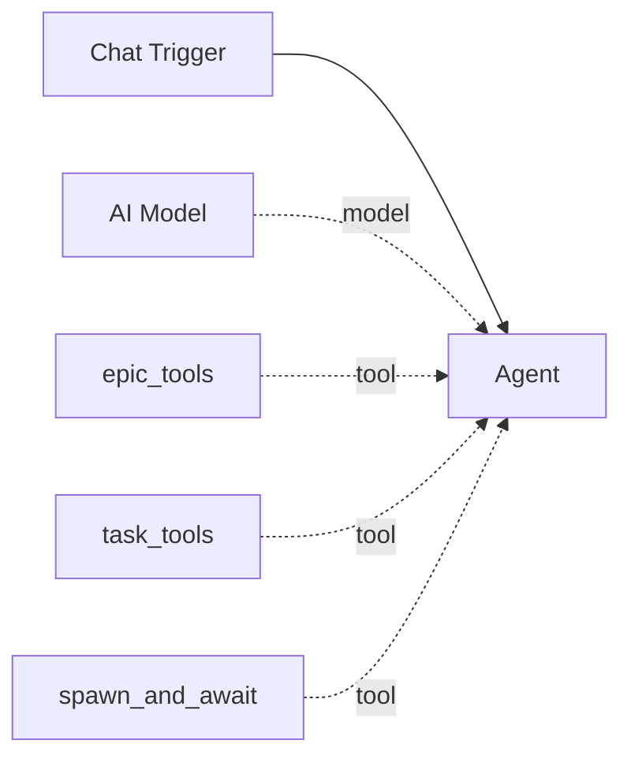

# Epics & Tasks

Epics and tasks form Pipelit's **multi-agent delegation system**. An epic is a high-level objective that gets decomposed into individual tasks, each of which can be executed by a separate workflow. This enables a main orchestrator agent to plan, delegate, track, and budget complex multi-step operations.

## Overview

The pattern works as follows:

1. A main agent receives a complex objective
2. It creates an **epic** to represent the objective
3. It decomposes the epic into **tasks** with dependencies
4. Each task is executed by spawning a child workflow via `spawn_and_await`
5. Results flow back, costs are tracked, and the epic status updates automatically

## Epics

An epic is a high-level objective that groups related tasks. It carries metadata for tracking progress, managing budgets, and recording outcomes.

### Epic fields

| Field | Type | Description |
|-------|------|-------------|
| `id` | string | Auto-generated ID (e.g., `ep-a1b2c3d4e5f6`) |
| `title` | string | Human-readable objective title |
| `description` | text | Detailed description of the objective |
| `tags` | JSON list | Labels for categorization and search |
| `status` | string | Current lifecycle state |
| `priority` | int | Priority level 1--5 (1 = highest) |
| `budget_tokens` | int | Optional token budget limit |
| `budget_usd` | decimal | Optional USD budget limit |
| `spent_tokens` | int | Total tokens consumed across all tasks |
| `spent_usd` | decimal | Total USD spent across all tasks |
| `total_tasks` | int | Number of tasks in this epic |
| `completed_tasks` | int | Number of successfully completed tasks |
| `failed_tasks` | int | Number of failed tasks |
| `result_summary` | text | Summary of the outcome when completed |

### Epic lifecycle

| Status | Meaning |
|--------|---------|
| `planning` | Epic created, tasks being defined |
| `active` | Work is in progress |
| `paused` | Temporarily halted |
| `completed` | All tasks finished successfully |
| `failed` | Unrecoverable failure |
| `cancelled` | Manually cancelled (cascades to pending/blocked/running tasks) |

!!! info "Cancellation cascade"
    When an epic is cancelled, all of its tasks with status `pending`, `blocked`, or `running` are automatically set to `cancelled`.

### Cost tracking on epics

Epics track spending at two levels:

- **Task-level costs** (`spent_tokens`, `spent_usd`): Rolled up from the `actual_tokens` and `actual_usd` fields of all tasks in the epic.
- **Agent overhead** (`agent_overhead_tokens`, `agent_overhead_usd`): Tokens consumed by the orchestrator agent itself (planning, reasoning, tool calls) as distinct from child workflow execution.

Budget enforcement is checked before every node execution. See [Cost Tracking](cost-tracking.md) for details.

## Tasks

A task is an individual work item within an epic. Tasks have dependencies, lifecycle tracking, cost accounting, and can be linked to workflow executions.

### Task fields

| Field | Type | Description |
|-------|------|-------------|
| `id` | string | Auto-generated ID (e.g., `tk-a1b2c3d4e5f6`) |
| `epic_id` | string | Parent epic (cascade delete) |
| `title` | string | What this task accomplishes |
| `description` | text | Detailed instructions |
| `tags` | JSON list | Labels for filtering |
| `status` | string | Current lifecycle state |
| `priority` | int | Priority 1--5 |
| `depends_on` | JSON list | List of task IDs that must complete first |
| `workflow_slug` | string | Target workflow to execute for this task |
| `execution_id` | string | Linked execution ID once spawned |
| `estimated_tokens` | int | Token cost estimate |
| `actual_tokens` | int | Actual tokens consumed |
| `actual_usd` | decimal | Actual USD spent |
| `llm_calls` | int | Number of LLM API calls made |
| `tool_invocations` | int | Number of tool calls made |
| `duration_ms` | int | Execution wall-clock time |
| `result_summary` | text | Outcome summary |
| `error_message` | text | Error details if failed |
| `retry_count` | int | Current retry attempt |
| `max_retries` | int | Maximum retry attempts (default 2) |
| `notes` | JSON list | Append-only notes log |

### Task lifecycle

| Status | Meaning |
|--------|---------|
| `pending` | Ready to execute (all dependencies met) |
| `blocked` | Waiting for dependent tasks to complete |
| `running` | Currently executing in a child workflow |
| `completed` | Finished successfully |
| `failed` | Execution failed |
| `cancelled` | Manually cancelled |

!!! tip "Automatic dependency resolution"
    When a task is created with `depends_on` IDs, it automatically starts in `blocked` status if any dependencies are not yet completed. When a dependency completes, all tasks that were blocked on it are automatically checked and unblocked if all their dependencies are now satisfied.

## Multi-agent delegation

The delegation pattern connects epic/task management with Pipelit's workflow execution engine through the `spawn_and_await` tool.

### spawn_and_await

The `spawn_and_await` tool is how an agent launches a child workflow and waits for its result:

1. The agent calls `spawn_and_await(workflow_slug, input_text, task_id)`
2. LangGraph's `interrupt()` pauses the agent at the tool-call boundary
3. The orchestrator spawns the child workflow execution
4. When the child completes, the orchestrator resumes the parent with the child's output
5. If the child fails, a `ToolException` is raised so the agent can handle the error

!!! warning "Long-running operations"
    `spawn_and_await` uses LangGraph checkpointing to pause the parent agent. The parent workflow's execution is interrupted and resumed asynchronously. This means the parent is not consuming resources while waiting.

### Cost synchronization

When a child execution completes, the orchestrator automatically:

1. Copies token counts and USD cost from the execution to the linked task
2. Recalculates the epic's `spent_tokens` and `spent_usd` by summing all task costs
3. Records `llm_calls` and `tool_invocations` on the task

This ensures the epic always reflects the true total cost across all child executions without double-counting.

## Tool components

### epic_tools

The `epic_tools` component provides four LangChain tools for agents:

| Tool | Description |
|------|-------------|
| `create_epic` | Create a new epic with title, description, tags, priority, and optional budget |
| `epic_status` | Get detailed epic status including task breakdown and cost summary |
| `update_epic` | Update any epic field (status, title, priority, budgets, result summary) |
| `search_epics` | Search epics by text, tags, or status with aggregate statistics |

### task_tools

The `task_tools` component provides four LangChain tools for agents:

| Tool | Description |
|------|-------------|
| `create_task` | Create a task within an epic, with dependencies, tags, and token estimates |
| `list_tasks` | List tasks in an epic, optionally filtered by status or tags |
| `update_task` | Update task fields (status, title, priority, result summary, notes) |
| `cancel_task` | Cancel a task and optionally its linked execution |

### Connecting tools to an agent

On the workflow canvas, connect `epic_tools` and `task_tools` nodes to an agent via the **tools** handle (green diamond). You will typically also connect `spawn_and_await` so the agent can delegate tasks to child workflows.

## WebSocket events

Epic and task mutations broadcast real-time events over the global WebSocket:

| Event | Channel | Payload |
|-------|---------|---------|
| `epic_created` | `epic:{epic_id}` | Full epic serialization |
| `epic_updated` | `epic:{epic_id}` | Full epic serialization |
| `task_created` | `epic:{epic_id}` | Full task serialization |
| `task_updated` | `epic:{epic_id}` | Full task serialization |

## What's next?

- Understand how costs are tracked and budgets enforced: [Cost Tracking](cost-tracking.md)
- Learn about agent capabilities: [Agents](agents.md)
- See how workflows are scheduled: [Scheduler](scheduler.md)
