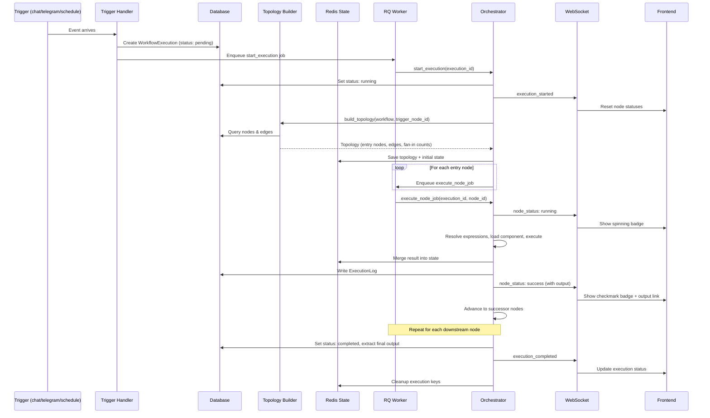
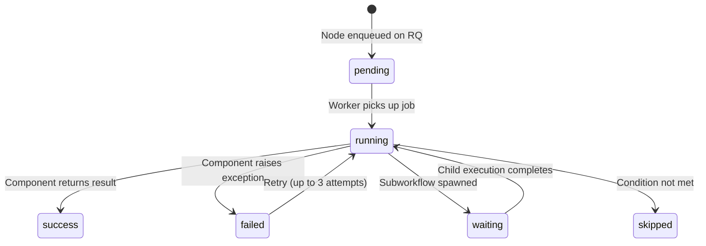

# Execution

An **execution** is a single run of a workflow. When a trigger fires, Pipelit compiles the reachable portion of the workflow into a directed graph, then the orchestrator runs each node asynchronously via RQ workers, broadcasting status updates over WebSocket in real time.

## Execution Lifecycle



## Trigger-Scoped Execution

When a trigger fires, the builder does **not** compile the entire workflow. Instead, it performs a BFS (breadth-first search) from the trigger node over direct edges to find all **reachable** downstream nodes. Only these nodes are included in the execution.

This design enables several patterns:

- **Multiple trigger branches** -- a single workflow can have a chat trigger and a Telegram trigger, each leading to different processing paths. Firing one trigger does not execute the other branch.
- **Unused nodes** -- nodes that are not connected to any trigger (e.g., nodes being configured but not yet wired in) are silently ignored.
- **No build errors from disconnected nodes** -- incomplete branches do not cause validation failures during execution.

!!! info "Sub-Component Exclusion"
    Sub-components (`ai_model`, tools, `output_parser`, `memory_read`, `memory_write`, etc.) are excluded from the execution graph even if reachable. They are resolved at build time by their parent nodes, not executed independently by the orchestrator.

## Node Status Lifecycle

Each node in an execution progresses through a status lifecycle:



| Status | Description | Canvas Badge |
|--------|-------------|-------------|
| `pending` | Node is queued on RQ, waiting for a worker | -- |
| `running` | Node component is currently executing | Spinning circle |
| `success` | Node completed and produced output | Green checkmark |
| `failed` | Node raised an exception after all retries | Red X |
| `skipped` | Node was skipped (e.g., conditional routing took another path) | Gray dash |
| `waiting` | Node is waiting for a child subworkflow to complete | -- |

## Retry Logic

If a node raises an exception, the orchestrator retries it up to **3 times** with exponential backoff:

| Attempt | Delay |
|---------|-------|
| 1st retry | 1 second |
| 2nd retry | 2 seconds |
| 3rd retry | 4 seconds |

After 3 failed attempts, the execution fails with the error from the last attempt, unless the node is inside a loop body with `on_error=continue`, in which case the loop advances to the next iteration.

## ExecutionLog Entries

Every node execution produces an `ExecutionLog` entry in the database:

| Field | Type | Description |
|-------|------|-------------|
| `execution_id` | `UUID` | Parent execution |
| `node_id` | `string` | Which node ran |
| `status` | `string` | `completed` or `failed` |
| `duration_ms` | `int` | Wall-clock execution time in milliseconds |
| `output` | `dict` | Node output (for successful executions) |
| `error` | `string` | Error message (for failed executions, truncated to 2,000 chars) |
| `error_code` | `string` | Exception class name (e.g., `ValueError`, `TimeoutError`) |
| `log_metadata` | `dict` | Additional metadata including token usage |

Logs are visible on the Execution Detail page, where each row can be expanded to show the full output in a `<pre>` block.

## NodeResult

The orchestrator wraps every node's raw output into a `NodeResult` Pydantic model:

```python
class NodeResult(BaseModel):
    status: NodeStatus       # success, failed, skipped
    data: dict[str, Any]     # The component's output data
    error: NodeError | None  # Error details if failed
    metadata: dict[str, Any] # Token usage, timing, etc.
    started_at: datetime
    completed_at: datetime
```

Factory methods provide a clean API for creating results:

- `NodeResult.success(data={...})` -- successful execution with output data.
- `NodeResult.failed(error_code="ValueError", message="...")` -- failed execution with error details.
- `NodeResult.skipped(reason="Route did not match")` -- skipped node with explanation.

All `NodeResult` objects are stored in `state["node_results"]` keyed by node ID and persisted to Redis during execution.

## RQ Worker Processing

Executions run asynchronously on **RQ (Redis Queue)** workers:

1. **Trigger handlers** enqueue a `start_execution` job on the `workflows` queue.
2. The `start_execution` job builds the topology, initializes state, and enqueues one `execute_node_job` per entry node.
3. Each `execute_node_job` executes a single node, then enqueues jobs for successor nodes.
4. When no more in-flight nodes remain, the orchestrator finalizes the execution.

```
RQ Queue: "workflows"
├── start_execution(exec_id)
│   ├── execute_node_job(exec_id, node_A)
│   │   ├── execute_node_job(exec_id, node_B)
│   │   └── execute_node_job(exec_id, node_C)  # fan-out
│   │       └── execute_node_job(exec_id, node_D)
```

The default job timeout is **600 seconds** (10 minutes). An in-flight counter in Redis tracks how many nodes are currently executing. When it reaches zero, `_finalize()` is called.

!!! warning "Worker Requirement"
    At least one RQ worker must be running to process executions. Without a worker, jobs will queue indefinitely. Start a worker with: `rq worker workflows --url $REDIS_URL`

## Component Output Convention

Components (the Python functions that implement each node type) return flat dictionaries. The orchestrator interprets the keys:

### Regular Keys

Any key that does **not** start with an underscore is treated as a port output value and stored in `state["node_outputs"][node_id]`:

```python
# Component returns:
{"output": "Hello world", "confidence": 0.95}

# Orchestrator stores:
state["node_outputs"]["agent_abc123"] = {
    "output": "Hello world",
    "confidence": 0.95
}
```

These values are accessible to downstream nodes via expressions: `{{ agent_abc123.output }}`.

### Reserved Underscore-Prefixed Keys

Keys starting with `_` are **side-effect directives** that control execution state:

| Key | Type | Effect |
|-----|------|--------|
| `_route` | `string` | Sets `state["route"]` for conditional edge routing. Used by switch nodes and AI routers. |
| `_messages` | `list` | Appended to `state["messages"]` (the LangGraph message list). Used by agent nodes to persist the full conversation. |
| `_state_patch` | `dict` | Merged into the global state dict. Protected keys (`messages`, `node_outputs`, `node_results`) cannot be overwritten. |
| `_delay_seconds` | `float` | Delays enqueuing successor nodes by this many seconds. Used by wait nodes. |
| `_loop` | `dict` | Contains `items` list for loop node iteration. |
| `_subworkflow` | `dict` | Contains `child_execution_id` for subworkflow nodes waiting on a child. |
| `_token_usage` | `dict` | Token counts, cost, and tool invocation stats. Accumulated into execution-level totals. |

!!! info "Legacy Output Format"
    For backwards compatibility, components that return `{"node_outputs": {...}}` directly (the legacy format) are also supported. The orchestrator detects this and merges accordingly.

## State Management

Execution state is stored in Redis with a 1-hour TTL. The state dict contains:

| Key | Description |
|-----|-------------|
| `messages` | LangGraph message list (HumanMessage, AIMessage, ToolMessage, etc.) |
| `trigger` | The trigger payload that started the execution |
| `user_context` | User profile ID and Telegram chat ID |
| `execution_id` | UUID of the current execution |
| `route` | Current routing value for conditional edges |
| `node_outputs` | Dict of `{node_id: {port: value}}` for all completed nodes |
| `node_results` | Dict of `{node_id: NodeResult}` for all completed nodes |
| `current_node` | ID of the node currently being executed |
| `loop` | Loop iteration context (item, index, total) when inside a loop body |

State is loaded and saved around each node execution. Multiple RQ workers can process different nodes of the same execution concurrently, with Redis providing the shared state.

## Fan-Out and Fan-In

The orchestrator supports parallel execution branches:

- **Fan-out** -- when a node has multiple direct outgoing edges, all target nodes are enqueued simultaneously on RQ.
- **Fan-in** -- merge nodes track incoming edge counts. A merge node only executes when all of its upstream branches have completed. This is tracked with a Redis counter per merge node.

## Conditional Routing

Switch nodes and AI router nodes set `state["route"]` via the `_route` key. The orchestrator matches this value against `condition_value` on each outgoing conditional edge to determine which branch to take. Only the matched target node is enqueued.

## Finalization

When all in-flight nodes complete (the Redis counter reaches zero), the orchestrator finalizes:

1. Extracts the final output from state (last AI message, or `node_outputs`).
2. Sets `execution.status = "completed"` and persists cost data.
3. Publishes `execution_completed` via WebSocket.
4. Runs output delivery (Telegram reply, webhook callback, etc.).
5. Completes the memory episode for the execution.
6. If this is a child execution, resumes the parent at its waiting node.
7. Cleans up all Redis keys for the execution.
