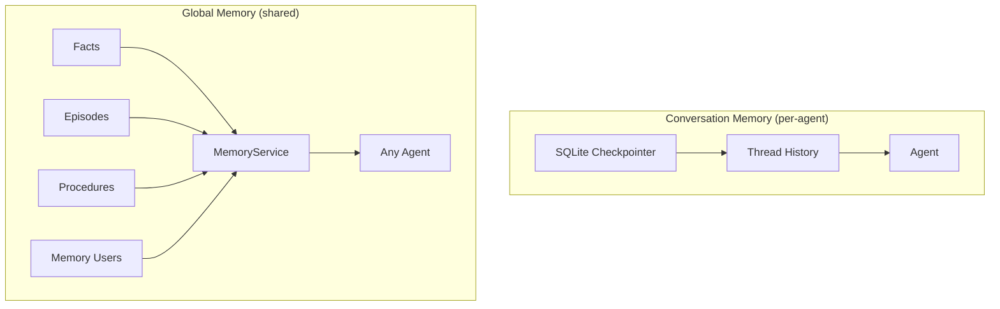
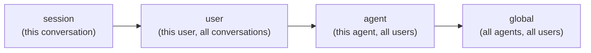
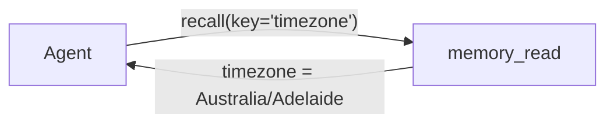
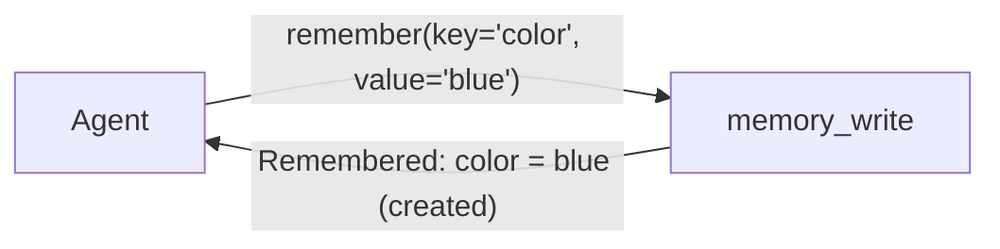

# Memory

Pipelit provides two distinct memory systems that give agents persistent knowledge across executions: **conversation memory** for per-agent chat continuity, and **global memory** for shared facts, episodes, and procedures that any agent can read and write.

## Two memory systems



### Conversation memory

Conversation memory is a **per-agent, opt-in** feature that persists chat history across executions. When enabled, the agent remembers previous turns in a conversation, even across separate workflow runs.

Under the hood, conversation memory uses a **SQLite checkpointer** (`platform/checkpoints.db`) backed by LangGraph's `SqliteSaver`. The checkpointer is a lazy singleton -- it is created once on first use and shared across all agents.

**Thread ID construction:**

Each conversation thread is identified by a composite key:

```
thread_id = user_profile_id + telegram_chat_id + workflow_id
```

This means the same user talking to the same workflow gets continuity, regardless of whether the conversation happens over chat, Telegram, or any other channel. Different users on the same workflow get separate threads.

!!! info "Enabling conversation memory"
    Toggle the **Conversation Memory** switch in the Node Details Panel for any agent node. The setting is stored as `conversation_memory: true` in the agent's `extra_config`.

**System prompt delivery:**

When conversation memory is enabled, the system prompt is delivered in two ways:

1. Via `create_react_agent(prompt=SystemMessage(...))` for the `system` role
2. As a `HumanMessage` fallback with a stable ID for providers that ignore the system role (e.g., Venice.ai)

The stable ID prevents the system prompt from being duplicated across checkpointer invocations, thanks to LangGraph's `add_messages` reducer.

### Global memory

Global memory is a shared knowledge store that persists independently of any single conversation. It is organized into four entity types, each serving a different purpose.

#### Facts

Facts are the agent's **semantic memory** -- extracted knowledge not tied to a specific episode. Like knowing "Paris is the capital of France."

| Field | Description |
|-------|-------------|
| `key` | Human-readable identifier (e.g., `"user_timezone"`) |
| `value` | JSON value (string, number, object, etc.) |
| `fact_type` | Classification of the fact (see table below) |
| `scope` | Visibility level: `session`, `user`, `agent`, or `global` |
| `confidence` | Float 0.0 -- 1.0, tracking how reliable the fact is |
| `times_confirmed` | How many times the fact has been re-asserted |
| `times_contradicted` | How many times contradictory information was seen |

**Fact types:**

| Type | Example |
|------|---------|
| `user_preference` | "User likes concise answers" |
| `world_knowledge` | "API endpoint is https://api.example.com" |
| `self_knowledge` | "My success rate for code review is 73%" |
| `correction` | "Don't use deprecated API v1, use v2 instead" |
| `relationship` | "User works at Acme Corp" |

**Scope hierarchy:**

Facts follow a scope hierarchy where the most specific scope wins during lookup:



When looking up a fact by key, the `MemoryService` checks scopes from most specific (session) to least specific (global), returning the first match.

#### Episodes

Episodes are the agent's **episodic memory** -- full records of past executions. Like remembering "that conversation last Tuesday."

Each episode captures:

- **Trigger context**: what started the execution and what input was provided
- **Conversation log**: the full message exchange
- **Actions taken**: tool calls and their results
- **Outcome**: success/failure status, final output, error details
- **Timing**: start time, end time, duration
- **Human feedback**: optional rating and comments

Episodes support future capabilities like semantic search via embeddings and automatic fact extraction.

#### Procedures

Procedures are the agent's **procedural memory** -- learned how-to instructions. Like knowing "how to ride a bike."

Procedures can emerge from:

- **Human teaching**: explicit instructions ("when X happens, do Y")
- **Self-learning**: patterns extracted from successful episodes
- **Evolution**: modifications of existing procedures

Each procedure has:

- **Trigger conditions**: when to apply the procedure (e.g., `{"goal_contains": ["weather"]}`)
- **Procedure type**: `workflow_graph`, `prompt_template`, `code_snippet`, or `tool_sequence`
- **Procedure content**: the actual instructions in the appropriate format
- **Performance tracking**: times used, success rate, average duration

#### Memory users

Memory users provide **cross-channel identity tracking**. They allow the same person on Telegram, email, or other channels to be recognized as a single identity.

Each memory user has:

- A `canonical_id` (e.g., `telegram:12345`)
- Channel-specific identifiers (`telegram_id`, `email`)
- A `display_name`
- Cached preferences (denormalized from facts for fast lookup)
- Conversation statistics

Users can be merged when the same person is identified across multiple channels via the `merged_into_id` field.

## Memory tools

Pipelit provides three tool components that agents can use to interact with memory at runtime.

### memory_read (recall)

The `memory_read` component gives agents a tool called **`recall`** that retrieves information from global memory.



**Behavior:**

- **No arguments**: lists all facts visible to the agent
- **`key` argument**: exact key lookup, falls back to fuzzy search if no exact match
- **`query` argument**: searches across facts, procedures, and/or episodes depending on `memory_type`

**Configuration (`extra_config`):**

| Field | Default | Description |
|-------|---------|-------------|
| `memory_type` | `"facts"` | Which memory types to search: `facts`, `procedures`, `episodes`, or `all` |
| `limit` | `10` | Maximum number of results to return |
| `min_confidence` | `0.5` | Minimum confidence score for fact results |

### memory_write (remember)

The `memory_write` component gives agents a tool called **`remember`** that stores facts in global memory.



**Behavior:**

- Stores a key-value fact in global scope
- If the key already exists and `overwrite` is true, updates the value and increments `times_confirmed`
- If the key already exists and `overwrite` is false, skips the write

**Configuration (`extra_config`):**

| Field | Default | Description |
|-------|---------|-------------|
| `fact_type` | `"world_knowledge"` | Default fact type for new facts |
| `overwrite` | `true` | Whether to overwrite existing facts with the same key |

### identify_user

The `identify_user` component is a graph node (not an agent tool) that identifies who is interacting with the workflow and loads their full context from memory.

It works by:

1. Extracting the channel and user identifier from the trigger payload
2. Looking up or creating a `MemoryUser` record
3. Loading all user-scoped facts and recent episodes
4. Patching the workflow state with `user_context` for downstream nodes

!!! tip "Use identify_user early in your workflow"
    Place the `identify_user` node immediately after your trigger so that downstream agents have access to user context, preferences, and history via `{{ identify_user.user_context }}`.

## Search implementation

Memory search currently uses **SQL ILIKE pattern matching** with fuzzy normalization. The search query is preprocessed so that spaces, underscores, and hyphens are treated as equivalent. For example, a search for `"local time"` will match a fact with the key `"lesson_local_time_command"`.

```
query: "local time"
pattern: %local%time%
matches: lesson_local_time_command, local_time_zone, get-local-time
```

Facts are filtered by confidence score (`min_confidence`) and ordered by confidence descending.

!!! note "Future: vector search"
    The `MemoryFact` and `MemoryEpisode` models include `embedding` fields (currently unused) reserved for future semantic vector search capabilities.

## API endpoints

Memory entities are managed through the REST API:

| Endpoint | Description |
|----------|-------------|
| `GET /api/v1/facts/` | List facts |
| `POST /api/v1/facts/batch-delete/` | Batch delete facts |
| `GET /api/v1/episodes/` | List episodes |
| `POST /api/v1/episodes/batch-delete/` | Batch delete episodes |
| `GET /api/v1/procedures/` | List procedures |
| `POST /api/v1/procedures/batch-delete/` | Batch delete procedures |
| `GET /api/v1/memory-users/` | List memory users |
| `POST /api/v1/memory-users/batch-delete/` | Batch delete memory users |
| `GET /api/v1/checkpoints/` | List checkpoints (conversation memory) |
| `POST /api/v1/checkpoints/batch-delete/` | Batch delete checkpoints |

All memory entities can be browsed and managed in the frontend at `/memories`, which provides tabbed views for Facts, Episodes, Checkpoints, Procedures, and Users.

## What's next?

- Learn about multi-agent task delegation: [Epics & Tasks](epics-and-tasks.md)
- Understand cost tracking for memory-heavy workflows: [Cost Tracking](cost-tracking.md)
- See how agents use tools: [Tools](tools.md)
