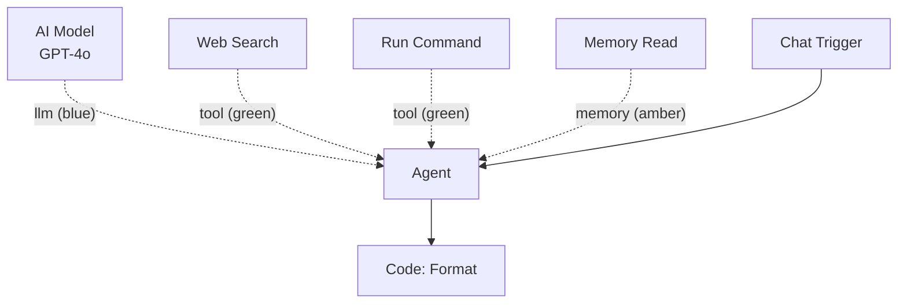

# Nodes & Edges

Nodes are the building blocks of workflows. Edges are the typed connections between them. Together, they form a directed graph with validated data flow that Pipelit compiles and executes.

## Nodes

Every element on the workflow canvas is a **node**. Each node has a `component_type` that determines its behavior, a unique `node_id` within the workflow, and a configuration that controls how it runs.

### Node categories

Pipelit organizes its node types into seven categories:

```mermaid
graph TD
    subgraph Triggers["Triggers (6 types)"]
        direction LR
        TC[Chat] ~~~ TT[Telegram] ~~~ TM[Manual]
        TS[Schedule] ~~~ TW[Workflow] ~~~ TE[Error]
    end

    subgraph AI["AI (4 types)"]
        direction LR
        Agent ~~~ Categorizer ~~~ Router ~~~ Extractor
    end

    subgraph Tools["Tools (5 types)"]
        direction LR
        RunCmd[Run Command] ~~~ HTTP[HTTP Request] ~~~ WebSearch[Web Search]
        Calc[Calculator] ~~~ DT[Date & Time]
    end

    subgraph Logic["Logic (9 types)"]
        direction LR
        Switch ~~~ Code ~~~ Merge
        Filter ~~~ Loop ~~~ Wait
        HC[Human Confirm] ~~~ Agg[Aggregator] ~~~ Sub[Subworkflow]
    end

    subgraph SubComp["Sub-Components (3 types)"]
        direction LR
        AIM[AI Model] ~~~ OP[Output Parser] ~~~ CE[Code Execute]
    end

    subgraph SelfAware["Self-Awareness (11 types)"]
        direction LR
        CAU[Create Agent User] ~~~ PA[Platform API] ~~~ WhoAmI
        TOTP[Get TOTP] ~~~ Epic[Epic Tools] ~~~ Task[Task Tools]
        SA[Spawn & Await] ~~~ WC[Workflow Create] ~~~ WD[Workflow Discover]
        ST[Scheduler Tools] ~~~ SH[System Health]
    end

    subgraph Memory["Memory (3 types)"]
        direction LR
        MR[Memory Read] ~~~ MW[Memory Write] ~~~ IU[Identify User]
    end
```

| Category | Types | Purpose |
|----------|-------|---------|
| **Triggers** | `trigger_chat`, `trigger_telegram`, `trigger_manual`, `trigger_schedule`, `trigger_workflow`, `trigger_error` | Initiate workflow execution from external events |
| **AI** | `agent`, `categorizer`, `router`, `extractor` | LLM-powered reasoning, classification, routing, and data extraction |
| **Tools** | `run_command`, `http_request`, `web_search`, `calculator`, `datetime` | Capabilities that agents can invoke during reasoning |
| **Logic** | `switch`, `code`, `merge`, `filter`, `loop`, `wait`, `human_confirmation`, `aggregator`, `workflow` | Flow control, data transformation, and branching |
| **Sub-Components** | `ai_model`, `output_parser`, `code_execute` | Configuration nodes that attach to other nodes (not independently executable) |
| **Self-Awareness** | `create_agent_user`, `platform_api`, `whoami`, `get_totp_code`, `epic_tools`, `task_tools`, `spawn_and_await`, `workflow_create`, `workflow_discover`, `scheduler_tools`, `system_health` | Tools that let agents inspect and modify the platform itself |
| **Memory** | `memory_read`, `memory_write`, `identify_user` | Persistent knowledge storage and user identification |

### Executable vs. non-executable nodes

Not all nodes run during execution:

- **Trigger nodes** initiate execution but do not execute themselves -- they produce output that flows to downstream nodes.
- **Sub-component nodes** (`ai_model`, `output_parser`) are configuration-only. They attach to AI nodes to provide model and parser settings.
- **Tool nodes** (`run_command`, `http_request`, etc.) are executable -- they run when an agent invokes them during its reasoning loop.

!!! note
    The `executable` flag on each node type controls whether the canvas shows execution status badges (spinning circle, checkmark, X) during a run. Non-executable nodes remain visually static.

## Typed ports

Every node declares typed **input ports** and **output ports**. Ports define what data a node accepts and what it produces.

### DataType enum

Pipelit uses a type system for port definitions:

| DataType | Description |
|----------|-------------|
| `STRING` | Text content |
| `NUMBER` | Numeric value |
| `BOOLEAN` | True/false |
| `OBJECT` | JSON object (dict) |
| `ARRAY` | JSON array (list) |
| `MESSAGE` | A single LangChain message |
| `MESSAGES` | A list of LangChain messages |
| `IMAGE` | Image data |
| `FILE` | File data |
| `ANY` | Accepts or produces any type |

### Port examples

Here are the port definitions for a few common node types:

=== "Agent"

    **Inputs:**

    | Port | Type | Required |
    |------|------|----------|
    | `messages` | `MESSAGES` | Yes |

    **Outputs:**

    | Port | Type |
    |------|------|
    | `messages` | `MESSAGES` |
    | `output` | `STRING` |

=== "Chat Trigger"

    **Outputs:**

    | Port | Type |
    |------|------|
    | `text` | `STRING` |
    | `payload` | `OBJECT` |

=== "Switch"

    **Inputs:**

    | Port | Type | Required |
    |------|------|----------|
    | `input` | `ANY` | Yes |

    **Outputs:**

    | Port | Type |
    |------|------|
    | `route` | `STRING` |

### Type compatibility

When you connect two nodes, Pipelit checks that the source output type is compatible with the target input type. The compatibility rules are:

- **Same type** -- always compatible
- **Any to Any** -- the `ANY` type is universally compatible as source or target
- **String coercions** -- `STRING` can connect to `MESSAGE` or `MESSAGES` inputs
- **Message coercions** -- `MESSAGE` can connect to `MESSAGES` inputs

Incompatible connections are rejected at edge creation time with a `422` error.

!!! tip "Use ANY for flexibility"
    Logic nodes like `code`, `switch`, and `merge` accept `ANY` type inputs, making them versatile adapters between differently-typed nodes.

## Edges

Edges are directed connections between nodes. They carry data from a source node's output to a target node's input.

### Edge types

| Edge Type | Description | Originating Node |
|-----------|-------------|-----------------|
| **direct** | Standard data flow from one node to another | Any node |
| **conditional** | Route-based branching, selected by matching `condition_value` against the `_route` output | `switch` nodes only |

### Edge labels

Edge labels identify the purpose of a connection. They determine which handle the edge connects to on the target node.

| Label | Purpose | Visual Handle |
|-------|---------|---------------|
| `""` (empty) | Standard data flow between nodes | Left/right circle handles |
| `"llm"` | Connects an AI Model to a node that requires one | Bottom diamond (blue) |
| `"tool"` | Connects a tool node to an agent | Bottom diamond (green) |
| `"memory"` | Connects memory to a node that supports it | Bottom diamond (amber) |
| `"output_parser"` | Connects an output parser to a categorizer, router, or extractor | Bottom diamond (slate) |
| `"loop_body"` | Connects a loop node to the first node in its body | Special flow-control edge |
| `"loop_return"` | Returns from the last body node back to the loop | Dashed edge routed below nodes |

### Edge validation

Pipelit validates edges at two levels:

1. **At creation time** -- When you draw an edge on the canvas or call the API, the system checks type compatibility between the source output and target input. Invalid connections return a `422` error.

2. **At workflow validation time** -- The `POST /api/v1/workflows/{slug}/validate/` endpoint (or the Validate button) runs comprehensive checks across all edges:
    - All source and target nodes exist
    - Conditional edges have a `condition_value` and originate from `switch` nodes
    - Type compatibility holds for all direct edges
    - Nodes that require a model connection have one

!!! warning "Conditional edges require switch nodes"
    Only `switch` nodes can originate conditional edges. The switch evaluates rules against its input and emits a `_route` value. Each conditional edge carries a `condition_value` that must match one of the switch's possible routes.

### Sub-component connections

AI nodes require sub-component connections to function:

| AI Node | Requires Model | Requires Tools | Requires Memory | Requires Output Parser |
|---------|---------------|----------------|-----------------|----------------------|
| `agent` | Yes | Yes | Yes | No |
| `categorizer` | Yes | No | Yes | Yes |
| `router` | Yes | No | Yes | Yes |
| `extractor` | Yes | No | Yes | Yes |

Sub-component connections use the diamond-shaped handles at the bottom of AI nodes. You connect an `ai_model` node via the blue handle, tool nodes via the green handle, and so on.

## Node output convention

When a component finishes executing, it returns a flat dictionary of its port values (e.g., `{"output": "Hello!", "messages": [...]}`). The orchestrator automatically stores all non-underscore-prefixed keys in `node_outputs[node_id]`, making them available to downstream nodes via Jinja2 expressions like `{{ agent_abc123.output }}`.

Reserved underscore-prefixed keys control side effects:

| Key | Effect |
|-----|--------|
| `_route` | Sets the route for conditional edge matching |
| `_messages` | Appends to the global LangGraph message list |
| `_state_patch` | Merges into the global workflow state |

## What's next?

- Learn how workflows start: [Triggers](triggers.md)
- Understand LLM-powered nodes: [Agents](agents.md)
- Reference upstream data: [Expressions](expressions.md)
