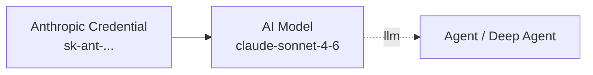

# LLM Providers

Pipelit supports multiple LLM providers through a unified **credential** system. Each provider is configured as a credential on the Credentials page and then selected in the AI Model sub-component.

## Supported Providers

| Provider | Credential Type | Notes |
|----------|----------------|-------|
| OpenAI | `llm` / `openai_compatible` | GPT-4o, o1, o3, etc. |
| Anthropic | `llm` / `anthropic` | Claude Opus, Sonnet, Haiku |
| MiniMax | `llm` / `openai_compatible` | MiniMax M2 models |
| GLM (Zhipu AI) | `llm` / `openai_compatible` | GLM-4 models |
| Any OpenAI-compatible API | `llm` / `openai_compatible` | LM Studio, vLLM, Ollama, Together, etc. |

## Credential Types

### Anthropic

Create an Anthropic credential to use Claude models.

**Required fields:**

| Field | Description |
|-------|-------------|
| `provider_type` | Set to `anthropic` |
| `api_key` | Your Anthropic API key (`sk-ant-...`) |

**Optional fields:**

| Field | Description |
|-------|-------------|
| `base_url` | Override API base URL (for proxies) |

**Available models** (auto-fetched or fallback list):

- `claude-opus-4-6`
- `claude-sonnet-4-6`
- `claude-haiku-4-5-20251001`
- `claude-opus-4-5`
- `claude-sonnet-4-5`

**Setup:**

1. Get your API key from [console.anthropic.com](https://console.anthropic.com)
2. Go to **Credentials** page → **Add Credential**
3. Choose type **LLM Provider**
4. Set Provider to **Anthropic**, paste your API key
5. Click **Test** to verify connectivity
6. Click **Save**



### OpenAI

Create an OpenAI credential to use GPT and o-series models.

**Required fields:**

| Field | Description |
|-------|-------------|
| `provider_type` | Set to `openai_compatible` |
| `api_key` | Your OpenAI API key (`sk-...`) |
| `base_url` | `https://api.openai.com/v1` |

**Optional fields:**

| Field | Description |
|-------|-------------|
| `organization_id` | OpenAI organization ID |

**Setup:**

1. Get your API key from [platform.openai.com](https://platform.openai.com)
2. Go to **Credentials** → **Add Credential** → **LLM Provider**
3. Set Provider to **OpenAI Compatible**
4. Set Base URL to `https://api.openai.com/v1`
5. Paste your API key → **Test** → **Save**

### MiniMax

MiniMax uses the OpenAI-compatible API format.

**Required fields:**

| Field | Description |
|-------|-------------|
| `provider_type` | `openai_compatible` |
| `api_key` | Your MiniMax API key |
| `base_url` | `https://api.minimax.chat/v1` |

**Available models:**

- `MiniMax-M2.5`
- `MiniMax-M2.1`

**Setup:**

1. Get your API key from [platform.minimaxi.com](https://platform.minimaxi.com)
2. Create an **LLM Provider** credential with `openai_compatible` type
3. Set base URL to `https://api.minimax.chat/v1`
4. Use the **Test** button to verify and load the model list

### GLM (Zhipu AI)

GLM models from Zhipu AI are OpenAI-compatible.

**Required fields:**

| Field | Description |
|-------|-------------|
| `provider_type` | `openai_compatible` |
| `api_key` | Your Zhipu AI API key |
| `base_url` | `https://open.bigmodel.cn/api/paas/v4` |

**Available models:**

- `glm-4-plus`
- `glm-4-air`
- `glm-4-flash`
- `glm-z1-flash`

### OpenAI-Compatible APIs

Any API that implements the OpenAI `/v1/chat/completions` endpoint can be used. This includes:

| Service | Base URL |
|---------|----------|
| LM Studio (local) | `http://localhost:1234/v1` |
| Ollama | `http://localhost:11434/v1` |
| vLLM | `http://localhost:8000/v1` |
| Together AI | `https://api.together.xyz/v1` |
| Groq | `https://api.groq.com/openai/v1` |
| Fireworks AI | `https://api.fireworks.ai/inference/v1` |

For services that don't require authentication, set the API key to any non-empty string (e.g., `not-needed`).

## Creating a Credential

1. Navigate to **Credentials** in the sidebar
2. Click **Add Credential**
3. Select type **LLM Provider**
4. Fill in the required fields for your provider
5. Click **Test Credential** — Pipelit will attempt a small API call to verify the key
6. Click **Save**

!!! tip "Testing credentials"
    The **Test** button makes a real API call: for Anthropic it sends a minimal message via the Anthropic SDK; for OpenAI-compatible providers it calls `/v1/models`. If the test fails, check your API key, base URL, and network connectivity.

## Using a Credential in a Workflow

1. Add an **AI Model** sub-component to your canvas
2. In the AI Model configuration panel, select your credential from the dropdown
3. Select the model from the list (populated from the credential's available models)
4. Connect the AI Model to an Agent or Deep Agent via the blue `llm` handle

## Provider Capabilities

| Feature | Anthropic | OpenAI | OpenAI-compatible |
|---------|-----------|--------|-------------------|
| Tool calling | Yes | Yes | Model-dependent |
| Streaming | Yes | Yes | Model-dependent |
| Vision | Yes (Sonnet/Opus) | Yes (GPT-4o) | Model-dependent |
| Thinking/reasoning | Yes (claude-3-7+) | Yes (o1/o3) | Model-dependent |
| System prompt | Yes | Yes | Yes |
| Custom headers | Via credential | Via credential | Via `custom_headers` |

## Custom Headers

For providers that require additional headers (e.g., API version headers, organization headers), add them to the credential's `custom_headers` field as a JSON object:

```json
{
  "X-Custom-Header": "value",
  "anthropic-version": "2023-06-01"
}
```

!!! note "Header precedence"
    Custom headers are merged with the default headers for the provider. If a custom header conflicts with a required header (e.g., `Authorization`), the custom header wins.

## Credential Security

All API keys are encrypted at rest using Fernet symmetric encryption. The API never returns the full key — responses show only the first 4 and last 4 characters with `****` in between. See [Security](security.md) for details.
