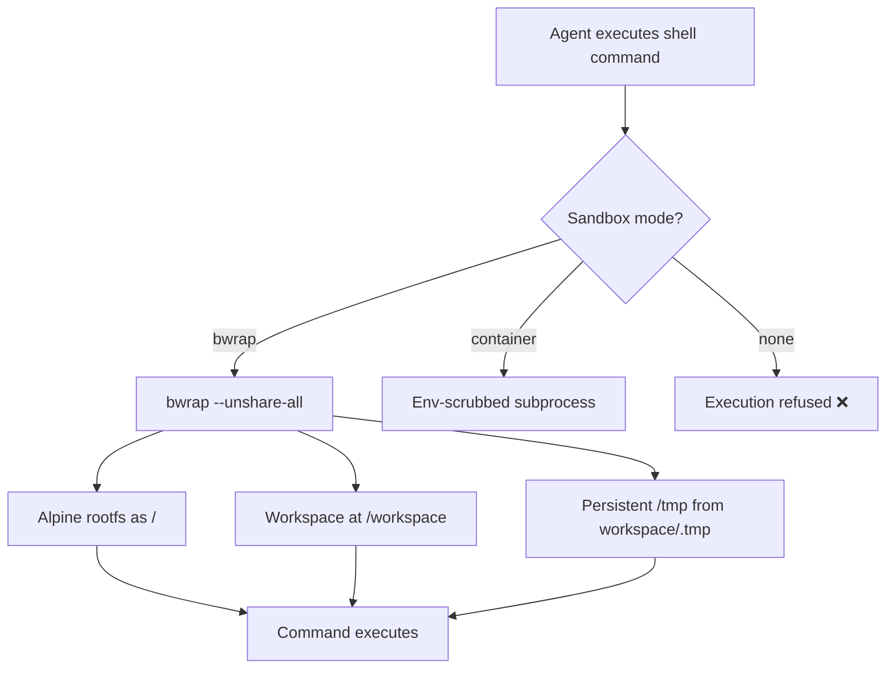

# Sandbox

Pipelit runs agent shell commands inside an OS-level sandbox to protect the host system. The sandbox isolates each agent workspace from the rest of the filesystem, the network, and other processes.

## Architecture Overview

The sandbox has three layers:

1. **Environment detection** — at startup, Pipelit detects what isolation primitives are available.
2. **Per-workspace Alpine rootfs** — each workspace gets its own Alpine Linux root filesystem.
3. **bwrap execution** — shell commands run inside a bubblewrap namespace with the Alpine rootfs mounted as `/`.



## Sandbox Modes

Pipelit automatically selects the best sandbox mode available on the host:

| Mode | When Used | Isolation |
|------|-----------|-----------|
| `bwrap` | Linux host with bubblewrap installed | Full: separate filesystem, network, and process namespaces |
| `container` | Already inside Docker, Codespaces, Gitpod, Kubernetes | Env-scrubbing only; container provides OS-level isolation |

!!! danger "No unsandboxed fallback"
    If neither bubblewrap nor a container environment is detected, Pipelit **refuses to execute** shell commands. Install bubblewrap (`apt install bubblewrap`) or run Pipelit inside a container.

## Environment Detection

On startup, Pipelit calls `detect_container()` to determine whether it is already running inside a container:

| Container Type | Detection Method |
|----------------|-----------------|
| GitHub Codespaces | `CODESPACES` env var |
| Gitpod | `GITPOD_WORKSPACE_ID` env var |
| Docker | `/.dockerenv` file present |
| Podman | `container` env var = `podman` |
| Kubernetes | `/var/run/secrets/kubernetes.io/` directory |
| containerd | `container` env var = `containerd` |

After container detection, `resolve_sandbox_mode()` determines the final mode:

```
# Auto-detect (default)
SANDBOX_MODE = "auto"
  ├── Linux without container → check for bwrap
  │     ├── bwrap available → mode: bwrap
  │     └── bwrap missing → execution refused
  └── Inside container → mode: container

# Explicit modes
SANDBOX_MODE = "bwrap"      → force bwrap (error if unavailable)
SANDBOX_MODE = "container"  → force container env-scrubbing (error if not in container)
```

## Alpine Rootfs

### Golden Image

When bwrap mode is used, Pipelit downloads an Alpine Linux minirootfs tarball and builds a **golden image** — a pre-installed rootfs with all required packages. This happens automatically on first use:

1. Detect host architecture (`x86_64`, `aarch64`, `armv7`, `x86`)
2. Fetch the latest Alpine version from the Alpine CDN
3. Download the minirootfs tarball with SHA-256 verification
4. Install tier-1 packages inside bwrap:

   **Tier 1** (always installed):
   ```
   bash python3 py3-pip git curl wget tar unzip
   ```

5. Install tier-2 packages:

   **Tier 2** (development tools):
   ```
   jq findutils grep sed gawk coreutils
   nodejs npm
   ```

6. Cache the golden image at `{pipelit_dir}/rootfs/golden/`

The golden image is built once and reused across all workspaces. A file lock prevents multiple workers from building it simultaneously.

### Per-Workspace Rootfs

Each workspace gets its own **copy** of the golden image at `{workspace_path}/.rootfs/`:

```
~/.config/pipelit/
├── rootfs/
│   └── golden/          ← shared golden image
└── workspaces/
    └── default/
        ├── .rootfs/     ← workspace-private copy of golden image
        ├── .tmp/        ← persistent /tmp inside sandbox
        └── .packages/   ← pip packages installed by agent
```

Copying is done with `cp -a` for efficiency. Workspace rootfs copies are independent, so packages installed by one agent do not affect other workspaces.

## bwrap Command Structure

Shell commands run via `bwrap --unshare-all` with the following mounts:

```bash
bwrap --unshare-all \
    --bind {workspace_rootfs}/ / \          # Alpine rootfs as root (rw)
    --bind {workspace} /workspace \          # Workspace data (rw)
    --bind {workspace}/.tmp /tmp \           # Persistent temp (rw)
    --proc /proc \                           # Process info
    --dev /dev \                             # Device files
    --die-with-parent \                      # Kill sandbox if parent dies
    --clearenv \                             # Strip host environment
    --setenv HOME /workspace \
    --setenv PATH /usr/local/sbin:/usr/local/bin:... \
    --setenv TMPDIR /tmp \
    --setenv LANG C.UTF-8 \
    --setenv PIP_TARGET /workspace/.packages \
    --setenv PYTHONPATH /workspace/.packages \
    --chdir /workspace \
    bash -c "<command>"
```

Key isolation properties:

- `--unshare-all` — creates new namespaces for user, PID, network, IPC, UTS, and cgroup
- `--clearenv` — strips all host environment variables; only explicit `--setenv` vars are visible
- The host filesystem is not visible except for `/proc` and `/dev`
- The agent can only write to `/workspace` and `/tmp`

## Network Access

By default, the sandbox has **network access enabled** (`--share-net` is passed to bwrap and `/etc/resolv.conf` is bind-mounted). This allows agents to make HTTP calls, use `git`, `curl`, web search tools, and other network-dependent operations.

To disable network access for a workspace, set `allow_network` to `false` in the workspace configuration. This removes `--share-net`, isolating the sandbox from the network entirely (`--unshare-all` creates a separate network namespace).

!!! tip "When to disable network"
    Disable network access for workspaces that should not make external calls — for example, sandboxed code evaluation where you want strict isolation.

## Container Mode

When running inside Docker, Codespaces, Gitpod, or Kubernetes, the container itself provides OS-level isolation. In this mode, Pipelit uses **env-scrubbing** instead of bwrap:

- Host environment variables are stripped
- A clean `PATH`, `HOME`, and `TMPDIR` are set
- The command runs as a regular subprocess (no namespace isolation beyond the container)
- `PIP_TARGET` and `PYTHONPATH` point to `{workspace}/.packages`

This mode is appropriate for production Docker deployments.

## Capability Injection

At startup and on demand (Settings → Environment tab), Pipelit runs `detect_capabilities()` to probe what tools are available inside the sandbox:

| Category | Tools Checked |
|----------|---------------|
| **Runtimes** | Python 3, Node.js, pip3, npm |
| **Shell tools (tier 1)** | bash, cat, ls, cp, mv, mkdir, rm, chmod, grep, sed, head, tail, wc |
| **Shell tools (tier 2)** | find, sort, awk, xargs, tee, curl, wget, git, tar, unzip, jq |
| **Network** | DNS resolution, HTTP connectivity |
| **Filesystem** | Write access to `/tmp` |
| **System** | uname, df, free |

The results are stored in `conf.json` under `detected_environment` and displayed in **Settings → Environment**. Agents can use the capability report to know what tools are available.

## Environment Variables in Workspaces

Workspaces support injecting custom environment variables into the sandbox. Variables can come from:

- **Raw values** — static strings set directly
- **Credential fields** — resolved at execution time from stored encrypted credentials (e.g., `GITHUB_TOKEN` from a Git credential's `access_token` field)

These variables are added to the bwrap `--setenv` list alongside the standard ones.

## Debugging / Manual Access

You can enter the sandbox interactively to inspect workspace state, test commands, or debug agent issues. From the workspace directory:

```bash
cd ~/.config/pipelit/workspaces/default  # or your workspace path

bwrap --unshare-all --share-net \
    --bind .rootfs/ / \
    --bind . /workspace \
    --bind .tmp /tmp \
    --proc /proc \
    --dev /dev \
    --die-with-parent \
    --clearenv \
    --setenv HOME /workspace \
    --setenv PATH /usr/local/sbin:/usr/local/bin:/usr/sbin:/usr/bin:/sbin:/bin \
    --setenv TMPDIR /tmp \
    --setenv LANG C.UTF-8 \
    --setenv PIP_TARGET /workspace/.packages \
    --setenv PYTHONPATH /workspace/.packages \
    --chdir /workspace \
    bash
```

This drops you into an interactive shell inside the sandbox with the same filesystem layout agents see.

!!! tip "No-network testing"
    Remove `--share-net` from the command to test with network access disabled — matching the default sandbox behavior. This is useful for verifying that an agent's commands work without network access.

## Security Considerations

!!! note "bwrap vs. VM isolation"
    bwrap uses Linux namespaces — it is process-level isolation, not full virtualization. A kernel exploit could escape it. For high-security deployments, run Pipelit inside a VM or dedicated container per user.

The sandbox protects against:

- **Filesystem escape** — the agent cannot read or write the host filesystem outside its workspace
- **Environment leakage** — host secrets (API keys, tokens) in environment variables are not visible to the agent
- **Process visibility** — `--unshare-pid` gives the agent its own PID namespace; it cannot see host processes
- **Network exfiltration** — by default, no network access from inside the sandbox

The sandbox does **not** protect against:

- Agents consuming excessive CPU or memory (no cgroup limits by default)
- Agents filling the workspace disk
- Kernel-level exploits

See [Security](security.md) for the full security model.
