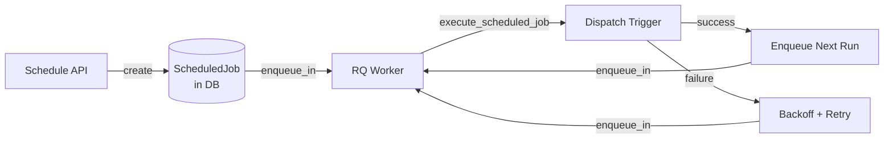
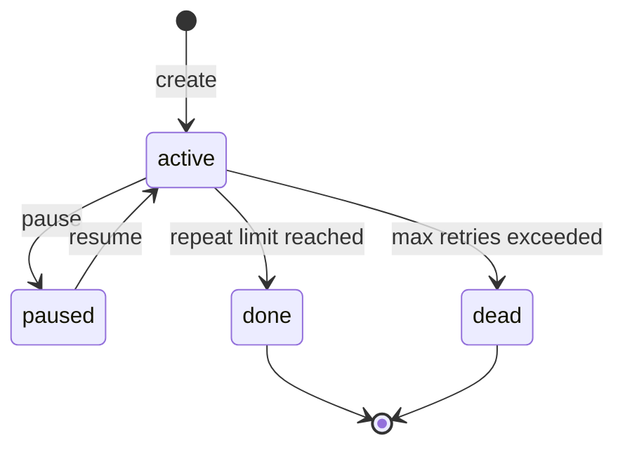
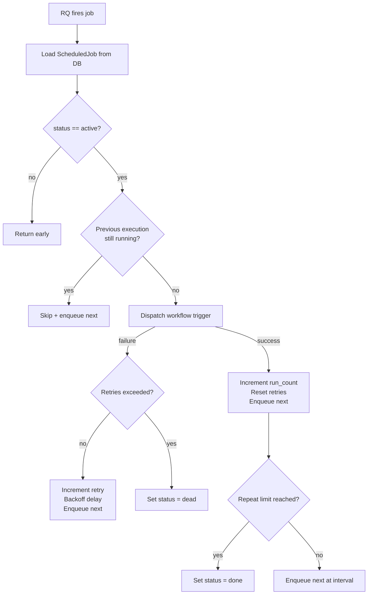

# Scheduler

Pipelit's scheduler provides **recurring workflow execution without external cron**. It uses a self-rescheduling pattern built on top of RQ (Redis Queue), where each execution enqueues the next one before completing. This gives you configurable intervals, repeat counts, retry with exponential backoff, pause/resume, and automatic crash recovery.

## Architecture



The key insight is that there is no persistent scheduler process or cron daemon. Each scheduled run is a **one-shot RQ job** that, upon completion, schedules the next one. The chain continues until the job is paused, exhausts its repeat count, or hits too many failures.

## ScheduledJob model

Every scheduled job is stored as a `ScheduledJob` row in the database:

| Field | Type | Description |
|-------|------|-------------|
| `id` | UUID | Primary key |
| `name` | string | Human-readable name |
| `description` | text | Optional description |
| `workflow_id` | FK | Workflow to execute |
| `trigger_node_id` | string | Specific trigger node to fire (optional) |
| `user_profile_id` | FK | Owner who created the schedule |
| `interval_seconds` | int | Time between runs |
| `total_repeats` | int | Maximum runs (0 = infinite) |
| `max_retries` | int | Max consecutive failures before death (default 3) |
| `timeout_seconds` | int | Per-execution timeout (default 600) |
| `trigger_payload` | JSON | Data passed to the trigger on each run |
| `status` | string | Current state machine status |
| `current_repeat` | int | How many successful runs have completed |
| `current_retry` | int | Current retry attempt for this run |
| `last_run_at` | datetime | When the last run started |
| `next_run_at` | datetime | When the next run is scheduled |
| `run_count` | int | Total successful runs |
| `error_count` | int | Total errors encountered |
| `last_error` | text | Most recent error message |

## State machine

The scheduler uses a simple state machine to track job lifecycle:



| Status | Meaning |
|--------|---------|
| `active` | Job is running normally; the next run is enqueued in Redis |
| `paused` | Job is temporarily halted; no runs are enqueued |
| `done` | Job completed all configured repeats |
| `dead` | Job failed too many times consecutively and was stopped |

!!! info "Pause is non-destructive"
    Pausing a job sets its status to `paused` and clears `next_run_at`. The RQ wrapper checks status at the start of each run and returns early if the job is not `active`. This means an already-enqueued job will simply no-op when it fires, rather than being removed from Redis.

## Execution flow

### execute_scheduled_job()

This is the core function that runs as an RQ job. It follows a strict sequence:



**Step by step:**

1. **Load**: Read the `ScheduledJob` from the database
2. **Status check**: If status is not `active`, return immediately (handles pause/stop)
3. **Overlap protection**: Check if a previous execution from this job is still running. If so, skip this run and enqueue the next one at the normal interval.
4. **Dispatch**: Call `dispatch_event("schedule", event_data, user, db)` to fire the workflow trigger
5. **On success**:
    - Increment `run_count` and `current_repeat`
    - Reset `current_retry` to 0
    - Check if `total_repeats > 0` and repeat limit is reached -- if so, set status to `done`
    - Otherwise, enqueue the next run at `interval_seconds`
6. **On failure**:
    - Increment `error_count` and `current_retry`
    - If retries exceeded `max_retries`, set status to `dead`
    - Otherwise, enqueue the next attempt with exponential backoff

### Trigger dispatch

When the scheduler fires, it constructs a trigger event with:

```python
event_data = {
    "scheduled_job_id": job.id,
    "scheduled_job_name": job.name,
    "repeat_number": job.current_repeat,
    "payload": job.trigger_payload or {},
}
```

This is dispatched via `dispatch_event("schedule", ...)`, which finds the appropriate trigger node and starts a workflow execution. The `trigger_payload` field lets you pass custom data to the trigger on each run.

## Deterministic job IDs

Each enqueued RQ job gets a **deterministic job ID** based on the scheduled job state:

```
sched-{job_id}-n{repeat_number}-rc{retry_count}
```

For example: `sched-a1b2c3d4-n5-rc0` (5th repeat, no retries).

This prevents duplicate enqueues during recovery. If the same job ID already exists in Redis, the enqueue is a no-op rather than creating a duplicate.

!!! tip "Why deterministic IDs matter"
    Without deterministic IDs, a crash-recovery cycle could enqueue a job that is already waiting in Redis, causing it to run twice. The deterministic ID ensures idempotent enqueuing.

## Exponential backoff

When a scheduled run fails, the next retry is delayed using exponential backoff:

```python
delay = min(interval * 2^(retry_count - 1), interval * 10)
```

| Retry | Interval: 60s | Interval: 300s |
|-------|--------------|----------------|
| 1st | 60s | 300s |
| 2nd | 120s | 600s |
| 3rd | 240s | 1200s |
| Cap | 600s (10x) | 3000s (10x) |

The backoff is **capped at 10x the base interval**. This prevents unreasonably long delays while still giving transient failures time to resolve.

## Crash recovery

On application startup, `recover_scheduled_jobs()` scans for active jobs that missed their scheduled run time:

```python
stale_jobs = ScheduledJob.filter(
    status == "active",
    next_run_at < now
)
```

For each stale job, it calls `start_scheduled_job()` to re-enqueue the next run. Because enqueuing uses deterministic job IDs, this is safe to call even if some jobs are already queued in Redis.

!!! info "Recovery is automatic"
    Call `recover_scheduled_jobs()` during application startup. It returns the number of jobs recovered, which is useful for logging. Jobs that were paused or completed are not affected.

## API endpoints

The scheduler is managed entirely through the REST API:

| Endpoint | Method | Description |
|----------|--------|-------------|
| `/api/v1/schedules/` | `GET` | List all scheduled jobs (supports `status` and `workflow_id` filters) |
| `/api/v1/schedules/` | `POST` | Create a new scheduled job and enqueue its first run |
| `/api/v1/schedules/{id}/` | `GET` | Get scheduled job details |
| `/api/v1/schedules/{id}/` | `PATCH` | Update job configuration |
| `/api/v1/schedules/{id}/` | `DELETE` | Delete a scheduled job |
| `/api/v1/schedules/{id}/pause/` | `POST` | Pause an active job |
| `/api/v1/schedules/{id}/resume/` | `POST` | Resume a paused job |
| `/api/v1/schedules/batch-delete/` | `POST` | Delete multiple jobs at once |

### Creating a schedule

```json
POST /api/v1/schedules/
{
    "name": "Daily report",
    "workflow_id": 1,
    "trigger_node_id": "trigger_schedule_abc123",
    "interval_seconds": 86400,
    "total_repeats": 0,
    "max_retries": 3,
    "timeout_seconds": 600,
    "trigger_payload": {"report_type": "daily"}
}
```

!!! warning "Pause vs. Delete"
    Pausing a job preserves its state (repeat count, error count, etc.) so it can be resumed later. Deleting a job permanently removes it. Use pause when you want to temporarily stop a schedule.

### Pause and resume

- **Pause**: Sets status to `paused` and clears `next_run_at`. Any already-enqueued RQ job will no-op on fire.
- **Resume**: Sets status back to `active` and enqueues the next run at `interval_seconds` from now.

Only `active` jobs can be paused, and only `paused` jobs can be resumed. Attempting to pause/resume a job in any other state returns HTTP 400.

## What's next?

- Learn how workflows execute: [Execution](execution.md)
- Understand triggers that start workflows: [Triggers](triggers.md)
- Track costs for scheduled executions: [Cost Tracking](cost-tracking.md)
