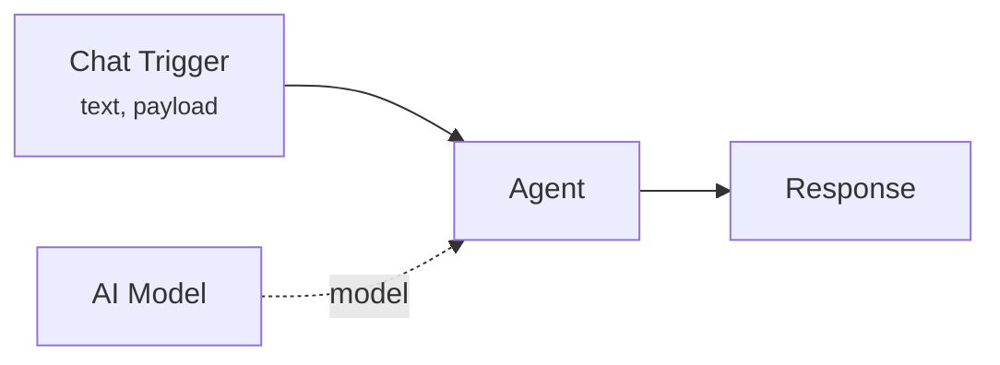
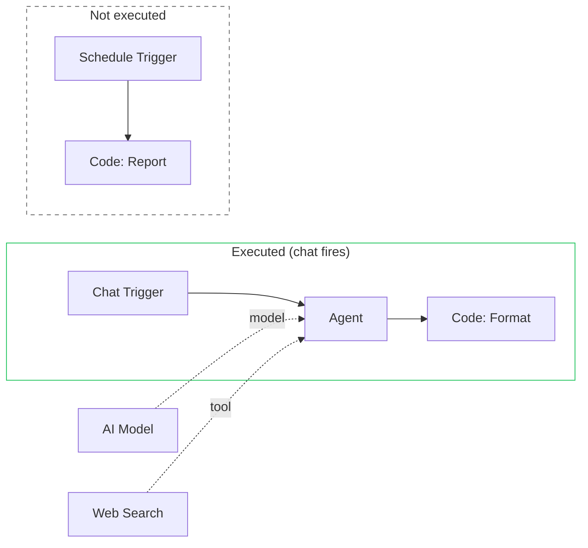

# Triggers

Triggers are the entry points of a workflow. They define **how** and **when** a workflow starts executing. In Pipelit, triggers are not a separate concept from nodes -- they **are** nodes, placed directly on the canvas alongside agents, tools, and logic.

## Triggers are nodes

Unlike many automation platforms that treat triggers as external configuration, Pipelit uses a **unified node model**. A trigger is a regular workflow node with:

- A `component_type` prefixed with `trigger_` (e.g., `trigger_chat`, `trigger_telegram`)
- Output ports that produce data when the trigger fires
- A position on the canvas, connected to downstream nodes via edges
- An orange border (`#f97316`) for visual identification

This unified design means you can:

- Place multiple triggers on the same canvas
- Connect the same downstream node to different triggers
- See trigger nodes alongside all other nodes in the editor
- Inspect trigger output after execution, just like any other node

!!! note "Display names"
    On the canvas, trigger nodes strip the `trigger_` prefix for cleaner display. For example, a `trigger_telegram` node shows as **telegram**, and a `trigger_chat` node shows as **chat**.

## Trigger types

Pipelit includes six trigger types, each designed for a different input channel:

| Trigger | Component Type | Description | Output Ports |
|---------|---------------|-------------|--------------|
| **Chat** | `trigger_chat` | Receives messages from the built-in chat interface | `text` (STRING), `payload` (OBJECT) |
| **Telegram** | `trigger_telegram` | Receives messages from a Telegram bot | `text` (STRING), `chat_id` (NUMBER), `payload` (OBJECT) |
| **Manual** | `trigger_manual` | Fired manually from the UI or API | `payload` (OBJECT) |
| **Schedule** | `trigger_schedule` | Fires on a recurring interval via the scheduler | `timestamp` (STRING) |
| **Workflow** | `trigger_workflow` | Fires when another workflow invokes this one as a subworkflow | `payload` (OBJECT) |
| **Error** | `trigger_error` | Fires when an error occurs during execution | `error` (OBJECT) |

### Chat Trigger

The most common trigger for interactive workflows. When a user sends a message through the built-in chat panel or the chat API (`POST /api/v1/workflows/{slug}/chat/`), the chat trigger fires with the message text and full payload.

### Telegram Trigger

Connects your workflow to a Telegram bot. When a message arrives via the Telegram webhook, the trigger fires with the message text, the chat ID (for reply routing), and the full Telegram payload.

!!! tip "Telegram credentials"
    To use the Telegram trigger, create a Telegram credential in the Credentials page with your bot token. The platform handles webhook registration and message routing.

### Manual Trigger

The simplest trigger -- fire it on demand from the executions UI or via the API. Useful for testing, one-off tasks, or workflows triggered by external systems through the API.

### Schedule Trigger

Fires on a recurring interval using Pipelit's self-rescheduling scheduler. Configure the interval, repeat count, and retry behavior through the Schedules API. The trigger output includes a `timestamp` of when it fired.

!!! note "No cron syntax"
    The scheduler uses interval-based timing (e.g., every 30 minutes), not cron expressions. It supports pause/resume, exponential backoff on failure, and automatic recovery after platform restarts.

### Workflow Trigger

Fires when another workflow invokes this one as a child via a `workflow` (subworkflow) node or a `spawn_and_await` tool. The parent workflow passes data through the `payload` output port. This enables workflow composition and multi-agent delegation patterns.

### Error Trigger

A special trigger that fires when an error occurs during execution. This allows you to build error-handling branches that run automatically when something goes wrong -- for example, sending an alert via Telegram or logging the error to an external system.

## Trigger-scoped execution

One of Pipelit's most important execution behaviors is **trigger-scoped compilation**. When a trigger fires, the execution engine does not compile or run the entire workflow. Instead, it:

1. Starts at the firing trigger node
2. Performs a **breadth-first search (BFS)** following all outgoing edges
3. Collects only the nodes reachable from that trigger
4. Compiles and executes just those nodes

In this example, when the chat trigger fires, only the Chat Trigger, Agent, and Format nodes execute. The Schedule Trigger and Report nodes are completely ignored -- they belong to a separate branch that only runs on a schedule.

### Why trigger-scoped execution matters

This design has several practical benefits:

- **Multiple entry points** -- One workflow can serve multiple channels (chat, Telegram, scheduled tasks) without interference.
- **Safe iteration** -- You can add new nodes to the canvas without affecting existing trigger branches. Unconnected work-in-progress nodes will not cause build errors.
- **Efficient execution** -- Only the relevant portion of the graph is compiled and run, keeping execution fast even for large workflows.
- **Independent error handling** -- An error in one trigger's branch does not affect other branches.

!!! warning "Shared nodes need explicit connections"
    If you want a node to be reachable from multiple triggers, you must connect it downstream of each trigger. There is no implicit sharing -- a node only executes if there is a path from the firing trigger to that node.

## The `trigger` expression shorthand

In Jinja2 expressions within node configuration, you can reference the firing trigger's output using the `trigger` shorthand:

- `{{ trigger.text }}` -- The text content from the trigger
- `{{ trigger.payload }}` -- The full trigger payload

This shorthand always refers to whichever trigger fired the current execution, making it safe to use in nodes that are downstream of multiple triggers.

!!! tip "Use `trigger` for portable expressions"
    Instead of referencing a specific trigger node ID (like `{{ trigger_chat_abc123.text }}`), use `{{ trigger.text }}`. This works regardless of which trigger fired and survives node replacements.

## What's next?

- Understand the nodes that triggers connect to: [Nodes & Edges](nodes-and-edges.md)
- Learn about LLM-powered agents: [Agents](agents.md)
- Build a chat workflow: [Quickstart Tutorial](../getting-started/quickstart-tutorial.md)
