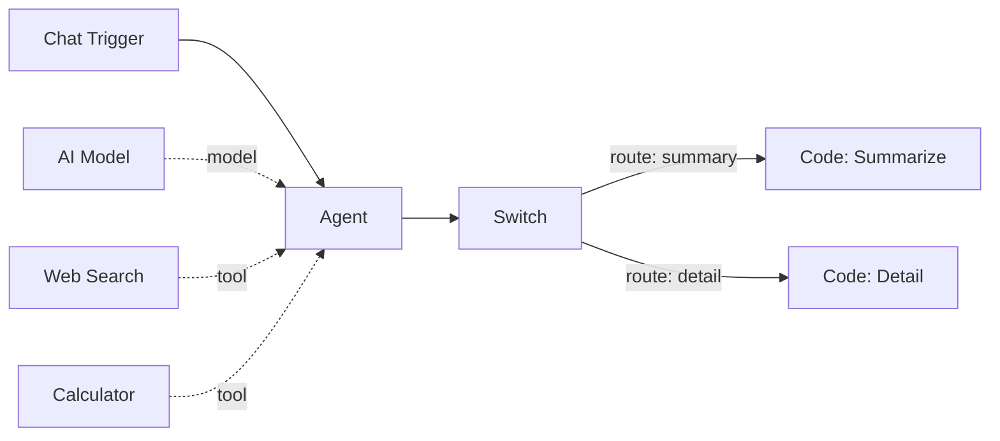
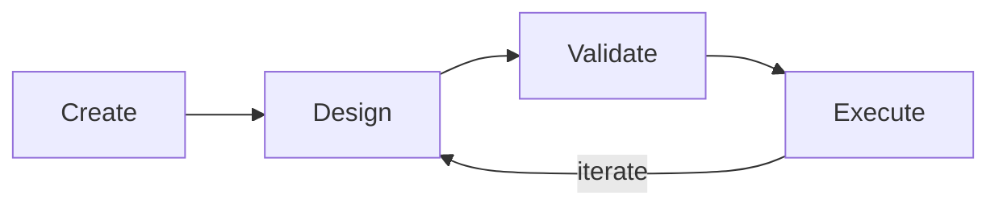
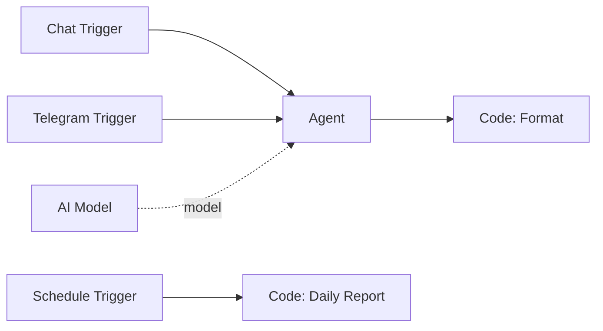

# Workflows

A **workflow** is the central organizing unit in Pipelit. It represents a visual pipeline that you design on a drag-and-drop canvas, connecting triggers, AI agents, tools, and logic nodes into a directed graph that executes automatically.

## What is a workflow?

A workflow is a collection of **nodes** (processing steps) connected by **edges** (data flow paths) arranged on a 2D canvas. When a trigger fires, Pipelit compiles the downstream portion of the graph into a LangGraph execution plan and runs each node in topological order, passing data along the edges.

The canvas is your primary design surface. You add nodes from the **Node Palette** on the left, configure them in the **Details Panel** on the right, and wire them together by dragging edges between handles.

## Workflow lifecycle

Every workflow moves through four stages:

### 1. Create

Create a new workflow from the dashboard. Each workflow gets a **name** and an auto-generated **slug** (a URL-friendly identifier like `my-chat-bot`). The slug is used throughout the API, WebSocket subscriptions, and browser URLs.

### 2. Design

Open the workflow editor to build your pipeline on the canvas:

- **Add nodes** from the palette (triggers, agents, tools, logic, sub-components)
- **Connect nodes** by dragging from output handles to input handles
- **Configure nodes** by selecting them and editing settings in the details panel
- **Attach sub-components** like AI models, tools, and memory to agent nodes via diamond-shaped handles

### 3. Validate

Before execution, validate your workflow to catch structural issues:

- Missing required connections (e.g., an agent without a model)
- Type mismatches between connected ports
- Orphaned conditional edges
- Unknown node references

!!! tip "Validate early, validate often"
    Use the **Validate** button in the editor toolbar or call `POST /api/v1/workflows/{slug}/validate/` from the API. Validation runs automatically before execution, but catching issues during design saves time.

### 4. Execute

Trigger the workflow to run it. Execution happens in the background via an RQ worker:

1. The trigger fires (chat message, Telegram message, schedule tick, manual dispatch, etc.)
2. The builder compiles only the nodes reachable from that trigger
3. The orchestrator executes nodes in topological order
4. Each node receives data from upstream nodes via resolved Jinja2 expressions
5. Real-time status updates stream to the frontend over WebSocket

After execution, you can inspect results, logs, and per-node outputs in the **Executions** page.

## Workflow slugs

Every workflow is identified by a **slug** -- a URL-friendly string derived from the workflow name. Slugs are unique across the platform and used as stable identifiers in:

- Browser URLs: `/workflows/my-chat-bot`
- API paths: `/api/v1/workflows/my-chat-bot/`
- WebSocket channels: `workflow:my-chat-bot`
- Subworkflow references: a `workflow` node targets another workflow by slug

!!! note
    Slugs are generated automatically when you create a workflow. They remain stable even if you rename the workflow later.

## Multi-trigger support

A single workflow can contain **multiple trigger nodes**, each defining an independent entry point into the graph. This is a powerful design pattern that lets you reuse downstream logic across different input channels.

In the example above, the same Agent node handles both chat and Telegram inputs, while a separate Schedule Trigger feeds a completely independent reporting branch.

### Trigger-scoped execution

When a trigger fires, Pipelit does **not** execute the entire workflow. Instead, it performs a BFS (breadth-first search) from the firing trigger and compiles only the nodes reachable downstream. Unconnected branches and unused nodes on the same canvas are ignored entirely.

This means:

- A chat message only runs the chat branch, not the Telegram branch
- A schedule tick only runs the scheduled branch, not the chat branch
- Nodes you are still building (not yet connected) will not cause errors during execution

!!! warning "Each trigger branch is independent"
    Nodes that are not reachable from the firing trigger will not execute. If you need a node to run from multiple triggers, connect it downstream of each one.

## What's next?

- Learn about the building blocks: [Nodes & Edges](nodes-and-edges.md)
- Understand how workflows start: [Triggers](triggers.md)
- Build your first workflow: [Quickstart Tutorial](../getting-started/quickstart-tutorial.md)
