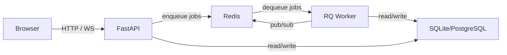

# Deployment

This section covers everything you need to deploy Pipelit in development and production environments.

## Overview

Pipelit is a self-hosted platform consisting of three runtime services:

| Service | Technology | Purpose |
|---------|-----------|---------|
| **Backend** | FastAPI + Uvicorn | REST API, WebSocket, static file serving |
| **Worker** | RQ (Redis Queue) | Background workflow execution, scheduled jobs |
| **Redis** | Redis 8.0+ | Task queue, pub/sub, search (RediSearch) |

The frontend is a React SPA that is either served by the Vite dev server during development or built into static files and served directly by FastAPI in production.

## Deployment Options

### [Docker](docker.md)

The recommended approach for most deployments. A multi-stage Dockerfile builds the frontend and backend into a single image, with docker-compose orchestrating all services.

### [Production](production.md)

Bare-metal or VM deployment with Gunicorn, systemd process management, and a production-ready security checklist.

### [Redis](redis.md)

Redis 8.0+ is required for task queuing, pub/sub, and full-text search. This page covers installation on all major platforms.

### [Reverse Proxy](reverse-proxy.md)

Nginx and Caddy configurations for HTTPS termination, WebSocket proxying, and domain-based routing.

### [Environment Variables](environment.md)

Complete reference for all environment variables that control Pipelit's behavior.

### [Database](database.md)

Database setup for SQLite (development) and PostgreSQL (production), plus Alembic migration management and backup strategies.

## Minimum Architecture

At minimum, a Pipelit deployment consists of:

All three services (FastAPI, RQ worker, Redis) must be running for workflows to execute. The backend and worker share the same codebase and database.
