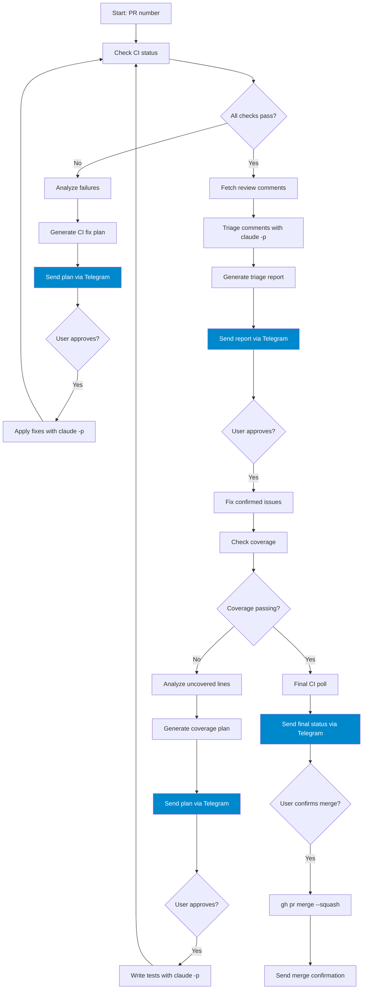

# PR Workflow

The `pr-workflow` skill manages the full GitHub pull request lifecycle with structured approval gates. It analyzes CI failures, triages reviewer comments, improves test coverage, and merges — but only after the user has approved a written plan at each stage.

**Skill file:** `docs/skills/pr-workflow/SKILL.md`

## Prerequisites

Before invoking this skill, ensure the following are available in the environment:

| Requirement | Purpose |
|-------------|---------|
| `gh` CLI (authenticated) | Fetch PR details, CI logs, post merge |
| `git` with push access | Commit and push fixes |
| `claude -p --dangerously-skip-permissions` | Code generation (uses Max subscription, not API tokens) |
| Telegram bot token + chat ID | Deliver plans and receive approvals |

!!! warning "Telegram is required"
    All status updates and approval requests are sent via Telegram. The skill is designed for asynchronous operation — you review and approve plans from your phone while the agent waits.

## Invoking the skill

```
/pr-workflow
```

Or mention a PR number in your message:

```
Check PR #42
```

```
Review and merge PR 42
```

The skill automatically detects PR numbers, CI check mentions, and review-related phrases in your message.

## Workflow overview



## Step-by-step reference

### Step 1: Check CI status

The skill polls all CI checks on the PR:

```bash
gh pr view <PR#> --json statusCheckRollup
```

It waits until all checks have a terminal status (pass or fail), then sends a Telegram summary:

```
📋 PR #42 CI Status:
✅ backend-tests
✅ frontend-lint
❌ codecov/patch (58%, target 92%)
```

If all checks pass, the skill jumps directly to Step 3. Otherwise it proceeds to Step 2.

### Step 2: CI fix plan (Approval Gate 1)

For each failing check, the skill:

1. Fetches the failed job logs via GitHub API
2. Uses `claude -p` to analyze the root cause
3. Generates `/tmp/pr-<N>-ci-fix-plan.md`

Example plan file:

```markdown
# CI Fix Plan — PR #42

## Failure: codecov/patch
- **Root cause:** Three new functions in `services/scheduler.py` have no test coverage
- **Proposed fix:** Add unit tests for `_enqueue_next()`, `recover_scheduled_jobs()`, and the backoff calculation
- **Files to change:** `tests/test_scheduler.py`
- **Risk:** low
```

The plan file is sent to Telegram as a document attachment. **The skill waits for user approval before making any code changes.**

After approval, the skill applies fixes with `claude -p`, commits, pushes, and loops back to Step 1.

### Step 3: Review triage (Approval Gate 2)

The skill fetches all reviewer comments:

```bash
gh pr view <PR#> --json comments
```

It uses `claude -p` to evaluate each comment: is it a genuine bug, a style preference, or a false positive? It generates `/tmp/pr-<N>-triage-report.md`:

```markdown
# Review Triage — PR #42

## Issue #1: Potential race condition in worker shutdown
- **Reviewer:** alice
- **File:** platform/worker_class.py:45
- **Verdict:** ✅ Confirmed bug
- **Reasoning:** The shutdown hook is not thread-safe; concurrent workers can call it simultaneously
- **Proposed fix:** Add a threading.Lock guard around the shutdown sequence

## Issue #2: Variable name could be clearer
- **Reviewer:** bob
- **File:** platform/services/scheduler.py:88
- **Verdict:** ❌ False positive
- **Reasoning:** `rc` follows the existing naming convention in this file; renaming would be inconsistent

## Summary
- Confirmed: 1 issue to fix
- False positives: 1 issue to skip
```

The report is sent to Telegram. **The skill waits for user approval before proceeding.**

After approval, the skill fixes confirmed issues with `claude -p`, commits, and pushes.

### Step 4: Coverage plan (Approval Gate 3)

The skill checks the codecov status. If coverage is passing, it skips to Step 5.

If coverage is failing, it identifies uncovered lines and generates `/tmp/pr-<N>-coverage-plan.md`:

```markdown
# Coverage Plan — PR #42

Current patch coverage: 58% (target: 92%)
Lines missing coverage: 14

## File: platform/services/scheduler.py (9 lines uncovered)
- **Lines:** 201-209
- **What they do:** Exponential backoff calculation with max cap
- **Tests to write:**
  - `test_backoff_doubles_each_retry`: verify backoff interval doubles on consecutive failures
  - `test_backoff_capped_at_max`: verify backoff does not exceed 10x the base interval

## File: platform/tasks/scheduled.py (5 lines uncovered)
- **Lines:** 34-38
- **What they do:** Early-return guard when job status is not active
- **Tests to write:**
  - `test_paused_job_skips_execution`: verify paused jobs return without dispatching

## Estimated coverage after tests: ~94%
```

The plan is sent to Telegram. **The skill waits for user approval before proceeding.**

After approval, the skill writes the tests with `claude -p`, commits, pushes, and loops back to Step 1 to verify CI passes.

### Step 5: Final check

Once all CI checks pass and coverage is satisfied, the skill sends a final summary:

```
🏁 PR #42 Final Status:
✅ backend-tests
✅ frontend-lint
✅ review
✅ codecov/patch (94%)

Ready to merge?
```

**The skill waits for explicit user confirmation before merging.**

### Step 6: Merge

```bash
gh pr merge <PR#> --squash --admin
```

Followed by a Telegram confirmation:

```
✅ PR #42 merged.
```

## Key rules

1. **Never make code changes without a plan** — every change is preceded by a `.md` plan sent to Telegram and approved by the user.
2. **Use `claude -p` for all code generation** — this uses the flat-rate Max subscription rather than per-token API billing.
3. **Send Telegram updates at every milestone** — the user operates asynchronously and cannot see agent activity in real time.
4. **Triage reviewer comments critically** — not every comment represents a genuine bug. The agent must reason about each one before accepting it.
5. **Never lower coverage thresholds** — write tests to reach the target, do not change the target to pass CI.

## Telegram commands reference

```bash
# Send a text message
curl -s \
  -F chat_id=<CHAT_ID> \
  -F text="<message>" \
  "https://api.telegram.org/bot<TOKEN>/sendMessage"

# Send a file (plan document)
curl -s \
  -F chat_id=<CHAT_ID> \
  -F document=@/tmp/pr-42-ci-fix-plan.md \
  "https://api.telegram.org/bot<TOKEN>/sendDocument"
```

## What's next?

- [Writing Skills](writing-skills.md) — create your own skills with the same pattern
- [Skills Index](index.md) — full catalog of available skills
