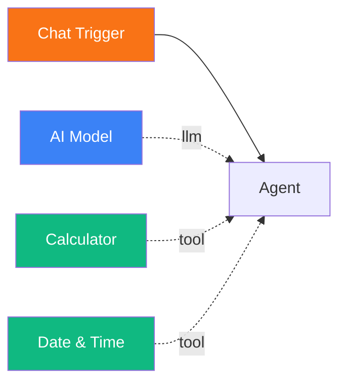
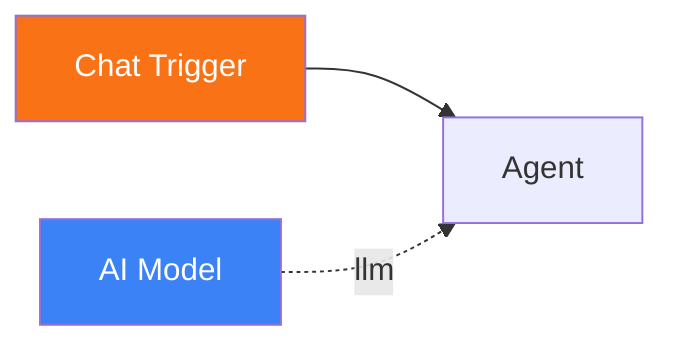

# Build a Conversational Chatbot

<span class="badge badge--ai">Beginner</span>

In this tutorial, you will build a chat agent that can hold a conversation, remember previous messages, and answer questions using tools. By the end, you will have a working chatbot accessible from the Pipelit web interface.

**Time:** 10 minutes

**What you will build:**



---

## Prerequisites

- Pipelit is [installed and running](../getting-started/first-run.md)
- You have at least one [LLM credential](../frontend/credentials-ui.md) configured (e.g., OpenAI, Anthropic, or another provider)

## Step 1: Create a new workflow

1. Open the Pipelit dashboard at `http://localhost:8000`.
2. Click **New Workflow**.
3. Enter a name -- for example, `My Chatbot`.
4. Click **Create**. You are taken to the workflow editor.

The editor has three panels:

- **Left** -- Node Palette (click to add nodes to the canvas)
- **Center** -- Canvas (arrange and connect nodes)
- **Right** -- Node Details Panel (configure the selected node)

## Step 2: Add a Chat Trigger

The chat trigger is the entry point for your workflow. It receives messages from the built-in web chat interface.

1. In the Node Palette on the left, find the **Triggers** section.
2. Click **Chat**. A chat trigger node appears on the canvas.

The Chat Trigger has no configuration -- it simply passes the user's message text downstream.

## Step 3: Add an AI Model

The AI Model node defines which LLM provider and model your agent will use.

1. In the Node Palette, find the **Sub-Components** section.
2. Click **AI Model**. An AI Model node appears on the canvas.
3. Click on the AI Model node to select it. The Node Details Panel opens on the right.
4. Select your **Credential** from the dropdown (e.g., your OpenAI or Anthropic credential).
5. Select a **Model** from the dropdown (e.g., `gpt-4o`, `claude-sonnet-4-20250514`).

!!! tip "Which model to choose?"
    For a general-purpose chatbot, models like `gpt-4o` or `claude-sonnet-4-20250514` work well. Smaller models like `gpt-4o-mini` are faster and cheaper, suitable for simple conversations.

## Step 4: Add an Agent

The Agent is the core AI node. It uses the connected model to reason about the user's message and produce a response.

1. In the Node Palette, find the **AI** section.
2. Click **Agent**. An agent node appears on the canvas.
3. Click on the Agent node to select it.
4. In the Node Details Panel, click the **System Prompt** field to open the editor.
5. Enter a system prompt that defines your chatbot's personality and behavior.

Here is an example system prompt:

```
You are a friendly and helpful assistant. You answer questions clearly and
concisely. When you do not know the answer, say so honestly rather than
guessing. Use your tools when they would help provide a more accurate answer.
```

### Tips for writing good system prompts

| Guideline | Example |
|-----------|---------|
| **Define the persona** | "You are a senior software engineer who explains concepts simply." |
| **Set boundaries** | "Only answer questions about Python. For other topics, politely redirect." |
| **Specify tone** | "Be concise and direct. Avoid filler phrases." |
| **Instruct tool use** | "Use the calculator for any math. Use datetime for time-related questions." |
| **Handle uncertainty** | "If you are unsure, say so. Do not fabricate information." |

!!! info "Jinja2 expressions in system prompts"
    System prompts support Jinja2 template expressions like `{{ trigger.text }}`. This is useful for injecting dynamic data, but for a basic chatbot, plain text is sufficient. See [Expressions](../concepts/expressions.md) for details.

## Step 5: Enable conversation memory

By default, agents are stateless -- each message starts a fresh conversation. Enabling conversation memory lets the agent remember previous messages.

1. With the Agent node selected, find the **Conversation Memory** toggle in the Node Details Panel.
2. Switch it **on**.

When enabled, the agent persists conversation history across messages. The thread is scoped to your user account and this workflow, so each user gets their own conversation.

## Step 6: Connect the nodes

Now wire the nodes together. Pipelit uses two types of connections:

- **Data flow edges** (solid lines) -- connect output handles (right side) to input handles (left side)
- **Sub-component edges** (dotted lines) -- connect diamond handles for model, tools, and memory

### Connect Chat Trigger to Agent

1. Hover over the **right handle** (circle) on the Chat Trigger node.
2. Click and drag to the **left handle** (circle) on the Agent node.
3. Release to create the connection.

### Connect AI Model to Agent

1. Hover over the **top diamond handle** on the AI Model node.
2. Click and drag to the **bottom "model" diamond handle** (blue) on the Agent node.
3. Release to create the connection.

Your workflow should now look like this:



## Step 7: Add tools (optional)

Tools give your agent capabilities beyond text generation. Let's add a calculator and a datetime tool.

1. In the Node Palette, find the **Tools** section.
2. Click **Calculator**. A calculator tool node appears.
3. Click **Date & Time**. A datetime tool node appears.
4. For each tool, drag from the tool's **right handle** to the Agent's **"tools" diamond handle** (green).

!!! note "Tool connection"
    Tool connections use the green diamond handle at the bottom of the Agent node, not the circular handles on the sides. The diamond handles are for sub-components (model, tools, memory).

## Step 8: Test your chatbot

1. Click the **Chat** button in the bottom panel of the workflow editor to open the chat interface.
2. Type a message and press Enter:

    > Hello! What is 42 multiplied by 17?

3. Watch the nodes on the canvas as they execute:

    - **Chat Trigger** flashes blue (running), then green (success)
    - **Agent** flashes blue, invokes the Calculator tool (which also flashes), then turns green
    - The response appears in the chat panel

4. Try a follow-up message to test conversation memory:

    > What did I just ask you about?

    The agent should remember the previous question because conversation memory is enabled.

5. Try a datetime question:

    > What is the current date and time?

    The agent should call the Date & Time tool and return the current time.

## What you built

You now have a conversational chatbot with:

- A **Chat Trigger** that receives messages from the web interface
- An **AI Model** providing the LLM backend
- An **Agent** with a custom system prompt and conversation memory
- **Calculator** and **Date & Time** tools for enhanced capabilities

Nodes show real-time execution status on the canvas -- blue spinning circles while running, green checkmarks on success, and red X marks on failure. After execution, click the green "output" link on any node to see its full output.

## Next steps

- [Set Up a Telegram Bot](telegram-bot.md) -- connect your agent to Telegram
- [Conditional Routing](conditional-routing.md) -- route different messages to different agents
- [Agent reference](../components/ai/agent.md) -- full configuration details for agent nodes
- [Tools reference](../components/tools/index.md) -- explore all available tool types
