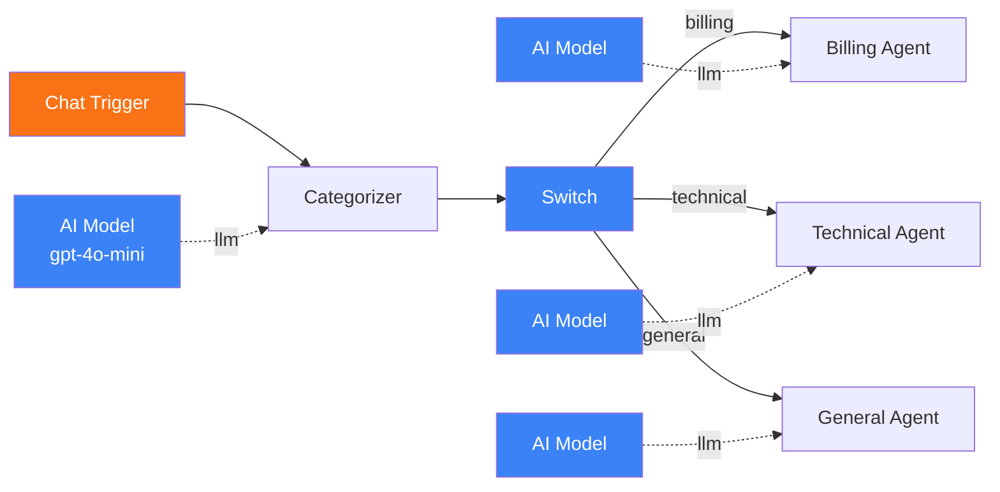
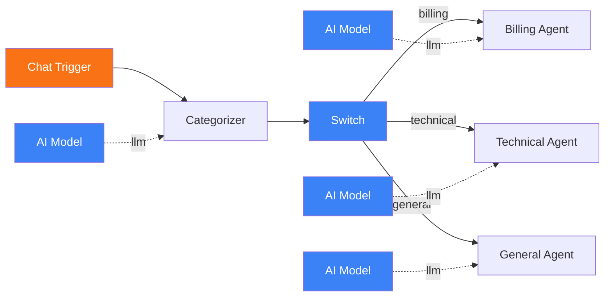
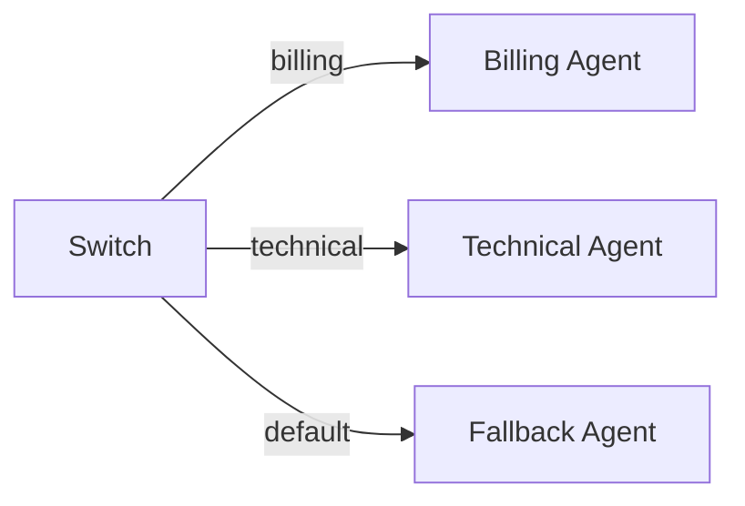

# Conditional Routing with Switch Nodes

<span class="badge badge--logic">Intermediate</span>

In this tutorial, you will build a workflow that classifies incoming messages and routes them to different specialized agents. A customer support scenario is used as the example: messages are categorized as billing, technical, or general, and each category is handled by a dedicated agent with domain-specific instructions.

**Time:** 20 minutes

**What you will build:**



---

## Prerequisites

- Pipelit is [installed and running](../getting-started/first-run.md)
- You have an [LLM credential](../frontend/credentials-ui.md) configured
- You have completed the [Chat Agent tutorial](chat-agent.md) (recommended)

## Concepts

Before building, here is how conditional routing works in Pipelit:

1. A **Categorizer** node uses an LLM to classify input text into one of several predefined categories.
2. The Categorizer outputs a `_route` value matching the category name.
3. A **Switch** node reads the route value from the workflow state.
4. **Conditional edges** on the Switch node direct execution to different downstream nodes based on the route value.

Only the branch matching the current route executes -- the other branches are skipped.

## Step 1: Create the workflow

1. On the Dashboard, click **New Workflow**.
2. Name it `Support Router` and click **Create**.

## Step 2: Add a Chat Trigger

1. From the Node Palette under **Triggers**, click **Chat**.
2. A Chat Trigger node appears on the canvas.

## Step 3: Add a Categorizer

The Categorizer uses an LLM to classify the incoming message into one of your defined categories.

1. From the Node Palette under **AI**, click **Categorizer**.
2. Click on the Categorizer node to select it.
3. In the Node Details Panel, configure the categories in **Extra Config**:

    ```json
    {
      "categories": [
        {
          "name": "billing",
          "description": "Questions about invoices, payments, refunds, pricing, or subscription plans"
        },
        {
          "name": "technical",
          "description": "Bug reports, errors, feature requests, integration help, or API questions"
        },
        {
          "name": "general",
          "description": "Greetings, general inquiries, feedback, or anything that does not fit the other categories"
        }
      ]
    }
    ```

4. Optionally, add a **System Prompt** to provide classification guidance:

    ```
    You are classifying customer support messages for a SaaS platform.
    Be precise -- questions about feature limits should go to "technical",
    not "billing". When in doubt, choose "general".
    ```

### Connect an AI Model to the Categorizer

1. Add an **AI Model** node from the Node Palette.
2. Configure it with your credential and a model. A smaller, cheaper model like `gpt-4o-mini` works well for classification since the task is straightforward.
3. Connect the AI Model's top diamond handle to the Categorizer's "model" diamond handle (blue).

!!! tip "Use a cheaper model for classification"
    The Categorizer makes a single LLM call to classify input. A smaller model reduces cost and latency without sacrificing classification quality for well-defined categories.

## Step 4: Add a Switch node

The Switch node reads the route value set by the Categorizer and directs execution down the matching conditional edge.

1. From the Node Palette under **Routing** (or **Logic**), click **Switch**.
2. A Switch node appears on the canvas.

The Switch node does not require configuration for this use case -- it reads the `_route` value from the workflow state, which the Categorizer sets automatically.

## Step 5: Add specialized agents

Create three agent nodes, one for each category.

### Billing Agent

1. Add an **Agent** from the Node Palette.
2. Set its **System Prompt**:

    ```
    You are a billing support specialist. Help customers with:
    - Invoice questions and payment issues
    - Subscription plan details and upgrades
    - Refund requests and billing disputes
    - Pricing clarification

    Be empathetic and solution-oriented. If the issue requires account
    access you do not have, escalate to a human agent.
    ```

3. Add an **AI Model** node and connect it to this agent's model handle.

### Technical Agent

1. Add another **Agent**.
2. Set its **System Prompt**:

    ```
    You are a technical support engineer. Help customers with:
    - Bug reports and error troubleshooting
    - API integration questions
    - Feature requests (acknowledge and log them)
    - Configuration and setup assistance

    Ask clarifying questions when the issue is ambiguous. Include
    specific steps in your solutions.
    ```

3. Add an **AI Model** node and connect it.

### General Agent

1. Add a third **Agent**.
2. Set its **System Prompt**:

    ```
    You are a friendly general support agent. Handle:
    - Greetings and casual conversation
    - General product inquiries
    - Feedback and suggestions
    - Anything that does not fit billing or technical categories

    Be warm and helpful. Redirect to specialized support if the
    conversation turns technical or billing-related.
    ```

3. Add an **AI Model** node and connect it.

!!! note "Sharing AI Model nodes"
    Each agent needs its own AI Model connection. You can use the same credential and model across all of them, but each requires a separate AI Model node on the canvas.

## Step 6: Connect the nodes

### Data flow connections

1. **Chat Trigger -> Categorizer**: Right handle to left handle.
2. **Categorizer -> Switch**: Right handle to left handle.

### Conditional edges from the Switch

Conditional edges are created differently from regular edges. Each conditional edge carries a `condition_value` that must match the route.

1. **Switch -> Billing Agent**: Drag from the Switch's right handle to the Billing Agent's left handle. When the edge creation dialog appears, set the **condition value** to `billing`.
2. **Switch -> Technical Agent**: Same process, with condition value `technical`.
3. **Switch -> General Agent**: Same process, with condition value `general`.

!!! info "Conditional edge labels"
    On the canvas, conditional edges display their condition value as a label on the edge (e.g., "billing", "technical", "general"). This makes it easy to see the routing logic at a glance.

### The complete workflow



## Step 7: Validate and test

### Validate the workflow

Before testing, validate the workflow to catch any configuration errors:

1. Click the **Validate** button (or use `POST /api/v1/workflows/{slug}/validate/`).
2. Fix any reported issues (e.g., missing model connections, unconnected nodes).

### Test with different messages

Open the Chat panel and try messages that should route to each category:

**Billing message:**
> I was charged twice on my last invoice. Can you help me get a refund?

Expected: Categorizer outputs `billing` -> Switch routes to Billing Agent.

**Technical message:**
> I am getting a 500 error when I try to use the API endpoint for user creation.

Expected: Categorizer outputs `technical` -> Switch routes to Technical Agent.

**General message:**
> Hi there! I just wanted to say I love your product.

Expected: Categorizer outputs `general` -> Switch routes to General Agent.

### Observe execution on the canvas

As each message is processed:

1. The Chat Trigger lights up (running -> success).
2. The Categorizer lights up and makes an LLM call to classify the message.
3. The Switch node lights up and evaluates the route.
4. Only the matching downstream agent lights up -- the other two stay idle.

Click the green "output" link on the Categorizer node after execution to see the classification result:

```json
{
  "category": "technical",
  "raw": "{\"category\": \"technical\"}"
}
```

## Variations

### Using a Switch node with custom rules

Instead of using a Categorizer (which requires an LLM call), you can configure the Switch node with pattern-matching rules for simpler routing:

```json
{
  "rules": [
    {"field": "text", "operator": "contains", "value": "invoice", "route": "billing"},
    {"field": "text", "operator": "contains", "value": "refund", "route": "billing"},
    {"field": "text", "operator": "contains", "value": "error", "route": "technical"},
    {"field": "text", "operator": "contains", "value": "bug", "route": "technical"}
  ],
  "default_route": "general"
}
```

This approach is faster and cheaper (no LLM call) but less flexible than LLM-based classification.

### Adding a default/fallback route

If the Categorizer returns a category that does not match any conditional edge, the Switch node falls back to a `default` route. Add a conditional edge with condition value `default` to handle unrecognized categories:



### Combining with conversation memory

Enable **Conversation Memory** on each specialized agent so they maintain context within their domain. A user who starts with a billing question and follows up with more details will get a continuous conversation thread with the Billing Agent.

## Next steps

- [Scheduled Workflows](scheduled-workflow.md) -- automate recurring tasks
- [Multi-Agent Delegation](multi-agent.md) -- coordinate agents across workflows
- [Categorizer reference](../components/ai/categorizer.md) -- full configuration details
- [Expressions](../concepts/expressions.md) -- use upstream outputs in system prompts
