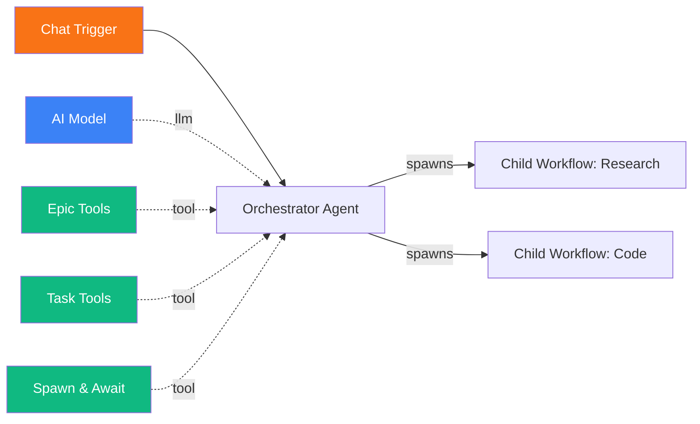
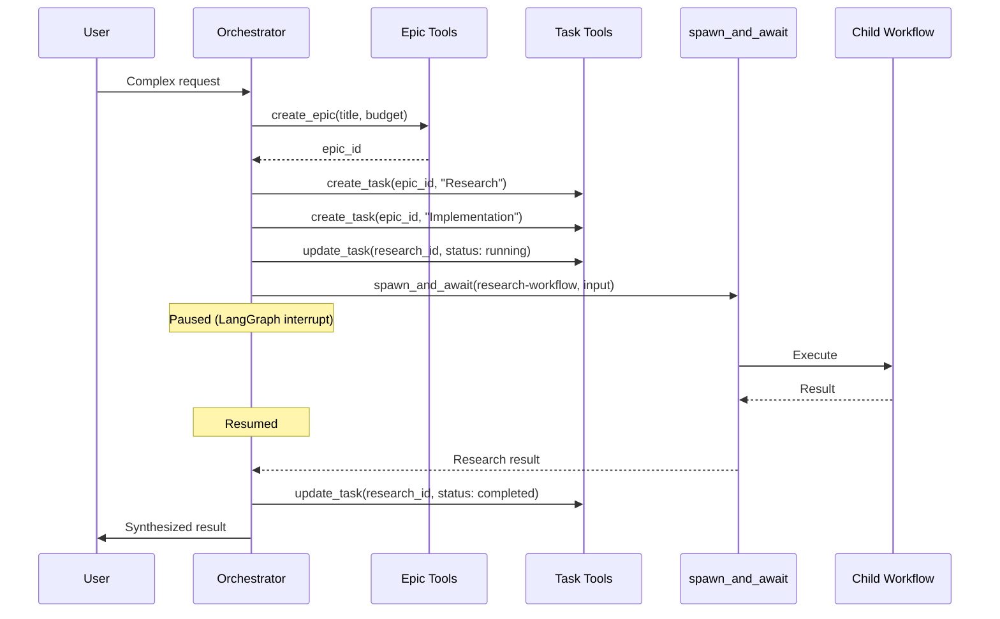
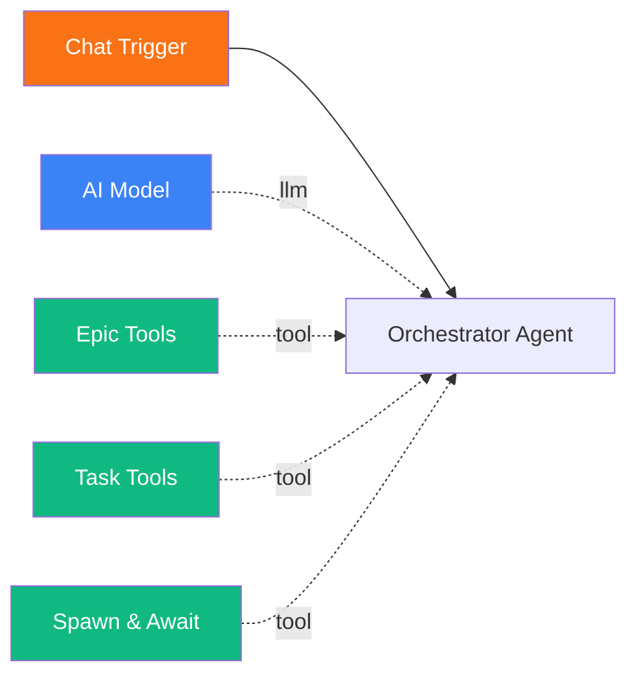

# Multi-Agent Delegation

<span class="badge badge--ai">Advanced</span>

In this tutorial, you will build a multi-agent system where a main orchestrator agent decomposes complex tasks into epics and individual work items, then delegates them to child workflows using `spawn_and_await`. The orchestrator tracks progress, costs, and results across all child executions.

**Time:** 30 minutes

**What you will build:**

- A **main orchestrator workflow** with epic/task management and child workflow spawning
- One or more **child worker workflows** that perform specific tasks
- A delegation flow where the orchestrator plans, delegates, and synthesizes results



---

## Prerequisites

- Pipelit is [installed and running](../getting-started/first-run.md) with **Redis** and an **RQ worker** active (required for spawn_and_await)
- You have an [LLM credential](../frontend/credentials-ui.md) configured
- You have completed the [Chat Agent tutorial](chat-agent.md)
- Familiarity with [Epics & Tasks](../concepts/epics-and-tasks.md) concepts is recommended

## Concepts

Multi-agent delegation in Pipelit follows this pattern:

1. An **orchestrator agent** receives a complex objective.
2. It creates an **epic** to represent the objective with an optional budget.
3. It decomposes the epic into **tasks** with dependencies between them.
4. Each task is executed by **spawning a child workflow** via `spawn_and_await`.
5. The orchestrator pauses (via LangGraph interrupt) while the child runs.
6. When the child completes, the orchestrator resumes with the result.
7. Costs from child executions are automatically synced to tasks and the epic.



## Step 1: Create child worker workflows

Before building the orchestrator, create the workflows it will delegate to. Each child workflow is a standalone workflow with its own trigger and agent.

### Research workflow

This workflow handles research tasks -- answering questions by searching the web.

1. Create a new workflow named `Research Worker`.
2. Add a **Chat Trigger** (child workflows are spawned via the chat dispatch mechanism).
3. Add an **Agent** with this system prompt:

    ```
    You are a research specialist. When given a research task:

    1. Use web search to find relevant, current information.
    2. Cross-reference multiple sources when possible.
    3. Provide a structured summary with key findings.
    4. Include source URLs when available.

    Be thorough but concise. Focus on actionable information.
    ```

4. Add an **AI Model** and connect it to the agent.
5. Add a **Web Search** tool and connect it to the agent's tools handle.
6. Connect: Chat Trigger -> Agent.

### Code workflow

This workflow handles code-related tasks.

1. Create a new workflow named `Code Worker`.
2. Add a **Chat Trigger**.
3. Add an **Agent** with this system prompt:

    ```
    You are a code specialist. When given a coding task:

    1. Understand the requirements fully before writing code.
    2. Use the run_command tool to test your code.
    3. Handle edge cases and include error handling.
    4. Provide clear explanations alongside the code.

    Write clean, well-documented code.
    ```

4. Add an **AI Model** and connect it.
5. Add a **Run Command** tool and connect it to the agent's tools handle.
6. Connect: Chat Trigger -> Agent.

!!! tip "Child workflow naming"
    Name child workflows with clear, descriptive slugs (e.g., `research-worker`, `code-worker`). The orchestrator references them by slug when calling `spawn_and_await`.

## Step 2: Create the orchestrator workflow

1. Create a new workflow named `Orchestrator`.
2. Add a **Chat Trigger**.
3. Add an **Agent** -- this is your orchestrator. Configure its system prompt:

    ```
    You are a project orchestrator agent. When given a complex task:

    1. PLAN: Break the task down into subtasks. Create an epic with
       create_epic, then create tasks with create_task.

    2. DELEGATE: For each task, use spawn_and_await to execute the
       appropriate child workflow:
       - Research tasks -> workflow slug: "research-worker"
       - Coding tasks -> workflow slug: "code-worker"

    3. TRACK: After each child completes, update the task status with
       update_task (status: "completed" or "failed").

    4. SYNTHESIZE: Once all tasks are complete, combine results into
       a coherent final response. Update the epic status to "completed"
       with a result_summary.

    Always create an epic before creating tasks. Set task dependencies
    when one task needs the result of another (use depends_on).

    Available child workflows:
    - "research-worker": Web research and information gathering
    - "code-worker": Code writing, review, and execution
    ```

4. Add an **AI Model** and connect it to the agent.
5. Enable **Conversation Memory** so the orchestrator remembers the delegation context across spawn_and_await pauses.

## Step 3: Add self-awareness tools to the orchestrator

The orchestrator needs several tools to manage epics, tasks, and child workflows.

### Epic Tools

1. From the Node Palette under **Self-Awareness**, add **Epic Tools**.
2. Connect it to the orchestrator agent's tools handle (green diamond).

Epic Tools provides four LangChain tools to the agent:

| Tool | Purpose |
|------|---------|
| `create_epic` | Create a new epic with title, description, tags, priority, and optional budget |
| `epic_status` | Get detailed status including task breakdown and cost summary |
| `update_epic` | Update status, title, priority, budgets, or result summary |
| `search_epics` | Search epics by text, tags, or status |

### Task Tools

1. Add **Task Tools** from the Node Palette.
2. Connect it to the agent's tools handle.

Task Tools provides:

| Tool | Purpose |
|------|---------|
| `create_task` | Create a task within an epic, with dependencies and estimates |
| `list_tasks` | List tasks in an epic, filter by status or tags |
| `update_task` | Update status, result summary, notes |
| `cancel_task` | Cancel a task and optionally its linked execution |

### Spawn & Await

1. Add **Spawn & Await** from the Node Palette.
2. Connect it to the agent's tools handle.

The `spawn_and_await` tool takes three parameters:

| Parameter | Description |
|-----------|-------------|
| `workflow_slug` | The slug of the child workflow to execute |
| `input_text` | The message to send to the child workflow's trigger |
| `task_id` | Optional task ID to link the execution with for cost tracking |

!!! warning "RQ worker required"
    `spawn_and_await` uses LangGraph's interrupt mechanism and RQ for async execution. Make sure your RQ worker is running, or the spawn will hang.

## Step 4: Connect the orchestrator workflow

1. **Chat Trigger -> Orchestrator Agent**: Right handle to left handle.
2. **AI Model -> Agent**: Top diamond to model handle.
3. **Epic Tools -> Agent**: Right handle to tools handle (green diamond).
4. **Task Tools -> Agent**: Right handle to tools handle.
5. **Spawn & Await -> Agent**: Right handle to tools handle.

The complete orchestrator workflow:



## Step 5: Test with a complex task

Open the Chat panel on the orchestrator workflow and send a request that requires multiple steps:

> Research the current best practices for Python error handling in web APIs,
> then write a FastAPI error handling middleware that implements those practices.

### Expected behavior

1. The orchestrator creates an epic: "Python API Error Handling"
2. It creates two tasks:
    - Task 1: "Research Python API error handling best practices" (workflow: `research-worker`)
    - Task 2: "Write FastAPI error handling middleware" (workflow: `code-worker`, depends_on: Task 1)
3. It spawns the research workflow with `spawn_and_await("research-worker", "Research current best practices for Python error handling in web APIs", task_id)`.
4. The orchestrator pauses while the research workflow runs.
5. When the research completes, the orchestrator resumes with the research results.
6. It updates Task 1 to `completed`.
7. It spawns the code workflow: `spawn_and_await("code-worker", "Write a FastAPI error handling middleware implementing these practices: [research results]", task_id)`.
8. The code workflow runs and returns the implementation.
9. The orchestrator synthesizes both results into a final response and updates the epic to `completed`.

### Monitor progress

- **Executions page**: Each spawn creates a separate execution. You will see the orchestrator execution (paused/running) and child executions.
- **Canvas**: Watch the orchestrator's nodes light up. When paused at `spawn_and_await`, the agent node shows an interrupted status.
- **Epic status**: The orchestrator can call `epic_status` to check progress mid-flight.

## Step 6: Track costs

Cost tracking is automatic. When a child execution completes:

1. Token counts and USD cost are copied from the execution to the linked task.
2. The epic's `spent_tokens` and `spent_usd` are recalculated by summing all task costs.
3. `llm_calls` and `tool_invocations` are recorded on each task.

### Setting a budget

When creating the epic, the orchestrator can set a budget:

```
create_epic(title="Error Handling Project", budget_usd=0.50, budget_tokens=100000)
```

Budget enforcement is checked before every node execution. If the epic exceeds its budget, further executions in linked tasks will fail with a budget-exceeded error.

### Viewing cost data

Use `epic_status` to see a cost breakdown:

```json
{
  "epic_id": "ep-abc123",
  "status": "completed",
  "total_tasks": 2,
  "completed_tasks": 2,
  "spent_tokens": 15420,
  "spent_usd": 0.12,
  "budget_usd": 0.50
}
```

## Tips for effective delegation

| Tip | Explanation |
|-----|-------------|
| **Keep child workflows focused** | Each child workflow should do one thing well. Avoid cramming multiple responsibilities into one worker. |
| **Use task dependencies** | Set `depends_on` when one task needs another's output. The orchestrator should respect this ordering. |
| **Include context in spawn input** | Pass relevant context from earlier tasks when spawning dependent work. The child workflow only sees what you send it. |
| **Set budgets on epics** | Prevents runaway costs from recursive or long-running delegations. |
| **Use tags for organization** | Tag epics and tasks (e.g., `["research", "python"]`) for easy filtering and search. |

## Next steps

- [Self-Improving Agent](self-improving-agent.md) -- agents that modify their own configuration
- [YAML DSL](yaml-dsl.md) -- programmatically create child workflows
- [Epics & Tasks reference](../concepts/epics-and-tasks.md) -- full lifecycle and field documentation
- [Cost Tracking](../concepts/cost-tracking.md) -- detailed cost tracking and budget enforcement
