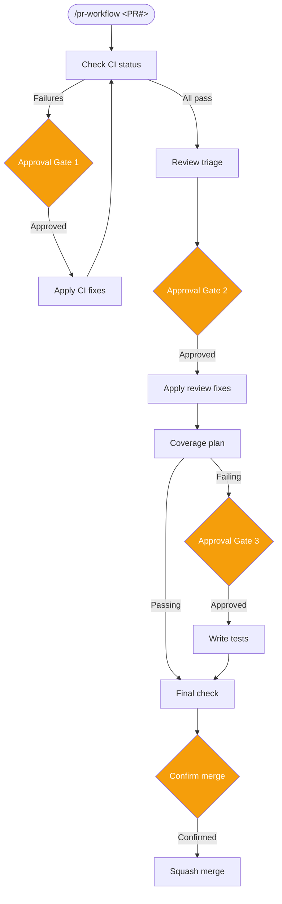

# End-to-End PR Workflow with Skills

<span class="badge badge--tool">Advanced</span>

Walk through using the `pr-workflow` skill with Claude Code to manage the full lifecycle of a GitHub pull request — from CI checks through code review triage to merge.

**What you will learn:** How skills structure complex workflows, how approval gates protect against unsupervised changes, and how to use the PR workflow pattern for CI analysis, review triage, and coverage fixing.

**Prerequisites:**

- Claude Code installed and configured
- `gh` CLI authenticated with push access to the repository
- A Pipelit deployment with Telegram configured (for status updates and approval gates)
- The `pr-workflow` skill installed from the [skills repository](https://github.com/theuselessai/skills)

---

## What is the pr-workflow skill?

The `pr-workflow` skill is a structured Claude Code workflow that manages the full lifecycle of a GitHub pull request with **four approval gates**. Each gate pauses execution, sends a plan to you via Telegram, and waits for your sign-off before making any code changes.

The skill encodes a repeatable engineering process in a `SKILL.md` file — a markdown document with YAML frontmatter that Claude Code reads to understand when and how to execute the workflow. See [Skills](../skills/index.md) for a conceptual overview.



---

## Step 1: Install the Skill

Clone the skills repository and copy the `pr-workflow` skill into your project's `.claude/skills/` directory:

```bash
# Clone the skills repository
git clone https://github.com/theuselessai/skills /tmp/skills

# Create the skills directory in your project
mkdir -p .claude/skills/pr-workflow

# Copy the skill
cp /tmp/skills/skills/pr-workflow/SKILL.md .claude/skills/pr-workflow/SKILL.md
```

Alternatively, clone the entire skills repository and symlink the skill:

```bash
git clone https://github.com/theuselessai/skills ~/.local/share/skills
mkdir -p .claude/skills
ln -s ~/.local/share/skills/skills/pr-workflow .claude/skills/pr-workflow
```

Claude Code reads all `SKILL.md` files in `.claude/skills/` on startup. The skill is immediately available once the file is in place — no restart required.

---

## Step 2: Invoke the Skill

In a Claude Code session within your project directory, invoke the skill with the PR number:

```
/pr-workflow 42
```

Claude Code reads the skill's YAML frontmatter to confirm the invocation, then begins executing the workflow steps. All status updates are sent to the Telegram bot configured in your Pipelit deployment.

!!! tip "Automatic invocation"
    The `pr-workflow` skill has a trigger description in its frontmatter that covers common phrasings. Claude Code may invoke the skill automatically when you say things like "check CI on PR 42", "review PR #42", or "merge PR 42" — without needing the explicit `/pr-workflow` command.

---

## Step 3: CI Status Check

The skill starts by fetching the PR's CI status using the `gh` CLI:

```bash
gh pr view 42 --json statusCheckRollup
```

It polls until all checks complete, then sends a summary via Telegram:

```
📋 PR #42 CI Status:
✅ backend-tests
✅ frontend-lint
❌ codecov/patch (58%, target 92%)
```

If all checks pass, the skill jumps directly to review triage (Step 5). If any check fails, it proceeds to the CI Fix Plan approval gate.

---

## Step 4: CI Fix Plan (Approval Gate 1)

When CI checks fail, the skill analyzes the failures before making any changes.

**What happens:**

1. Fetches failed job logs via the GitHub API
2. Uses `claude -p` to analyze the root cause of each failure
3. Generates a structured fix plan at `/tmp/pr-42-ci-fix-plan.md`

**Example plan format:**

```markdown
# CI Fix Plan — PR #42

## Failure: codecov/patch
- **Root cause:** New code in `platform/services/scheduler.py` lines 145-162 is not covered
- **Proposed fix:** Add two test cases to `tests/test_scheduler.py`
- **Files to change:** `tests/test_scheduler.py`
- **Risk:** low
```

The plan is sent as a file via Telegram. **The skill waits for your approval before writing any code.**

After you approve, the skill applies the fixes using `claude -p`, commits the changes, pushes to the branch, and re-runs the CI status check from the beginning.

---

## Step 5: Review Triage (Approval Gate 2)

Once CI passes, the skill pulls all reviewer comments:

```bash
gh pr view 42 --json comments
```

It uses `claude -p` to triage each comment — distinguishing confirmed bugs from false positives — and generates a triage report at `/tmp/pr-42-triage-report.md`.

**Example triage report format:**

```markdown
# Review Triage — PR #42

## Issue #1: Unchecked return value in retry logic
- **Reviewer:** alice
- **File:** platform/services/scheduler.py:89
- **Verdict:** ✅ Confirmed bug
- **Reasoning:** The return value of `enqueue_in()` is used later but not checked here
- **Proposed fix:** Assign to variable and check for None

## Issue #2: Unnecessary type cast
- **Reviewer:** bob
- **File:** platform/api/workflows.py:234
- **Verdict:** ❌ False positive
- **Reasoning:** The cast is required for SQLAlchemy 2.0 compatibility

## Summary
- Confirmed: 1 issue to fix
- False positives: 1 issue to skip
```

The report is sent via Telegram. **The skill waits for your approval before applying fixes.**

After approval, confirmed issues are fixed with `claude -p`, committed, and pushed.

---

## Step 6: Coverage Plan (Approval Gate 3)

After review fixes are applied, the skill checks codecov status. If coverage is already passing, it skips directly to the final check.

If coverage is failing, the skill analyzes which lines are uncovered and generates a test plan at `/tmp/pr-42-coverage-plan.md`.

**Example coverage plan format:**

```markdown
# Coverage Plan — PR #42

Current patch coverage: 58% (target: 92%)
Lines missing coverage: 14

## File: platform/services/scheduler.py (8 lines uncovered)
- **Lines:** 145-152
- **What they do:** Exponential backoff calculation for failed jobs
- **Tests to write:**
  - `test_backoff_increases_exponentially`: verify each retry doubles the delay
  - `test_backoff_capped_at_max_interval`: verify delay doesn't exceed 10x interval

## File: platform/api/schedules.py (6 lines uncovered)
- **Lines:** 89-94
- **What they do:** Batch delete validation for active schedules
- **Tests to write:**
  - `test_batch_delete_active_schedule_rejected`: verify 400 on active schedule

## Estimated coverage after tests: ~94%
```

The plan is sent via Telegram. **The skill waits for your approval before writing tests.**

After approval, tests are written with `claude -p`, committed, pushed, and CI is re-checked.

---

## Step 7: Merge

Once all checks pass, the skill sends a final summary via Telegram:

```
🏁 PR #42 Final Status:
✅ backend-tests
✅ frontend-lint
✅ review
✅ codecov/patch (94%)
Ready to merge?
```

After your confirmation, the skill performs a squash merge:

```bash
gh pr merge 42 --squash --admin
```

And sends a final confirmation:

```
✅ PR #42 merged.
```

---

## Key Takeaways

- **Skills encode engineering processes** as structured markdown workflows that Claude Code executes step by step
- **Approval gates prevent unsupervised changes** — every plan is documented and sent to you before any code is written or committed
- **The analyze → report → approve → act pattern** is reusable: the same structure applies to CI fixes, review triage, and test writing
- **`claude -p` handles code generation** at each gate, keeping changes consistent with the existing codebase

## Next Steps

- [Skills overview](../skills/index.md) — concepts, invocation syntax, and the skills repository
- [Self-Improving Agent](self-improving-agent.md) — a related pattern for autonomous agents with human oversight
- [Telegram Bot](telegram-bot.md) — set up Telegram notifications for your Pipelit workflows
