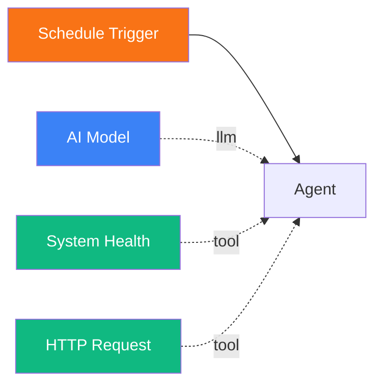

# Scheduled Workflow Execution

<span class="badge badge--trigger">Intermediate</span>

In this tutorial, you will build a workflow that runs on a recurring schedule. The example is a system health monitoring workflow that checks infrastructure status every hour, but the pattern applies to any recurring task -- daily reports, periodic data fetches, or automated maintenance.

**Time:** 15 minutes

**What you will build:**



---

## Prerequisites

- Pipelit is [installed and running](../getting-started/first-run.md) with **Redis** and an **RQ worker** active (required for scheduling)
- You have an [LLM credential](../frontend/credentials-ui.md) configured
- You are comfortable making API calls (the scheduler is currently API-only)

## Concepts

Pipelit's scheduler uses a **self-rescheduling** architecture built on RQ (Redis Queue):

- A **Schedule Trigger** is a trigger node on the canvas that fires when a scheduled job runs.
- A **ScheduledJob** record defines the schedule: interval, repeat count, retry policy, and status.
- After each execution, the scheduler automatically enqueues the next run.
- On failure, exponential backoff kicks in (capped at 10x the interval).
- On startup, missed jobs are recovered and re-enqueued automatically.

There is no external cron dependency -- the scheduling is entirely self-contained within Pipelit.

## Step 1: Create the workflow

1. On the Dashboard, click **New Workflow**.
2. Name it `Health Monitor` and click **Create**.

## Step 2: Add a Schedule Trigger

1. From the Node Palette under **Triggers**, click **Schedule**.
2. A Schedule Trigger node appears on the canvas.

The Schedule Trigger has no canvas-level configuration. It outputs a `timestamp` (ISO 8601) indicating when it fired.

## Step 3: Build the workflow logic

### Add an Agent

1. Add an **Agent** from the Node Palette.
2. Configure its **System Prompt**:

    ```
    You are a system monitoring agent. When triggered:

    1. Check the platform health using the system_health tool.
    2. Make an HTTP request to any external services you need to monitor.
    3. Analyze the results and produce a concise health report.

    Format your report as:
    - Overall status: OK / WARNING / CRITICAL
    - Key metrics and any anomalies
    - Recommended actions if issues are found

    Scheduled run at: {{ trigger.timestamp }}
    ```

    Note the use of `{{ trigger.timestamp }}` -- this Jinja2 expression injects the schedule trigger's timestamp into the prompt.

### Add an AI Model

1. Add an **AI Model** node.
2. Configure it with your credential and model.
3. Connect it to the Agent's model handle (blue diamond).

### Add tools

1. Add a **System Health** tool from the Node Palette (under Self-Awareness). This tool checks Redis, RQ workers, queues, and recent execution status.
2. Add an **HTTP Request** tool (under Tools) for monitoring external services. Optionally set the `method`, `headers`, and `timeout` in Extra Config.
3. Connect both tools to the Agent's tools handle (green diamond).

### Connect the data flow

1. **Schedule Trigger -> Agent**: Right handle to left handle.

## Step 4: Create a scheduled job via the API

The scheduler is API-driven. You create a `ScheduledJob` that targets your workflow and the specific Schedule Trigger node.

### Find the trigger node ID

You need the exact `node_id` of your Schedule Trigger. Find it by checking the node on the canvas (the label shows the node ID) or by querying the API:

```bash
curl -H "Authorization: Bearer YOUR_API_KEY" \
  http://localhost:8000/api/v1/workflows/health-monitor/nodes/
```

Look for the node with `component_type: "trigger_schedule"` and note its `node_id` (e.g., `trigger_schedule_abc123`).

### Also find the workflow ID

The Schedules API requires the numeric `workflow_id`, not the slug. Get it from:

```bash
curl -H "Authorization: Bearer YOUR_API_KEY" \
  http://localhost:8000/api/v1/workflows/health-monitor/
```

Note the `id` field in the response.

### Create the schedule

```bash
curl -X POST http://localhost:8000/api/v1/schedules/ \
  -H "Authorization: Bearer YOUR_API_KEY" \
  -H "Content-Type: application/json" \
  -d '{
    "workflow_id": 1,
    "trigger_node_id": "trigger_schedule_abc123",
    "interval_seconds": 3600,
    "repeat_count": 0,
    "retry_max": 3
  }'
```

**Parameters explained:**

| Parameter | Value | Meaning |
|-----------|-------|---------|
| `workflow_id` | `1` | The numeric ID of your workflow |
| `trigger_node_id` | `trigger_schedule_abc123` | The Schedule Trigger node to fire |
| `interval_seconds` | `3600` | Run every hour (3600 seconds) |
| `repeat_count` | `0` | Repeat indefinitely (0 = infinite) |
| `retry_max` | `3` | Retry up to 3 times on failure |

The response includes the created job with its `id`, `status` (initially `active`), and `next_run_at`:

```json
{
  "id": 1,
  "workflow_id": 1,
  "trigger_node_id": "trigger_schedule_abc123",
  "interval_seconds": 3600,
  "repeat_count": 0,
  "retry_max": 3,
  "status": "active",
  "next_run_at": "2026-02-16T15:00:00Z",
  "current_repeat": 0,
  "current_retry": 0
}
```

## Step 5: Configure retry and backoff

The scheduler handles failures with **exponential backoff**:

- **First failure**: Retries after `interval_seconds`.
- **Second failure**: Retries after `2 * interval_seconds`.
- **Third failure**: Retries after `4 * interval_seconds`.
- **Cap**: Backoff is capped at `10 * interval_seconds`.

After exhausting `retry_max` retries, the job status changes to `dead` and stops rescheduling.

### Adjusting retry behavior

Update an existing schedule to change retry limits:

```bash
curl -X PATCH http://localhost:8000/api/v1/schedules/1/ \
  -H "Authorization: Bearer YOUR_API_KEY" \
  -H "Content-Type: application/json" \
  -d '{
    "retry_max": 5,
    "interval_seconds": 1800
  }'
```

## Step 6: Monitor execution

### List scheduled jobs

```bash
curl -H "Authorization: Bearer YOUR_API_KEY" \
  http://localhost:8000/api/v1/schedules/
```

The response shows each job's status, next run time, and current repeat/retry counts.

### View execution history

Check the Executions page in the web UI or query the API:

```bash
curl -H "Authorization: Bearer YOUR_API_KEY" \
  "http://localhost:8000/api/v1/executions/?workflow_slug=health-monitor"
```

Each scheduled run creates a new execution record with full logs.

### Pause a schedule

```bash
curl -X POST http://localhost:8000/api/v1/schedules/1/pause/ \
  -H "Authorization: Bearer YOUR_API_KEY"
```

The job status changes to `paused` and no further runs are enqueued until you resume.

### Resume a schedule

```bash
curl -X POST http://localhost:8000/api/v1/schedules/1/resume/ \
  -H "Authorization: Bearer YOUR_API_KEY"
```

The scheduler calculates the next run time and enqueues the job.

### Delete a schedule

```bash
curl -X DELETE http://localhost:8000/api/v1/schedules/1/ \
  -H "Authorization: Bearer YOUR_API_KEY"
```

## Common scheduling patterns

### Every 5 minutes (short interval monitoring)

```json
{
  "interval_seconds": 300,
  "repeat_count": 0,
  "retry_max": 2
}
```

### Daily report (once per day, limited runs)

```json
{
  "interval_seconds": 86400,
  "repeat_count": 30,
  "retry_max": 3
}
```

This runs once a day for 30 days, then stops.

### One-shot delayed execution

```json
{
  "interval_seconds": 600,
  "repeat_count": 1,
  "retry_max": 1
}
```

This runs once, 10 minutes after creation, and does not repeat.

## Crash recovery

If Pipelit restarts while a scheduled job is pending, the `recover_scheduled_jobs()` function runs on startup and re-enqueues any active jobs whose `next_run_at` is in the past. This means scheduled jobs survive restarts without data loss.

Each enqueued RQ job uses a deterministic job ID (`sched-{id}-n{repeat}-rc{retry}`) to prevent duplicate enqueues during recovery.

## Next steps

- [Multi-Agent Delegation](multi-agent.md) -- use scheduled workflows to trigger complex multi-step operations
- [Self-Improving Agent](self-improving-agent.md) -- let agents create and manage their own schedules
- [Schedule Trigger reference](../components/triggers/schedule.md) -- full component details
- [Schedules API reference](../api/schedules.md) -- complete API endpoint documentation
