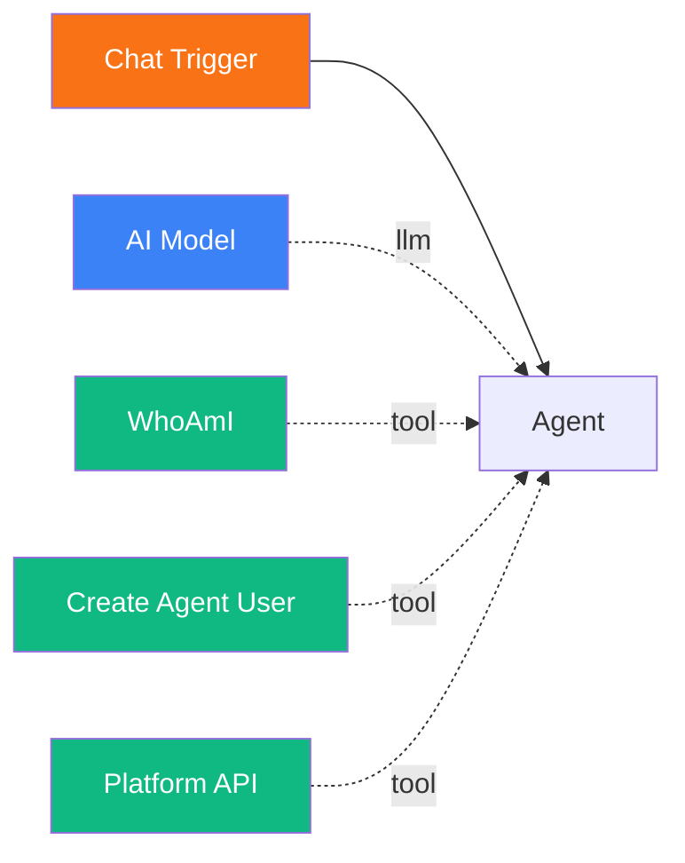
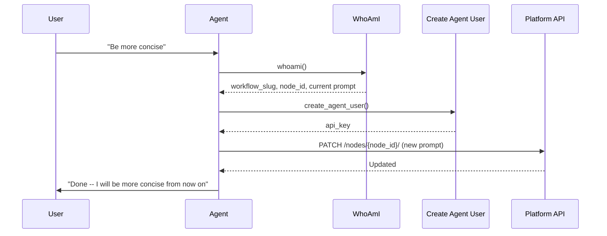

# Self-Improving Agent

<span class="badge badge--tool">Advanced</span>

In this tutorial, you will create an agent that can inspect its own configuration, modify its system prompt, create new nodes and edges, and even build entirely new workflows -- all through the Pipelit platform API. This is one of Pipelit's most powerful patterns: agents that evolve autonomously.

**Time:** 25 minutes

**What you will build:**



---

## Prerequisites

- Pipelit is [installed and running](../getting-started/first-run.md)
- You have an [LLM credential](../frontend/credentials-ui.md) configured
- You have completed the [Chat Agent tutorial](chat-agent.md)

## Concepts

Self-improvement in Pipelit works through three tools used together:

| Tool | Role |
|------|------|
| **WhoAmI** | Tells the agent its workflow slug, node ID, current system prompt, and the exact API endpoint for self-modification |
| **Create Agent User** | Provisions API credentials (username + API key) so the agent can authenticate against the platform API |
| **Platform API** | Makes authenticated HTTP requests to any platform REST endpoint -- reading configs, updating nodes, creating workflows |

The self-modification cycle:



!!! info "Changes take effect on the next execution"
    When an agent modifies its own system prompt, the change is persisted to the database but does not affect the current execution. The updated prompt will be used starting from the next message/execution.

## Step 1: Create the workflow

1. On the Dashboard, click **New Workflow**.
2. Name it `Self-Improving Agent` and click **Create**.

## Step 2: Add the trigger and agent

1. Add a **Chat Trigger** from the Node Palette.
2. Add an **Agent** from the Node Palette.
3. Add an **AI Model**, configure it with your credential and model, and connect it to the Agent's model handle.
4. Connect: Chat Trigger -> Agent.

### Configure the system prompt

Set the Agent's system prompt to include self-improvement instructions:

```
You are a self-improving assistant. You can inspect and modify your own
configuration when asked. Here is how:

SELF-INSPECTION:
- Call whoami() to see your current workflow slug, node ID, system prompt,
  and configuration.

SELF-MODIFICATION:
- Call create_agent_user() to get API credentials (safe to call multiple
  times -- it is idempotent).
- Call platform_api() with the PATCH method to update your configuration.
  The endpoint and example body are provided in the whoami() response.

CREATING NEW NODES:
- Use platform_api() with POST to /api/v1/workflows/{slug}/nodes/ to add
  new nodes to your workflow.
- Use POST to /api/v1/workflows/{slug}/edges/ to connect them.

DISCOVERING THE API:
- Call platform_api(path="/openapi.json") to get the full API specification.
- Use this to discover available endpoints and request formats.

IMPORTANT RULES:
- Always call whoami() first to understand your current state.
- Always confirm with the user before making changes.
- Changes to your system prompt take effect on the next conversation.
- Do not delete your own node or the trigger node.
```

## Step 3: Add self-awareness tools

### WhoAmI

1. From the Node Palette under **Self-Awareness**, add **WhoAmI**.
2. Connect it to the Agent's tools handle (green diamond).

When the agent calls `whoami()`, it receives:

```json
{
  "identity": {
    "workflow_slug": "self-improving-agent",
    "workflow_id": 5,
    "node_id": "agent_abc123",
    "component_type": "agent"
  },
  "current_config": {
    "system_prompt": "You are a self-improving assistant...",
    "system_prompt_length": 547,
    "extra_config": { "conversation_memory": false }
  },
  "self_modification": {
    "endpoint": "/api/v1/workflows/self-improving-agent/nodes/agent_abc123/",
    "method": "PATCH",
    "example_body": {
      "config": {
        "system_prompt": "Your new system prompt here",
        "extra_config": { "conversation_memory": true }
      }
    }
  }
}
```

### Create Agent User

1. Add **Create Agent User** from the Node Palette.
2. Connect it to the Agent's tools handle.

This tool provisions API credentials scoped to this specific agent. The username is deterministic (`agent_{workflow_slug}_{agent_node_id}`), so calling it multiple times is safe and returns the same credentials.

### Platform API

1. Add **Platform API** from the Node Palette.
2. Connect it to the Agent's tools handle.

This tool sends authenticated HTTP requests to any Pipelit API endpoint. The agent passes the `api_key` from `create_agent_user` and the method/path/body for the request.

## Step 4: Connect everything

1. **Chat Trigger -> Agent**: Right handle to left handle.
2. **AI Model -> Agent**: Top diamond to model handle (blue).
3. **WhoAmI -> Agent**: Right handle to tools handle (green diamond).
4. **Create Agent User -> Agent**: Right handle to tools handle.
5. **Platform API -> Agent**: Right handle to tools handle.

## Step 5: Test self-inspection

Open the Chat panel and ask the agent about itself:

> Who are you? What is your current configuration?

The agent should:

1. Call `whoami()` to retrieve its identity and configuration.
2. Report its workflow slug, node ID, current system prompt, and extra config.

## Step 6: Test self-modification

Ask the agent to change its behavior:

> I would like you to always respond in bullet points. Update your system prompt to include this preference.

The agent should:

1. Call `whoami()` to get its current prompt and the PATCH endpoint.
2. Call `create_agent_user()` to get API credentials.
3. Call `platform_api()` with:
    - `method="PATCH"`
    - `path="/api/v1/workflows/self-improving-agent/nodes/agent_abc123/"`
    - `body='{"config": {"system_prompt": "...updated prompt with bullet point instruction..."}}'`
    - `api_key="..."`
4. Confirm to the user that the change was made and will take effect on the next message.

Send a new message to verify:

> Tell me about the weather.

The agent should now respond in bullet points (assuming the prompt modification was applied correctly).

## Step 7: Test workflow inspection

The agent can also read its own workflow structure:

> List all the nodes in your workflow.

The agent should call:

```
platform_api(method="GET", path="/api/v1/workflows/self-improving-agent/nodes/", api_key="...")
```

And report back the list of nodes with their types and configurations.

## Step 8: Advanced -- creating new workflows

The agent can create entirely new workflows programmatically:

> Create a new workflow called "Daily Greeter" with a schedule trigger and an agent that says good morning.

The agent should:

1. `POST /api/v1/workflows/` to create the workflow.
2. `POST /api/v1/workflows/daily-greeter/nodes/` to create the trigger node.
3. `POST /api/v1/workflows/daily-greeter/nodes/` to create the agent node (with an AI model configuration).
4. `POST /api/v1/workflows/daily-greeter/edges/` to connect them.

!!! tip "OpenAPI discovery"
    Encourage the agent to call `platform_api(path="/openapi.json")` first to learn the exact API schema. This is especially useful for complex operations where the request format matters.

## Safety considerations

Self-improving agents are powerful but require care:

### Do

| Practice | Why |
|----------|-----|
| **Require user confirmation** before changes | Prevents unintended modifications |
| **Log all modifications** | Audit trail for debugging |
| **Start with read-only testing** | Verify the agent understands its environment before enabling writes |
| **Set budgets on epics** | Prevents runaway costs if the agent enters a modification loop |
| **Use conversation memory** | Lets the agent track what it has already changed |

### Do not

| Anti-pattern | Risk |
|--------------|------|
| **Let agents delete their own trigger** | Breaks the workflow permanently |
| **Allow unrestricted API access** | Agent could modify other workflows or delete data |
| **Skip confirmation for destructive operations** | Hard to recover from accidental deletions |
| **Give agents admin credentials** | Use scoped agent API keys instead |

### Guardrails in the system prompt

Include explicit rules in the system prompt:

```
SAFETY RULES:
- NEVER delete your own node (agent_abc123) or the trigger node.
- ALWAYS ask for user confirmation before modifying any configuration.
- NEVER modify workflows other than your own unless explicitly asked.
- If unsure about an operation, explain what you would do and ask for approval.
```

### Scoped API keys

Agent API keys created by `create_agent_user` have the same permissions as the user who owns the workflow. For tighter control, consider:

- Restricting network access for the agent user at the infrastructure level
- Monitoring agent API calls via execution logs
- Using budget limits on epics to cap spending

## What you built

You now have an agent that can:

- **Inspect itself** -- read its own workflow slug, node ID, and system prompt
- **Modify itself** -- update its system prompt and configuration via the platform API
- **Inspect its workflow** -- list all nodes, edges, and connections
- **Create new resources** -- build new workflows, nodes, and edges programmatically

This pattern is the foundation for autonomous agent evolution in Pipelit.

## Next steps

- [YAML DSL](yaml-dsl.md) -- use structured YAML to create workflows programmatically
- [Multi-Agent Delegation](multi-agent.md) -- combine self-improvement with task delegation
- [WhoAmI reference](../components/self-awareness/whoami.md) -- full tool documentation
- [Platform API reference](../components/self-awareness/platform-api.md) -- full tool documentation
- [Create Agent User reference](../components/self-awareness/create-agent-user.md) -- credential provisioning details
