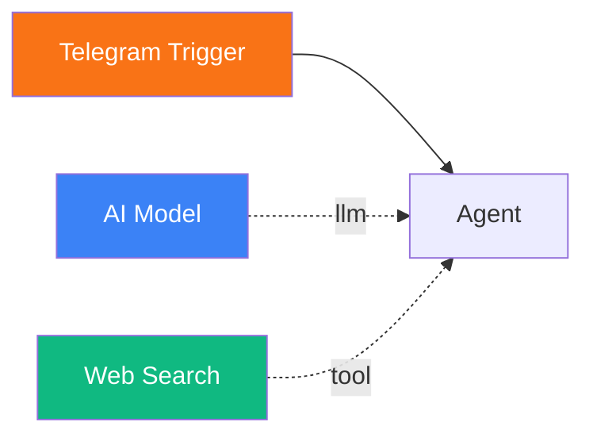
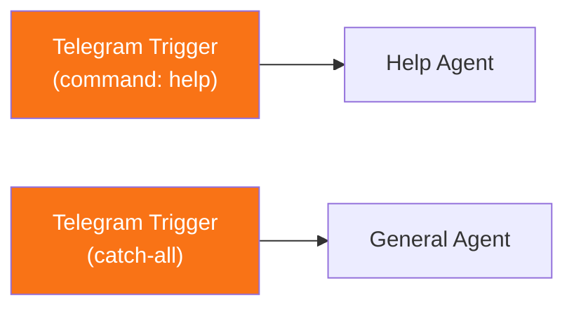

# Set Up a Telegram Bot

<span class="badge badge--trigger">Beginner</span>

In this tutorial, you will create a Telegram bot powered by a Pipelit agent. Messages sent to your bot in Telegram will be processed by an LLM agent, and the response will be delivered back to the Telegram chat automatically.

**Time:** 15 minutes

**What you will build:**



---

## Prerequisites

- Pipelit is [installed and running](../getting-started/first-run.md)
- You have an [LLM credential](../frontend/credentials-ui.md) configured
- You have a Telegram account
- Your Pipelit instance is accessible via a public URL (for the Telegram webhook). For local development, use a tunneling service like [ngrok](https://ngrok.com/) or [Cloudflare Tunnel](https://developers.cloudflare.com/cloudflare-one/connections/connect-apps/).

## Step 1: Create a Telegram bot via BotFather

1. Open Telegram and search for **@BotFather** (or visit [t.me/BotFather](https://t.me/BotFather)).
2. Send the `/newbot` command.
3. Follow the prompts:
    - Enter a **display name** for your bot (e.g., `My Pipelit Agent`).
    - Enter a **username** for your bot (must end in `bot`, e.g., `my_pipelit_agent_bot`).
4. BotFather responds with your **bot token**. It looks like this:

    ```
    123456789:ABCdefGHIjklMNOpqrSTUvwxYZ
    ```

5. Copy the bot token -- you will need it in the next step.

!!! warning "Keep your bot token secret"
    The bot token grants full control over your Telegram bot. Do not share it publicly or commit it to version control.

## Step 2: Add a Telegram credential in Pipelit

1. In the Pipelit web interface, navigate to **Credentials** (sidebar).
2. Click **Add Credential**.
3. Fill in the form:
    - **Type**: Telegram
    - **Name**: A descriptive name (e.g., `My Telegram Bot`)
    - **Bot Token**: Paste the token from BotFather
    - **Allowed User IDs** (optional): Comma-separated list of Telegram user IDs to restrict access. Leave empty to allow all users.
4. Click **Save**.

!!! tip "Finding your Telegram user ID"
    Send a message to **@userinfobot** on Telegram. It will reply with your numeric user ID. Use this if you want to restrict bot access to yourself during development.

## Step 3: Create a workflow with a Telegram trigger

1. Go to the **Dashboard** and click **New Workflow**.
2. Name it `Telegram Bot` and click **Create**.
3. In the Node Palette, under **Triggers**, click **Telegram**. A Telegram trigger node appears on the canvas.

The Telegram trigger does not require canvas-level configuration -- it automatically receives messages via the webhook you will set up in Step 6.

## Step 4: Add an Agent and AI Model

1. From the Node Palette, add an **AI Model** (under Sub-Components).
2. Select it and configure:
    - **Credential**: Your LLM provider credential
    - **Model**: Choose a model (e.g., `gpt-4o`)
3. Add an **Agent** (under AI).
4. Select the Agent and set its **System Prompt**:

    ```
    You are a helpful Telegram bot. Keep your responses concise since they
    will be displayed in a Telegram chat. Use markdown formatting sparingly
    -- Telegram supports basic markdown but not all features.

    When the user asks a question you cannot answer from your training data,
    use the web search tool to find current information.
    ```

5. Enable **Conversation Memory** so the bot remembers previous messages from each user.

### Add a tool (optional)

For a more capable bot, add a **Web Search** tool:

1. From the Node Palette under **Tools**, click **Web Search**.
2. Select the Web Search node and configure `searxng_url` in Extra Config (this requires a running [SearXNG](https://docs.searxng.org/) instance).

## Step 5: Connect the nodes

1. **Telegram Trigger -> Agent**: Drag from the Telegram Trigger's right handle to the Agent's left handle.
2. **AI Model -> Agent**: Drag from the AI Model's top diamond handle to the Agent's "model" diamond handle (blue).
3. **Web Search -> Agent** (if added): Drag from the Web Search's right handle to the Agent's "tools" diamond handle (green).

Your workflow should look like this:


## Step 6: Set up the Telegram webhook

Telegram delivers messages to your bot via a **webhook** -- an HTTP endpoint that Telegram calls whenever someone sends a message to your bot.

### Determine your public URL

Your Pipelit instance must be reachable from the internet. The webhook URL format is:

```
https://your-domain/api/v1/telegram/webhook/{bot_token}/
```

Replace `your-domain` with your actual domain and `{bot_token}` with your bot token from Step 1.

**For local development with ngrok:**

```bash
# Start ngrok to tunnel to your local Pipelit instance
ngrok http 8000
```

ngrok gives you a public URL like `https://abc123.ngrok-free.app`. Your webhook URL would be:

```
https://abc123.ngrok-free.app/api/v1/telegram/webhook/123456789:ABCdefGHIjklMNOpqrSTUvwxYZ/
```

### Register the webhook with Telegram

Use the Telegram Bot API to register your webhook. Run this command (replace the placeholders):

```bash
curl -X POST "https://api.telegram.org/bot{BOT_TOKEN}/setWebhook" \
  -H "Content-Type: application/json" \
  -d '{"url": "https://your-domain/api/v1/telegram/webhook/{BOT_TOKEN}/"}'
```

You should receive a response like:

```json
{
  "ok": true,
  "result": true,
  "description": "Webhook was set"
}
```

### Verify the webhook

```bash
curl "https://api.telegram.org/bot{BOT_TOKEN}/getWebhookInfo"
```

Check that the `url` field matches what you set and `last_error_date` is empty.

## Step 7: Test your Telegram bot

1. Open Telegram and find your bot by searching for the username you chose in Step 1.
2. Send a message:

    > Hello! What can you do?

3. Watch the workflow execute in the Pipelit editor -- the Telegram Trigger node lights up, followed by the Agent.
4. The agent's response appears in the Telegram chat. A typing indicator is displayed while the workflow is processing.
5. Try follow-up messages to test conversation memory:

    > What did I just ask you?

### Automatic replies

Pipelit's delivery service handles replies automatically. When the workflow execution completes, the agent's final output is sent back to the Telegram chat that originated the message. You do not need to configure this -- it works out of the box when a Telegram trigger is the entry point.

## Troubleshooting

| Issue | Solution |
|-------|----------|
| Bot does not respond | Check the webhook is registered correctly with `getWebhookInfo`. Verify your Pipelit instance is accessible from the internet. |
| "Unauthorized" errors in logs | Verify the bot token in your Telegram credential matches the one from BotFather. |
| Messages from some users are ignored | Check the **Allowed User IDs** field in your Telegram credential. Clear it to allow all users. |
| Webhook URL returns 404 | Make sure the URL includes `/api/v1/telegram/webhook/{BOT_TOKEN}/` with the trailing slash. |
| ngrok tunnel expired | ngrok free tier URLs rotate. Re-run ngrok and update the webhook URL. |

## Advanced: Trigger filtering

If you want multiple workflows to handle different Telegram commands, use trigger-level matching in the Telegram Trigger's Extra Config:

| Config Field | Description |
|-------------|-------------|
| `command` | Match a specific Telegram command (e.g., `start` matches `/start`) |
| `pattern` | Regex pattern to match against message text |
| `allowed_user_ids` | List of Telegram user IDs to accept |

For example, one workflow handles `/help` commands while another handles everything else:



## User management

When a Telegram user first interacts with your bot, Pipelit automatically creates a `UserProfile` for them using their Telegram user data (username, first name, last name). Subsequent messages from the same Telegram user ID are associated with the existing profile. This enables conversation memory to work correctly across sessions.

## Next steps

- [Conditional Routing](conditional-routing.md) -- route Telegram messages to different agents based on content
- [Scheduled Workflows](scheduled-workflow.md) -- send periodic reports via Telegram
- [Telegram Trigger reference](../components/triggers/telegram.md) -- full configuration details
- [Chat Agent tutorial](chat-agent.md) -- add a web chat interface to the same workflow
