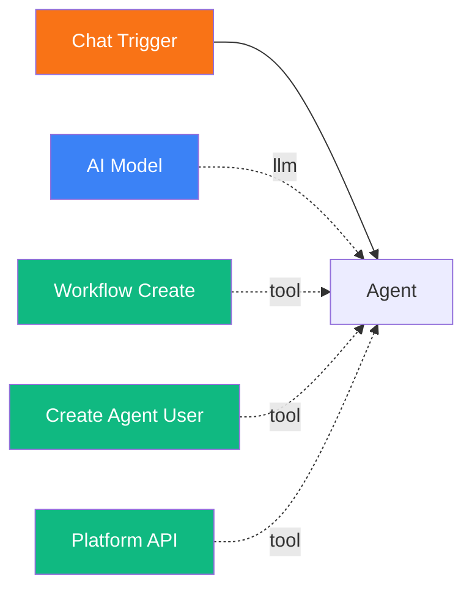

# Programmatic Workflow Creation with YAML DSL

<span class="badge badge--tool">Advanced</span>

In this tutorial, you will learn how to define entire workflows in YAML and have agents build them programmatically using the `workflow_create` tool. This enables agents to design and deploy new workflows on the fly -- a key capability for autonomous agent systems.

**Time:** 20 minutes

**What you will build:**

- An agent with the `workflow_create` tool that can construct workflows from YAML specifications
- A YAML definition for a complete workflow with triggers, agents, models, tools, and edges

---

## Prerequisites

- Pipelit is [installed and running](../getting-started/first-run.md)
- You have an [LLM credential](../frontend/credentials-ui.md) configured
- You have completed the [Self-Improving Agent tutorial](self-improving-agent.md) (recommended)

## Concepts

The YAML DSL (Domain-Specific Language) provides a structured format for defining workflows. Instead of manually clicking through the UI to create nodes and draw edges, you describe the entire workflow in a YAML document and let the `workflow_create` tool build it.

This is useful for:

- **Agents creating workflows** -- an orchestrator agent can design and deploy new worker workflows
- **Templates and reproducibility** -- define workflow patterns once and instantiate them many times
- **Version control** -- store workflow definitions as YAML files in a repository

## YAML DSL structure overview

A workflow YAML document has three sections:

```yaml
workflow:
  name: "My Workflow"
  description: "What this workflow does"

nodes:
  - id: trigger_chat_001
    type: trigger_chat
    position: { x: 100, y: 200 }
    config:
      # Node-specific configuration

  - id: agent_001
    type: agent
    position: { x: 400, y: 200 }
    config:
      system_prompt: "You are a helpful assistant."
      extra_config:
        conversation_memory: true

edges:
  - source: trigger_chat_001
    target: agent_001
    type: direct
    label: ""
```

### Workflow section

| Field | Required | Description |
|-------|----------|-------------|
| `name` | Yes | Display name for the workflow |
| `description` | No | Description of the workflow's purpose |

### Nodes section

Each node requires:

| Field | Required | Description |
|-------|----------|-------------|
| `id` | Yes | Unique node identifier (e.g., `agent_001`, `trigger_chat_main`) |
| `type` | Yes | Component type (e.g., `trigger_chat`, `agent`, `ai_model`, `switch`, `run_command`) |
| `position` | No | Canvas position as `{x, y}` coordinates. Defaults to `{x: 0, y: 0}`. |
| `config` | No | Node configuration (varies by type) |

### Edges section

Each edge requires:

| Field | Required | Description |
|-------|----------|-------------|
| `source` | Yes | Source node ID |
| `target` | Yes | Target node ID |
| `type` | No | `direct` (default) or `conditional` |
| `label` | No | Edge label: `""` for data flow, `llm` for model connection, `tool` for tool connection, `memory` for memory connection |
| `condition_value` | No | For conditional edges from switch nodes, the route value this edge matches |

## Step 1: Build the YAML-creating agent

Create a workflow that has an agent equipped with the `workflow_create` tool.

1. Create a new workflow named `Workflow Builder`.
2. Add a **Chat Trigger**.
3. Add an **Agent** with this system prompt:

    ```
    You are a workflow architect. You create Pipelit workflows from
    natural language descriptions using the workflow_create tool.

    When the user describes a workflow they want, you should:

    1. Understand the requirements.
    2. Design the workflow with appropriate nodes and connections.
    3. Write a YAML specification following the Pipelit DSL format.
    4. Call workflow_create with the YAML to build the workflow.

    YAML DSL FORMAT:
    - workflow: name and description
    - nodes: list of {id, type, position, config}
    - edges: list of {source, target, type, label, condition_value}

    NODE TYPES:
    Triggers: trigger_chat, trigger_telegram, trigger_schedule, trigger_manual
    AI: agent, categorizer, router, extractor
    Tools: run_command, http_request, web_search, calculator, datetime
    Self-Awareness: whoami, create_agent_user, platform_api, epic_tools,
      task_tools, spawn_and_await, workflow_create, system_health
    Logic: switch, code, merge, filter, loop, wait
    Sub-Components: ai_model, output_parser
    Memory: memory_read, memory_write, identify_user

    EDGE LABELS:
    - "" (empty): data flow between nodes
    - "llm": connects ai_model to agent/categorizer/router/extractor
    - "tool": connects tool nodes to agents
    - "memory": connects memory nodes to agents

    IMPORTANT: Every agent-type node needs an ai_model connected via an
    "llm" edge. Use the credential_id from the user's existing credentials.

    Position nodes logically: triggers on the left, processing in the
    middle, outputs on the right. Use x increments of ~300 and y
    increments of ~150 for readability.
    ```

4. Add an **AI Model** and connect it.

### Add the workflow_create tool

1. From the Node Palette under **Self-Awareness**, add **Workflow Create**.
2. Connect it to the Agent's tools handle (green diamond).

### Optionally add supporting tools

For a more capable builder, also add:

- **Create Agent User** -- so the agent can provision credentials if needed
- **Platform API** -- so the agent can inspect existing workflows and credentials

Connect all tools to the agent and wire the workflow:



## Step 2: YAML DSL examples

Here are complete YAML examples for common workflow patterns.

### Example 1: Simple chat agent

A basic chatbot with conversation memory:

```yaml
workflow:
  name: "Simple Chatbot"
  description: "A conversational chatbot with memory"

nodes:
  - id: trigger_chat_001
    type: trigger_chat
    position: { x: 100, y: 200 }

  - id: ai_model_001
    type: ai_model
    position: { x: 400, y: 350 }
    config:
      llm_credential_id: 1
      model_name: "gpt-4o"

  - id: agent_001
    type: agent
    position: { x: 400, y: 200 }
    config:
      system_prompt: "You are a friendly assistant. Be helpful and concise."
      extra_config:
        conversation_memory: true

edges:
  - source: trigger_chat_001
    target: agent_001
    type: direct
    label: ""

  - source: ai_model_001
    target: agent_001
    type: direct
    label: "llm"
```

### Example 2: Agent with tools

A research agent with web search and HTTP request capabilities:

```yaml
workflow:
  name: "Research Agent"
  description: "An agent that can search the web and make HTTP requests"

nodes:
  - id: trigger_chat_001
    type: trigger_chat
    position: { x: 100, y: 200 }

  - id: ai_model_001
    type: ai_model
    position: { x: 400, y: 400 }
    config:
      llm_credential_id: 1
      model_name: "gpt-4o"

  - id: agent_001
    type: agent
    position: { x: 400, y: 200 }
    config:
      system_prompt: |
        You are a research assistant. Use web search to find current
        information and HTTP requests to access APIs directly.
        Always cite your sources.
      extra_config:
        conversation_memory: true

  - id: web_search_001
    type: web_search
    position: { x: 700, y: 300 }
    config:
      extra_config:
        searxng_url: "http://localhost:8888"

  - id: http_request_001
    type: http_request
    position: { x: 700, y: 400 }

edges:
  - source: trigger_chat_001
    target: agent_001
    type: direct
    label: ""

  - source: ai_model_001
    target: agent_001
    type: direct
    label: "llm"

  - source: web_search_001
    target: agent_001
    type: direct
    label: "tool"

  - source: http_request_001
    target: agent_001
    type: direct
    label: "tool"
```

### Example 3: Routing workflow with conditional edges

A customer support router with categorization and specialized agents:

```yaml
workflow:
  name: "Support Router"
  description: "Classifies and routes customer messages to specialized agents"

nodes:
  - id: trigger_chat_001
    type: trigger_chat
    position: { x: 100, y: 300 }

  - id: categorizer_001
    type: categorizer
    position: { x: 400, y: 300 }
    config:
      system_prompt: "Classify customer support messages precisely."
      extra_config:
        categories:
          - name: billing
            description: "Invoices, payments, refunds, pricing"
          - name: technical
            description: "Bugs, errors, feature requests, API help"
          - name: general
            description: "Greetings, feedback, general questions"

  - id: cat_model_001
    type: ai_model
    position: { x: 400, y: 450 }
    config:
      llm_credential_id: 1
      model_name: "gpt-4o-mini"

  - id: switch_001
    type: switch
    position: { x: 700, y: 300 }

  - id: billing_agent
    type: agent
    position: { x: 1000, y: 150 }
    config:
      system_prompt: "You are a billing support specialist."

  - id: billing_model
    type: ai_model
    position: { x: 1000, y: 300 }
    config:
      llm_credential_id: 1
      model_name: "gpt-4o"

  - id: tech_agent
    type: agent
    position: { x: 1000, y: 450 }
    config:
      system_prompt: "You are a technical support engineer."

  - id: tech_model
    type: ai_model
    position: { x: 1000, y: 600 }
    config:
      llm_credential_id: 1
      model_name: "gpt-4o"

  - id: general_agent
    type: agent
    position: { x: 1000, y: 750 }
    config:
      system_prompt: "You are a friendly general support agent."

  - id: general_model
    type: ai_model
    position: { x: 1000, y: 900 }
    config:
      llm_credential_id: 1
      model_name: "gpt-4o"

edges:
  # Data flow
  - source: trigger_chat_001
    target: categorizer_001
    type: direct
    label: ""

  - source: categorizer_001
    target: switch_001
    type: direct
    label: ""

  # Model connections
  - source: cat_model_001
    target: categorizer_001
    type: direct
    label: "llm"

  - source: billing_model
    target: billing_agent
    type: direct
    label: "llm"

  - source: tech_model
    target: tech_agent
    type: direct
    label: "llm"

  - source: general_model
    target: general_agent
    type: direct
    label: "llm"

  # Conditional edges from switch
  - source: switch_001
    target: billing_agent
    type: conditional
    condition_value: "billing"

  - source: switch_001
    target: tech_agent
    type: conditional
    condition_value: "technical"

  - source: switch_001
    target: general_agent
    type: conditional
    condition_value: "general"
```

## Step 3: Test workflow creation

Open the Chat panel on your Workflow Builder and try:

> Create a workflow called "Weather Bot" with a chat trigger connected to an
> agent that has a web search tool. The agent should tell users about current
> weather conditions. Use credential ID 1 with gpt-4o.

The agent should:

1. Design the workflow with appropriate nodes.
2. Write a YAML specification.
3. Call `workflow_create` with the YAML.
4. Report back the created workflow's slug so you can open it in the editor.

After creation, navigate to the new workflow in the dashboard to see the nodes and edges laid out on the canvas.

## Step 4: Verify and iterate

After the agent creates a workflow:

1. Open the workflow in the editor to verify the layout and connections.
2. Check that all required connections are present (especially AI Model -> Agent via `llm` edges).
3. Run the workflow's **Validate** action to catch any issues.
4. Test the workflow by sending a message through its chat trigger.

If something is wrong, tell the builder agent:

> The Weather Bot workflow is missing a connection from the AI Model to the
> Agent. Can you fix it?

If the agent also has the `platform_api` tool, it can inspect and patch the existing workflow rather than creating a new one.

## Configuration reference

### Node config by type

| Node Type | Key Config Fields |
|-----------|------------------|
| `trigger_chat` | None required |
| `trigger_telegram` | None (credential is separate) |
| `trigger_schedule` | None (schedule is created via API) |
| `ai_model` | `llm_credential_id`, `model_name` |
| `agent` | `system_prompt`, `extra_config.conversation_memory` |
| `categorizer` | `system_prompt`, `extra_config.categories` |
| `switch` | `extra_config.rules`, `extra_config.default_route` |
| `web_search` | `extra_config.searxng_url` |
| `http_request` | `extra_config.method`, `extra_config.headers`, `extra_config.timeout` |
| `datetime` | `extra_config.timezone` |
| `code` | `extra_config.code`, `extra_config.language` |

### Edge label reference

| Label | Meaning | Source -> Target |
|-------|---------|-----------------|
| `""` (empty) | Data flow | Any node -> any node (output handle to input handle) |
| `llm` | Model connection | `ai_model` -> agent/categorizer/router/extractor |
| `tool` | Tool connection | Tool node -> agent |
| `memory` | Memory connection | `memory_read`/`memory_write` -> agent |
| `output_parser` | Parser connection | `output_parser` -> categorizer/router/extractor |

### Credential ID

The `llm_credential_id` field in `ai_model` nodes must reference an existing credential. To find available credentials, have the agent call:

```
platform_api(method="GET", path="/api/v1/credentials/", api_key="...")
```

Or check the Credentials page in the web UI.

## Tips for reliable YAML workflows

| Tip | Details |
|-----|---------|
| **Use descriptive node IDs** | `billing_agent` is clearer than `agent_003`. The agent and humans both benefit from readable IDs. |
| **Position nodes logically** | Left to right flow: triggers at x=100, processing at x=400, agents at x=700. Vertical spacing of ~150px between parallel nodes. |
| **Always connect AI Models** | Every agent-type node must have an `llm` edge from an `ai_model` node. Missing this is the most common YAML error. |
| **Validate after creation** | Always run `POST /workflows/{slug}/validate/` after building from YAML. |
| **Use YAML multiline strings** | For long system prompts, use the `|` block scalar indicator. |

## Next steps

- [Architecture: Workflow DSL](../architecture/workflow-dsl.md) -- full DSL specification and internals
- [Self-Improving Agent](self-improving-agent.md) -- combine YAML creation with self-modification
- [Multi-Agent Delegation](multi-agent.md) -- create worker workflows on demand for task delegation
- [Workflow Create reference](../components/self-awareness/workflow-create.md) -- full tool documentation
