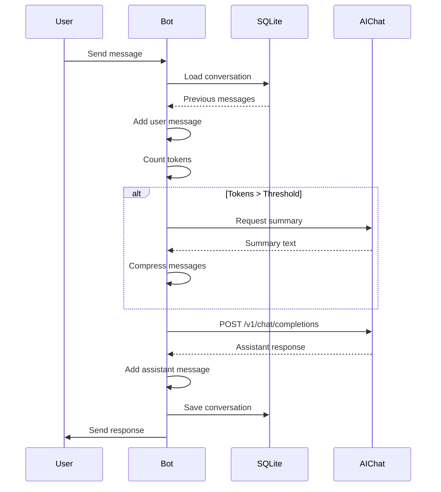

# Context Window and Session Management

> Design document for conversation persistence and automatic context compression

---

## Overview

The current bot is stateless - each message is treated as a new conversation. This document outlines how to add:

1. **Session persistence** - Conversations survive bot restarts
2. **Dynamic context limits** - Fetch from API, not hardcoded
3. **Automatic compression** - Summarize when approaching limits

---

## Architecture

```
┌─────────────────────────────────────────────────────────────────┐
│                        Telegram User                            │
└─────────────────────────────────────────────────────────────────┘
                                │
                                ▼
┌─────────────────────────────────────────────────────────────────┐
│                      Telegram Bot (Python)                      │
│  ┌───────────────┐  ┌───────────────┐  ┌───────────────────┐   │
│  │ Session Store │  │ Token Counter │  │ Context Compressor│   │
│  │   (SQLite)    │  │  (tiktoken)   │  │  (LLM summarize)  │   │
│  └───────────────┘  └───────────────┘  └───────────────────┘   │
└─────────────────────────────────────────────────────────────────┘
                                │
                                ▼
┌─────────────────────────────────────────────────────────────────┐
│                   AIChat Server (localhost:8000)                │
└─────────────────────────────────────────────────────────────────┘
```

---

## 1. Conversation Data Structure

Each conversation follows the OpenAI messages format:

```python
conversations: dict[int, list[dict]] = {
    123456789: [  # user_id (Telegram) as key
        {"role": "system", "content": "You are a helpful assistant."},
        {"role": "user", "content": "What is Python?"},
        {"role": "assistant", "content": "Python is a programming language..."},
        {"role": "user", "content": "Show me an example"},
        {"role": "assistant", "content": "Here's a simple example:\n```python\nprint('Hello')\n```"},
    ],
}
```

### Message Roles

| Role | Description |
|------|-------------|
| `system` | Initial instructions, context summary after compression |
| `user` | Messages from the Telegram user |
| `assistant` | Responses from the LLM |

---

## 2. Dynamic Context Window Detection

### Venice.ai API Response

Venice.ai exposes context limits via `/v1/models`:

```bash
curl -s https://api.venice.ai/api/v1/models \
  -H "Authorization: Bearer $API_KEY"
```

Response includes `model_spec.availableContextTokens`:

```json
{
  "id": "zai-org-glm-4.7",
  "model_spec": {
    "availableContextTokens": 202752,
    "capabilities": {
      "supportsFunctionCalling": true,
      "supportsReasoning": true
    }
  }
}
```

### Known Context Windows (Venice.ai)

| Model | Context Tokens |
|-------|----------------|
| `zai-org-glm-4.7` | 202,752 |
| `llama-3.3-70b` | 131,072 |
| `mistral-31-24b` | 131,072 |
| `qwen3-4b` | 32,768 |
| `venice-uncensored` | 32,768 |

### Implementation

```python
async def fetch_model_context_windows(base_url: str, api_key: str) -> dict[str, int]:
    """Fetch context windows from Venice.ai API at startup."""
    async with httpx.AsyncClient() as client:
        response = await client.get(
            f"{base_url}/models",
            headers={"Authorization": f"Bearer {api_key}"}
        )
        response.raise_for_status()

        return {
            model["id"]: model["model_spec"]["availableContextTokens"]
            for model in response.json()["data"]
            if "model_spec" in model and "availableContextTokens" in model["model_spec"]
        }
```

---

## 3. Token Counting

Use `tiktoken` for accurate token estimation:

```python
import tiktoken

def count_tokens(messages: list[dict], model: str = "gpt-4") -> int:
    """Count tokens in a conversation."""
    # Use cl100k_base encoding (works for most modern models)
    encoding = tiktoken.get_encoding("cl100k_base")

    total = 0
    for message in messages:
        # ~4 tokens per message for role/formatting overhead
        total += 4
        total += len(encoding.encode(message["content"]))

    return total
```

### Compression Threshold

```python
# Reserve 25% for response generation
COMPRESS_RATIO = 0.75

def get_compress_threshold(model: str, context_windows: dict[str, int]) -> int:
    context_limit = context_windows.get(model, 128_000)  # fallback
    return int(context_limit * COMPRESS_RATIO)
```

---

## 4. Automatic Compression

When token count exceeds threshold, compress the conversation:

### Compression Strategy

```
Before compression:
┌────────────────────────────────────────┐
│ system: "You are helpful..."           │
│ user: "Message 1"                      │
│ assistant: "Response 1"                │
│ user: "Message 2"                      │
│ assistant: "Response 2"                │
│ ... (many messages) ...                │
│ user: "Message N"                      │
│ assistant: "Response N"                │
└────────────────────────────────────────┘

After compression:
┌────────────────────────────────────────┐
│ system: "You are helpful..."           │
│ system: "Previous context summary:     │
│          User asked about X, Y, Z.     │
│          Key points discussed: ..."    │
│ user: "Message N-2"    ─┐              │
│ assistant: "Response N-2" │ Keep recent│
│ user: "Message N-1"      │ messages    │
│ assistant: "Response N-1" │            │
│ user: "Message N"       ─┘             │
└────────────────────────────────────────┘
```

### Summarization Prompt

```python
SUMMARIZE_PROMPT = """Summarize this conversation in 200 words or less.
Focus on:
- Key topics discussed
- Important decisions or conclusions
- Context needed for continuing the conversation

Conversation:
{conversation}
"""
```

### Compression Flow

```python
async def compress_if_needed(
    user_id: int,
    messages: list[dict],
    threshold: int
) -> list[dict]:
    """Compress conversation if it exceeds token threshold."""

    token_count = count_tokens(messages)
    if token_count < threshold:
        return messages

    # Keep system message and last N messages
    system_msgs = [m for m in messages if m["role"] == "system"]
    recent_msgs = messages[-6:]  # Last 3 exchanges
    old_msgs = messages[len(system_msgs):-6]

    if not old_msgs:
        return messages  # Nothing to compress

    # Generate summary of old messages
    summary = await generate_summary(old_msgs)

    # Rebuild conversation
    compressed = system_msgs + [
        {"role": "system", "content": f"Previous conversation summary:\n{summary}"}
    ] + recent_msgs

    return compressed
```

---

## 5. Persistence (SQLite)

### Schema

```sql
CREATE TABLE conversations (
    user_id INTEGER PRIMARY KEY,
    messages TEXT NOT NULL,           -- JSON array of messages
    summary TEXT,                     -- Compressed history (if any)
    token_count INTEGER DEFAULT 0,
    created_at TIMESTAMP DEFAULT CURRENT_TIMESTAMP,
    updated_at TIMESTAMP DEFAULT CURRENT_TIMESTAMP
);

CREATE INDEX idx_updated_at ON conversations(updated_at);
```

### Database Operations

```python
import sqlite3
import json
from pathlib import Path

DB_PATH = Path("sessions.db")

def init_db() -> sqlite3.Connection:
    """Initialize database and return connection."""
    conn = sqlite3.connect(DB_PATH)
    conn.execute("""
        CREATE TABLE IF NOT EXISTS conversations (
            user_id INTEGER PRIMARY KEY,
            messages TEXT NOT NULL,
            summary TEXT,
            token_count INTEGER DEFAULT 0,
            created_at TIMESTAMP DEFAULT CURRENT_TIMESTAMP,
            updated_at TIMESTAMP DEFAULT CURRENT_TIMESTAMP
        )
    """)
    conn.commit()
    return conn

def get_conversation(conn: sqlite3.Connection, user_id: int) -> list[dict]:
    """Load conversation for a user."""
    row = conn.execute(
        "SELECT messages FROM conversations WHERE user_id = ?",
        (user_id,)
    ).fetchone()
    return json.loads(row[0]) if row else []

def save_conversation(
    conn: sqlite3.Connection,
    user_id: int,
    messages: list[dict],
    token_count: int
) -> None:
    """Save conversation for a user."""
    conn.execute("""
        INSERT INTO conversations (user_id, messages, token_count, updated_at)
        VALUES (?, ?, ?, CURRENT_TIMESTAMP)
        ON CONFLICT(user_id) DO UPDATE SET
            messages = excluded.messages,
            token_count = excluded.token_count,
            updated_at = CURRENT_TIMESTAMP
    """, (user_id, json.dumps(messages), token_count))
    conn.commit()

def clear_conversation(conn: sqlite3.Connection, user_id: int) -> None:
    """Clear conversation for a user."""
    conn.execute("DELETE FROM conversations WHERE user_id = ?", (user_id,))
    conn.commit()
```

---

## 6. Telegram Commands

| Command | Description |
|---------|-------------|
| `/start` | Welcome message |
| `/clear` | Clear conversation history |
| `/stats` | Show token count, message count |
| `/context` | Show current context window usage |

---

## 7. Complete Message Flow



---

## 8. Configuration

### Environment Variables

```bash
# .env additions
VENICE_API_KEY=your_key_here        # For fetching model info
COMPRESS_RATIO=0.75                 # Compress at 75% of context window
KEEP_RECENT_MESSAGES=6              # Messages to keep after compression
```

### Config Class Updates

```python
@dataclass
class Config:
    # Existing
    TELEGRAM_BOT_TOKEN: str
    ALLOWED_USER_IDS: list[int]
    AICHAT_BASE_URL: str
    AICHAT_MODEL: str

    # New
    VENICE_API_KEY: str              # For model info endpoint
    COMPRESS_RATIO: float = 0.75
    KEEP_RECENT_MESSAGES: int = 6
    DB_PATH: str = "sessions.db"
```

---

## 9. Error Handling

### Context Overflow Recovery

If we still hit context limits (edge case), handle gracefully:

```python
except httpx.HTTPStatusError as e:
    error_text = e.response.text
    if "context length" in error_text.lower():
        # Emergency compression: keep only last 2 exchanges
        messages = messages[-4:]
        # Retry with minimal context
        return await chat_with_aichat(user_id, messages)
    raise
```

---

## 10. Response Processing

### Stripping Thinking Tags

Some models output reasoning in `<think>...</think>` tags. These are:
- **Hidden from user** - Stripped from displayed response
- **Kept in context** - Stored in session for continuity

```python
def strip_thinking_tags(text: str) -> str:
    """Remove <think>...</think> blocks from response."""
    cleaned = re.sub(r"<think>.*?</think>", "", text, flags=re.DOTALL)
    cleaned = re.sub(r"\n{3,}", "\n\n", cleaned)
    return cleaned.strip()
```

### Timeout Handling

On request timeout:
- User's message is saved to session (not lost)
- User can retry or use `/clear` to start fresh

---

## 11. Future Enhancements

- **Per-user system prompts** - Custom personas via `/role` command
- **Session naming** - Multiple named conversations per user
- **Export/import** - Backup conversations as JSON
- **TTL cleanup** - Auto-delete old sessions (e.g., 30 days inactive)

---

## References

- [AIChat compression](https://github.com/sigoden/aichat/issues/576)
- [OpenAI messages format](https://platform.openai.com/docs/api-reference/chat)
- [tiktoken](https://github.com/openai/tiktoken)
- [Venice.ai API](https://docs.venice.ai/)
