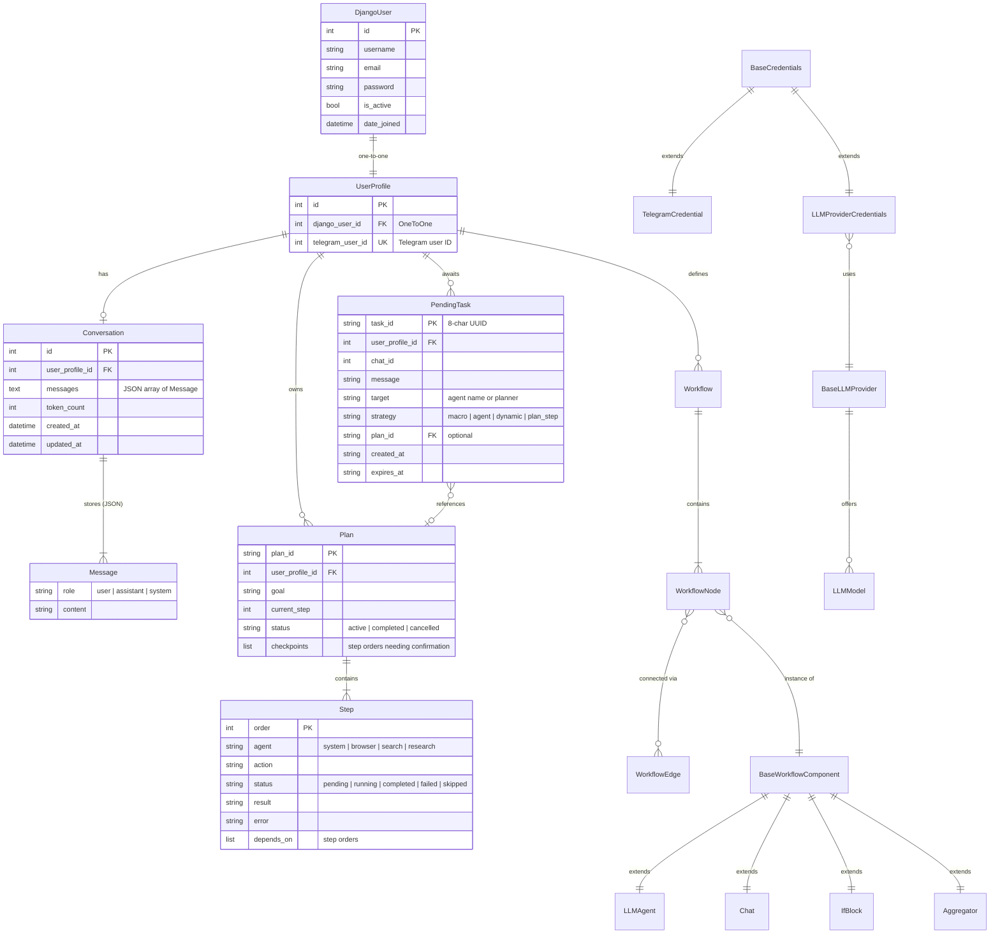
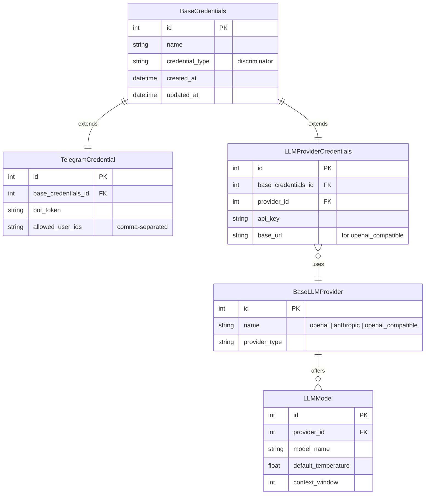
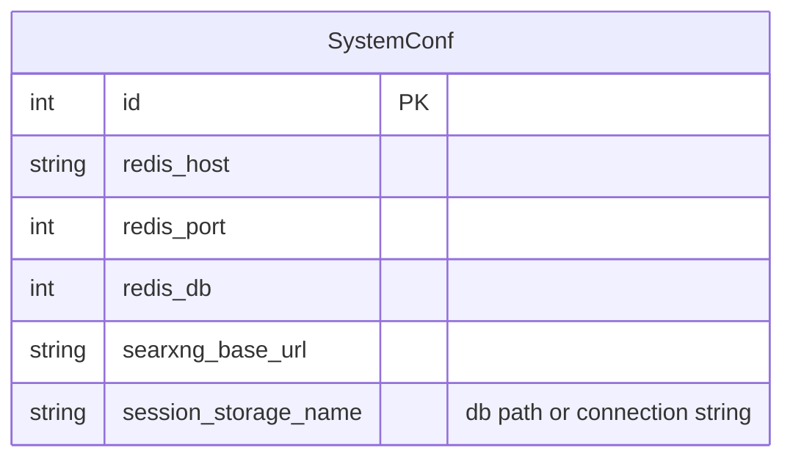
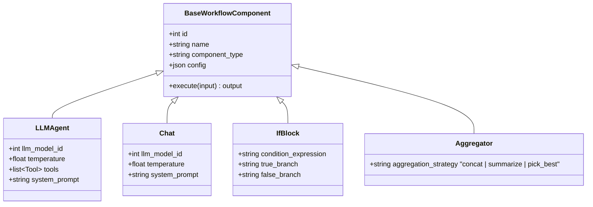
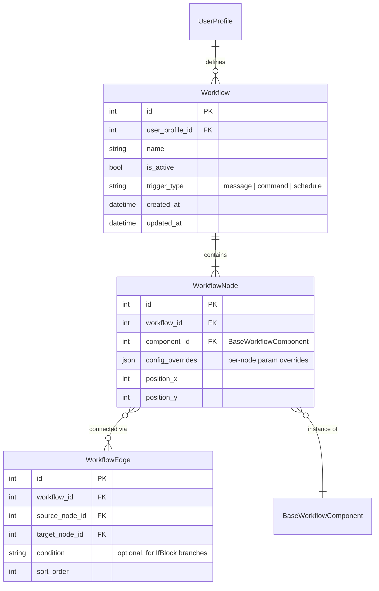
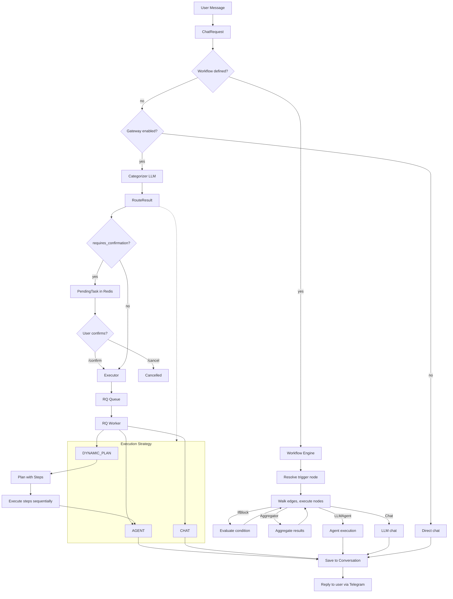

# Domain Model

## Core Entities

## Credentials & Providers

## System Configuration

## Workflow Components

## Workflow Definition (n8n-style)

## Message Flow

## Storage

| Entity | Store | TTL |
|--------|-------|-----|
| DjangoUser | PostgreSQL / SQLite | permanent |
| UserProfile | PostgreSQL / SQLite | permanent |
| Conversation | per SystemConf.session_storage_name | permanent |
| Credentials | PostgreSQL / SQLite | permanent |
| Workflow, Nodes, Edges | PostgreSQL / SQLite | permanent |
| Plan | Redis | 1 hour |
| PendingTask | Redis | 5 minutes (configurable) |
| RQ Jobs | Redis | per queue defaults |
