# Domain Model

```mermaid
erDiagram
    User ||--o| Conversation : has
    User ||--o{ Plan : owns
    User ||--o{ PendingTask : awaits
    Plan ||--|{ Step : contains
    PendingTask }o--o| Plan : "references"
    Conversation ||--|{ Message : "stores (JSON)"

    User {
        int user_id PK "Telegram user ID"
    }

    Conversation {
        int user_id PK
        text messages "JSON array of Message"
        int token_count
        datetime created_at
        datetime updated_at
    }

    Message {
        string role "user | assistant | system"
        string content
    }

    Plan {
        string plan_id PK
        int user_id FK
        string goal
        int current_step
        string status "active | completed | cancelled"
        list checkpoints "step orders needing confirmation"
    }

    Step {
        int order PK
        string agent "system | browser | search | research"
        string action
        string status "pending | running | completed | failed | skipped"
        string result
        string error
        list depends_on "step orders"
    }

    PendingTask {
        string task_id PK "8-char UUID"
        int user_id FK
        int chat_id
        string message
        string target "agent name or planner"
        string strategy "macro | agent | dynamic | plan_step"
        string plan_id FK "optional"
        string created_at
        string expires_at
    }
```

## Message Flow

## Storage

| Entity | Store | TTL |
|--------|-------|-----|
| Conversation | SQLite | permanent |
| Plan | Redis | 1 hour |
| PendingTask | Redis | 5 minutes (configurable) |
| RQ Jobs | Redis | per queue defaults |

## Agents

