# AI Assistant Blueprint v0.3

> Telegram bot powered by AIChat + Venice.ai GLM-4.7

---

## Simplified Architecture

Using [sigoden/aichat](https://github.com/sigoden/aichat) as the backend dramatically simplifies our stack. AIChat provides:
- Built-in OpenAI-compatible HTTP server (`--serve`)
- Native support for Venice.ai and 20+ other providers
- Session management, RAG, tools, and agents built-in
- Rust binary = fast, low memory footprint

```mermaid
flowchart LR
    subgraph External
        USER["👤 You<br/>Telegram App"]
        TG["☁️ Telegram<br/>Cloud"]
        VENICE["🌐 Venice.ai<br/>GLM-4.7"]
    end

    subgraph Server["🐧 Your Linux Laptop"]
        BOT["🤖 Telegram Bot<br/>Python (thin client)"]
        AICHAT["⚡ AIChat Server<br/>localhost:8000<br/>OpenAI-compatible API"]
    end

    USER <-->|"Messages"| TG
    TG <-->|"Long Polling"| BOT
    BOT <-->|"POST /v1/chat/completions"| AICHAT
    AICHAT <-->|"HTTPS"| VENICE
```



---

## Component Breakdown

| Component | Tech | Role |
|-----------|------|------|
| **Telegram Bot** | Python (`python-telegram-bot`) | Thin relay: receives messages, forwards to aichat, returns response |
| **AIChat Server** | Rust binary | LLM gateway with sessions, tools, RAG |
| **Venice.ai** | Cloud API | GLM-4.7 inference |

**Lines of code we need to write**: ~100 (just the Telegram bot)

---

## Phase 1: Basic Chat via AIChat

### Step 1: Install AIChat

```bash
# Option A: Cargo (if you have Rust)
cargo install aichat

# Option B: Homebrew
brew install aichat

# Option C: Pre-built binary
# Download from https://github.com/sigoden/aichat/releases
wget https://github.com/sigoden/aichat/releases/download/v0.30.0/aichat-v0.30.0-x86_64-unknown-linux-gnu.tar.gz
tar -xzf aichat-v0.30.0-x86_64-unknown-linux-gnu.tar.gz
sudo mv aichat /usr/local/bin/
```

### Step 2: Configure AIChat for Venice.ai

```bash
# Create config directory
mkdir -p ~/.config/aichat

# Create config file
cat > ~/.config/aichat/config.yaml << 'EOF'
model: venice:glm-4.7
clients:
  - type: openai-compatible
    name: venice
    api_base: https://api.venice.ai/api/v1
    api_key: YOUR_VENICE_API_KEY
    models:
      - name: glm-4.7
        max_input_tokens: 128000
        supports_function_calling: true
EOF
```

**Verify it works:**
```bash
# Test CLI
aichat "Hello, what model are you?"

# Test server mode
aichat --serve
# In another terminal:
curl -X POST http://127.0.0.1:8000/v1/chat/completions \
  -H "Content-Type: application/json" \
  -d '{"model":"venice:glm-4.7","messages":[{"role":"user","content":"Hello!"}]}'
```

### Step 3: Create Telegram Bot

#### Project Structure

```
telegram-aichat-bot/
├── .env
├── .env.example
├── config.py
├── main.py
└── requirements.txt
```

#### requirements.txt

```txt
python-telegram-bot>=21.0
httpx>=0.25.0
python-dotenv>=1.0.0
```

#### .env.example

```bash
# Telegram
TELEGRAM_BOT_TOKEN=your_bot_token_from_botfather
ALLOWED_USER_IDS=123456789

# AIChat server
AICHAT_BASE_URL=http://127.0.0.1:8000
AICHAT_MODEL=venice:glm-4.7
```

#### config.py

```python
import os
from dotenv import load_dotenv

load_dotenv()

class Config:
    TELEGRAM_BOT_TOKEN: str = os.getenv("TELEGRAM_BOT_TOKEN", "")
    ALLOWED_USER_IDS: list[int] = [
        int(uid.strip()) 
        for uid in os.getenv("ALLOWED_USER_IDS", "").split(",") 
        if uid.strip()
    ]
    AICHAT_BASE_URL: str = os.getenv("AICHAT_BASE_URL", "http://127.0.0.1:8000")
    AICHAT_MODEL: str = os.getenv("AICHAT_MODEL", "venice:glm-4.7")

config = Config()
```

#### main.py

```python
#!/usr/bin/env python3
"""
Telegram bot that relays messages to a local AIChat server.
"""
import logging
import httpx
from telegram import Update
from telegram.ext import Application, CommandHandler, MessageHandler, ContextTypes, filters

from config import config

# Logging
logging.basicConfig(
    format="%(asctime)s - %(name)s - %(levelname)s - %(message)s",
    level=logging.INFO
)
logger = logging.getLogger(__name__)

# HTTP client for AIChat
http_client = httpx.AsyncClient(timeout=120.0)


def is_allowed(user_id: int) -> bool:
    """Check if user is whitelisted."""
    if not config.ALLOWED_USER_IDS:
        return True  # No whitelist = allow all (for testing)
    return user_id in config.ALLOWED_USER_IDS


async def chat_with_aichat(message: str) -> str:
    """Send message to AIChat server and get response."""
    try:
        response = await http_client.post(
            f"{config.AICHAT_BASE_URL}/v1/chat/completions",
            json={
                "model": config.AICHAT_MODEL,
                "messages": [{"role": "user", "content": message}],
                "stream": False
            }
        )
        response.raise_for_status()
        data = response.json()
        return data["choices"][0]["message"]["content"]
    except httpx.TimeoutException:
        return "⏱️ Request timed out. Please try again."
    except httpx.HTTPStatusError as e:
        logger.error(f"HTTP error: {e}")
        return f"❌ API error: {e.response.status_code}"
    except Exception as e:
        logger.error(f"Error: {e}")
        return f"❌ Error: {str(e)}"


async def start(update: Update, context: ContextTypes.DEFAULT_TYPE):
    """Handle /start command."""
    if not is_allowed(update.effective_user.id):
        await update.message.reply_text("⛔ Access denied.")
        return
    
    await update.message.reply_text(
        "👋 Hello! I'm connected to AIChat + Venice.ai GLM-4.7.\n\n"
        "Just send me a message!"
    )


async def handle_message(update: Update, context: ContextTypes.DEFAULT_TYPE):
    """Handle incoming text messages."""
    user_id = update.effective_user.id
    
    if not is_allowed(user_id):
        logger.warning(f"Unauthorized: {user_id}")
        await update.message.reply_text("⛔ Access denied.")
        return
    
    user_message = update.message.text
    logger.info(f"[{user_id}] {user_message[:50]}...")
    
    # Show typing indicator
    await context.bot.send_chat_action(
        chat_id=update.effective_chat.id,
        action="typing"
    )
    
    # Get response from AIChat
    response = await chat_with_aichat(user_message)
    
    # Send response (split if too long)
    max_len = 4096
    if len(response) <= max_len:
        await update.message.reply_text(response)
    else:
        for i in range(0, len(response), max_len):
            await update.message.reply_text(response[i:i + max_len])


async def on_shutdown(application: Application):
    """Cleanup on shutdown."""
    await http_client.aclose()


def main():
    """Start the bot."""
    logger.info("Starting Telegram-AIChat bot...")
    
    app = Application.builder().token(config.TELEGRAM_BOT_TOKEN).build()
    
    # Handlers
    app.add_handler(CommandHandler("start", start))
    app.add_handler(MessageHandler(filters.TEXT & ~filters.COMMAND, handle_message))
    
    # Shutdown hook
    app.post_shutdown = on_shutdown
    
    # Run
    app.run_polling(allowed_updates=["message"], drop_pending_updates=True)


if __name__ == "__main__":
    main()
```

---

## Running the System

### Terminal 1: AIChat Server

```bash
aichat --serve
# Output:
# Chat Completions API: http://127.0.0.1:8000/v1/chat/completions
# Embeddings API:       http://127.0.0.1:8000/v1/embeddings
# LLM Playground:       http://127.0.0.1:8000/playground
```

### Terminal 2: Telegram Bot

```bash
cd telegram-aichat-bot
source venv/bin/activate
python main.py
```

---

## Sequence Diagram

```mermaid
sequenceDiagram
    participant U as 👤 You (Telegram)
    participant T as Telegram Cloud
    participant B as Telegram Bot<br/>(Python)
    participant A as AIChat Server<br/>(localhost:8000)
    participant V as Venice.ai

    U->>T: Send message
    T->>B: Long polling update
    B->>B: Check whitelist ✓
    B->>B: Send typing indicator
    B->>A: POST /v1/chat/completions<br/>{model: "venice:glm-4.7", messages: [...]}
    A->>V: Forward to Venice.ai API
    V-->>A: LLM response
    A-->>B: {choices: [{message: {content: "..."}}]}
    B->>T: sendMessage(response)
    T-->>U: Display response
```



---

## Phase 2+ Roadmap (Using AIChat Features)

AIChat already has most features built-in. We just need to expose them via Telegram commands:

| Phase | Feature | AIChat Support | Telegram Command |
|-------|---------|----------------|------------------|
| 2 | Conversation history | ✅ Sessions | `/session start`, `/session clear` |
| 2 | System prompts | ✅ Roles | `/role coder`, `/role writer` |
| 3 | File input | ✅ `-f` flag | Send document → process |
| 3 | Web URLs | ✅ `-f URL` | `/fetch https://...` |
| 4 | RAG | ✅ Built-in | `/rag add`, `/rag query` |
| 4 | Function calling | ✅ Tools/Agents | `/agent coder` |
| 5 | Multiple models | ✅ Multi-provider | `/model claude:sonnet` |

---

## Systemd Services

### aichat.service

```ini
[Unit]
Description=AIChat LLM Server
After=network.target

[Service]
Type=simple
User=your_user
ExecStart=/usr/local/bin/aichat --serve
Restart=always
RestartSec=5
Environment="HOME=/home/your_user"

[Install]
WantedBy=multi-user.target
```

### telegram-bot.service

```ini
[Unit]
Description=Telegram AIChat Bot
After=network.target aichat.service
Requires=aichat.service

[Service]
Type=simple
User=your_user
WorkingDirectory=/home/your_user/telegram-aichat-bot
ExecStart=/home/your_user/telegram-aichat-bot/venv/bin/python main.py
Restart=always
RestartSec=5

[Install]
WantedBy=multi-user.target
```

### Enable services

```bash
sudo systemctl daemon-reload
sudo systemctl enable aichat telegram-bot
sudo systemctl start aichat telegram-bot
```

---

## Quick Start Summary

```bash
# 1. Install aichat
cargo install aichat  # or download binary

# 2. Configure Venice.ai
mkdir -p ~/.config/aichat
# Edit ~/.config/aichat/config.yaml with Venice API key

# 3. Test aichat
aichat "Hello!"

# 4. Clone/create bot
mkdir telegram-aichat-bot && cd telegram-aichat-bot
# Create files as shown above

# 5. Setup Python env
python3 -m venv venv
source venv/bin/activate
pip install python-telegram-bot httpx python-dotenv

# 6. Configure bot
cp .env.example .env
# Edit .env with your Telegram bot token

# 7. Run (two terminals)
# Terminal 1:
aichat --serve

# Terminal 2:
python main.py
```

---

## Advantages of This Approach

1. **Minimal code** - We only write the Telegram relay (~100 lines)
2. **Battle-tested** - AIChat handles LLM complexity (retries, streaming, etc.)
3. **Future-proof** - Easy to add RAG, tools, multi-model via AIChat config
4. **Low resource** - Rust binary is lightweight
5. **Flexible** - Can switch providers by editing config, not code

---

*Blueprint Version: 0.3*  
*Architecture: Telegram Bot → AIChat Server → Venice.ai*
